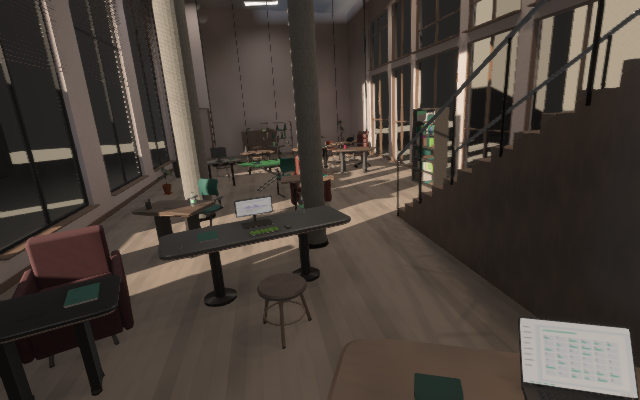
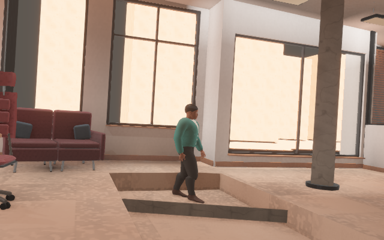
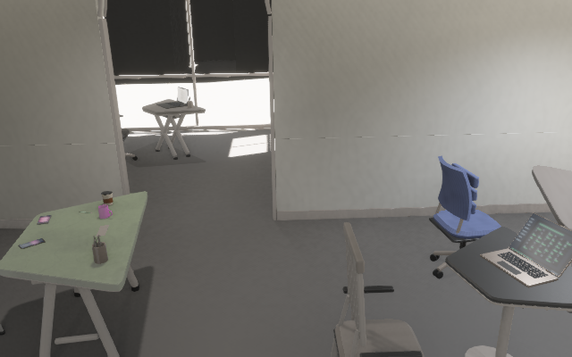
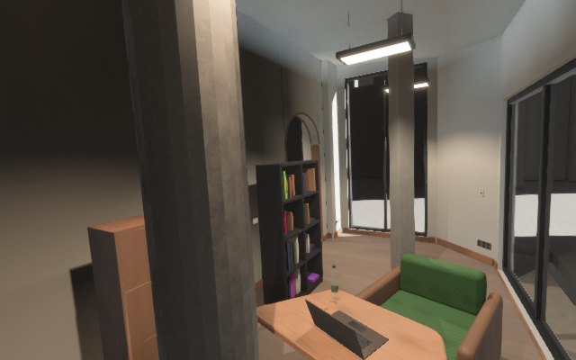
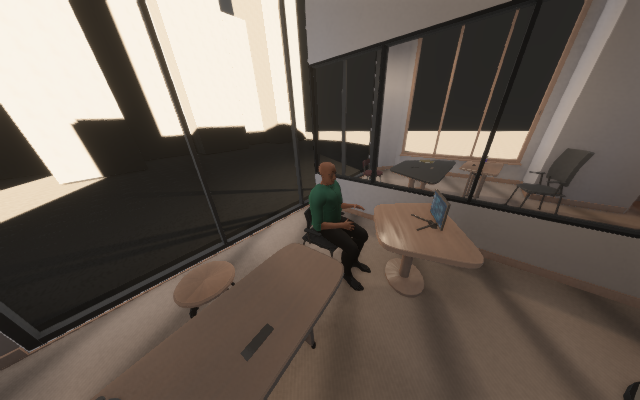
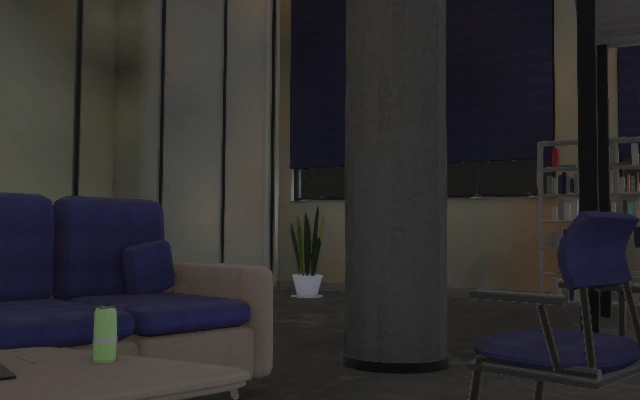

# bevy_zeroverse ♾️

[](https://github.com/Mosure/bevy_zeroverse/actions?query=workflow%3Atest)
[](https://crates.io/crates/bevy_zeroverse)
[](LICENSE)

A procedural synthetic-data engine for multi-view reconstruction and geometric
learning. Generate furnished interiors, capture synchronized views, and export
calibrated cameras with aligned images, geometry and labels.

[Project page](https://mosure.github.io/bevy_zeroverse/project/) ·
[WebGPU viewer](https://mosure.github.io/bevy_zeroverse/?scene_type=procedural-indoor&indoor_seed=7&num_cameras=4&camera_grid=true&regenerate_ms=0) ·
[Whitepaper](https://mosure.github.io/bevy_zeroverse/project/static/papers/bevy_zeroverse.pdf) ·
[Documentation](docs/README.md)

## Rendered examples

<table>
  <tr>
    <td width="33%" align="center">
      <a href="www/project/static/media/architecture/s7-t0-c3-color.webp"></a><br>
      <strong>Mezzanine &amp; stairs</strong><br><sub>Seed 7 · camera 3</sub>
    </td>
    <td width="33%" align="center">
      <a href="www/project/static/media/architecture/s8-t0-c3-color.webp"></a><br>
      <strong>Sunken lounge</strong><br><sub>Seed 8 · camera 3</sub>
    </td>
    <td width="33%" align="center">
      <a href="www/project/static/media/architecture/s6-t0-c1-color.webp"></a><br>
      <strong>Raised floor &amp; archway</strong><br><sub>Seed 6 · camera 1</sub>
    </td>
  </tr>
  <tr>
    <td width="33%" align="center">
      <a href="www/project/static/media/architecture/s4-t0-c0-color.webp"></a><br>
      <strong>Sloping ceiling &amp; pillars</strong><br><sub>Seed 4 · camera 0</sub>
    </td>
    <td width="33%" align="center">
      <a href="www/project/static/media/architecture/s2-t0-c3-color.webp"></a><br>
      <strong>Tall glazing &amp; daylight</strong><br><sub>Seed 2 · camera 3</sub>
    </td>
    <td width="33%" align="center">
      <a href="www/project/static/media/architecture/s28-t0-c0-color.webp"></a><br>
      <strong>Low-light interior</strong><br><sub>Seed 28 · camera 0</sub>
    </td>
  </tr>
</table>

Selected native captures at the start of each camera trajectory, with no exposure
correction. Click a thumbnail for the full image. The project page includes more
rooms, synchronized views, matching annotations, floor plans and distributions.

## Capabilities

- **Continuous scene programs:** polygonal footprints, cut-ins, chamfered corners,
  sloped ceilings, arches, pillars, floor levels and mezzanines. Windows and glass
  partitions connect interiors to neighboring rooms and outdoor context.
- **Procedural furnishings and appearance:** multipart furniture, potted plants,
  fixtures and clutter, with varied geometry, placement, PBR textures, glass and
  lighting. Architecture and furnishings need no downloaded mesh or texture catalog.
- **Calibrated multi-view cameras:** sampled intrinsics, primary-room placement,
  collision-checked trajectories and adjustable baselines with shared-view constraints.
- **People and motion:** AnnyBody meshes with procedural clothing and optional
  ARDY text/waypoint motion. Cameras and people share a capture timeline; static
  scenes do not initialize motion models.

Primitive-object, Cornell cube, room, semantic-room and standalone-human scenes
are also supported. The engine is built with Bevy and Rust, with native dataset
generation, a WebGPU viewer, and Python/PyTorch integration.

## Quick start

Run the native viewer using the repository's nightly Rust toolchain:

```sh
cargo run --bin viewer -- --scene-type procedural-indoor --indoor-seed 7 \
  --num-cameras 4 --camera-grid
```

Adjust controls, then press **Regenerate / R**. Camera baseline controls spacing
between views; trajectory length controls how far each camera travels.

Generate a dataset with four views per room:

```sh
cargo run -p bevy_zeroverse_burn --bin zeroverse_gen -- \
  --scene-type procedural-indoor --output out/indoor_dataset \
  --samples 100 --seed 0 --workers 1 --chunk-size 16 \
  --cameras 4 --width 640 --height 480 --playback-steps 1 \
  --indoor-camera '{"baseline":0.5}' \
  --render-modes color depth normal semantic position co-visibility \
  --ov-mode disabled --no-ui
```

The native CLI requires a GPU but no display server. Capture waits for assets,
render pipelines and requested motion. People use the body assets in
`assets/burn_human`; set `--indoor-human-density 0` to generate interiors without them.

## Exports

| Output | Contents |
| --- | --- |
| RGB and calibration | Color images, camera intrinsics, poses and capture times |
| Depth, normals and positions | Native float32 geometric annotations |
| Semantics and instances | Class labels, object bounds, primary-room AABB and human joints |
| Optical flow and motion vectors | Temporal correspondence, validity and visibility masks |
| Co-visibility | Per-pixel membership in up to 16 capture cameras |
| O-voxel | Primary-room surface geometry and semantics |

Exports support chunked or per-sample storage, resume validation and distributions
of object counts, placements, lighting and camera parameters. Glass is the first
surface in geometry annotations. O-voxel requires one timestep and disabled human
motion. Split training and evaluation by room seed.

Materials, people and indirect lighting remain approximate; photographic realism
and downstream training gains require further evaluation.

## Credits

[Zeroverse](https://github.com/desaixie/zeroverse) ·
[LGM](https://github.com/3DTopia/LGM) ·
[MatSynth](https://huggingface.co/datasets/gvecchio/MatSynth)
