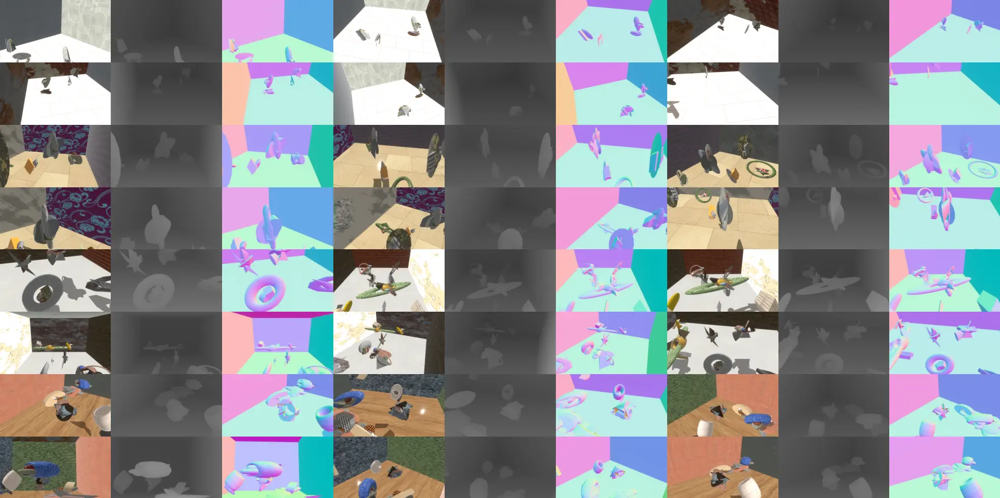
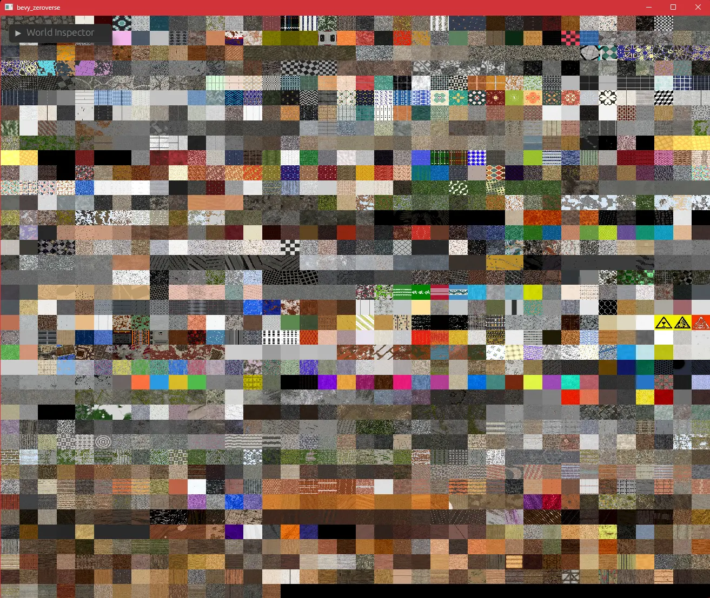

# bevy_zeroverse ♾️

[](https://github.com/Mosure/bevy_zeroverse/actions?query=workflow%3Atest)
[](https://raw.githubusercontent.com/mosure/bevy_zeroverse/main/LICENSE)
[](https://github.com/mosure/bevy_zeroverse)
[](https://github.com/mosure/bevy_zeroverse/issues)
[](http://isitmaintained.com/project/mosure/bevy_zeroverse)
[](https://crates.io/crates/bevy_zeroverse)

### [arXiv](https://arxiv.org/abs/) | [project page](https://mosure.github.io/bevy_zeroverse/project/index.html)</a>

bevy zeroverse synthetic reconstruction dataset generator. view the [live demo](https://mosure.github.io/bevy_zeroverse/?yaw_speed=0.7&num_cameras=4&camera_grid=true&regenerate_ms=8000&plucker_visualization=true).


## capabilities

- [X] depth/normal rendering modes
- [X] plücker camera labels
- [X] generate parameteric zeroverse primitives
- [X] primitive deformation
- [x] procedural zeroverse composite environments
- [x] online torch dataloader
- [x] safetensor chunking
- [x] hypersim semantic labels
- [x] [ovoxel](https://arxiv.org/abs/2512.14692) annotation
- [x] obb annotation
- [x] [procedural humans](https://arxiv.org/abs/2511.03589)
- [x] procedural furnished `procedural_indoor` scenes with seeded layouts and generated PBR surfaces
- [ ] primitive boolean operations
- [ ] primitive pbr wireframe
- [ ] primitive 4d augmentation


## procedural interiors

```sh
cargo run --bin viewer -- --scene-type procedural-indoor --indoor-seed 6
```

Conference rooms, open offices, lounges and training rooms use multipart furniture,
metric texture coordinates, generated PBR textures, shadowed lighting, window recesses
and a furnished neighboring room behind glass. No downloaded mesh or texture catalog
is required for the architecture and furnishings. People use the bundled AnnyBody
reference in `assets/burn_human`; `--indoor-human-density 0` runs without it. Existing
scene types remain available.

Generator v8 expands continuous room, furnishing, material, camera and
low-light-to-sunlight distributions. See the [domain review](docs/procedural_domain_v8.md)
for measured coverage and renders. The [generator-v7 review](docs/scene_quality_v7.md)
records the controls, human surfaces, glazing and annotation fixes. The generator-v6
[program review](docs/procedural_program_review.md) retains its historical
native/browser checks and matched Cycles comparisons. The earlier
[generator-v5 review](docs/local_scene_quality_review.md) is retained as historical evidence.
See the [0.20 release notes](docs/release_0_20.md) for API and capture compatibility.

See the [generation, capture and validation guide](docs/procedural_indoor.md) for
dataset examples, distribution evidence and current rendering limits. The
[generator-v4 review](docs/procedural_indoor_review_v4.md) covers architectural
families, six potted plant forms, desk clutter, render inspections and dataset
metrics. Native capture includes diffuse GI and float32 geometry annotations;
the [WebGPU viewer](docs/procedural_indoor_web.md) has explicit quality profiles.

## dataloader



```python
from bevy_zeroverse_dataloader import BevyZeroverseDataset
from torch.utils.data import DataLoader

dataset = BevyZeroverseDataset(
    editor=False, headless=True, num_cameras=6,
    width=640, height=480, num_samples=1e6,
)
dataloader = DataLoader(
    dataset, batch_size=4, shuffle=True, num_workers=1,
)

for batch in dataloader:
    visualize(batch)
```

### chunked dataloader

requires nvjpeg: https://developer.nvidia.com/nvjpeg


## mat-synth

- download the mat-synth dataset [here](https://huggingface.co/datasets/gvecchio/MatSynth/blob/main/scripts/download_dataset.py)
- resize the mat-synth dataset (4k is heavy) using `python mat-synth/resize.py --source_dir <path-to-mat-synth> --dest_dir assets/materials`
- material basecolor grid view (`cargo run -- --material-grid` or [live demo](https://mosure.github.io/bevy_zeroverse?material_grid=true))




The current checkout pins Bevy 0.19.1, Burn 0.21.0, `burn_human` 0.4.0 and
`bevy_burn_human` 0.4.0. Capture metadata includes an engine identity; datasets
created with the older rendering contract cannot be resumed into a mixed-version
capture stream. Existing dataset files remain readable. See the
[physical accuracy and memory review](docs/procedural_indoor_review_v6.md)
for measured Cycles differences and the failed continuous-process stability gate.
Production CLI generation should retain its process lifetime limit. The checkout's
wgpu memory patches are not inherited by downstream crates.io consumers.

## compatible bevy versions

| `bevy_zeroverse` | `bevy` |
| :--                       | :--    |
| `0.20`, `0.19`            | `0.19.1` |
| published `0.17`           | `0.17` |
| `0.8`                     | `0.16` |
| `0.6`                     | `0.15` |
| `0.2`                     | `0.14` |
| `0.1`                     | `0.13` |


## credits

- [lgm](https://github.com/3DTopia/LGM)
- [mat-synth](https://huggingface.co/datasets/gvecchio/MatSynth)
- [zeroverse](https://github.com/desaixie/zeroverse)
