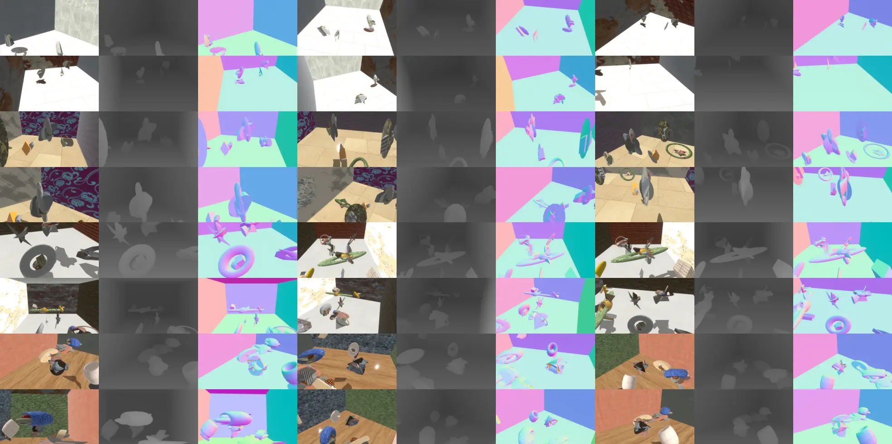

# bevy_zeroverse ♾️

[](https://github.com/Mosure/bevy_zeroverse/actions?query=workflow%3Atest)
[](https://raw.githubusercontent.com/mosure/bevy_zeroverse/main/LICENSE)
[](https://github.com/mosure/bevy_zeroverse)
[](https://github.com/mosure/bevy_zeroverse/issues)
[](http://isitmaintained.com/project/mosure/bevy_zeroverse)
[](https://crates.io/crates/bevy_zeroverse)

### [arXiv](https://arxiv.org/abs/) | [project page](https://mosure.github.io/bevy_zeroverse/project/index.html)</a>

bevy zeroverse synthetic reconstruction dataset generator. view the [live demo](https://mosure.github.io/bevy_zeroverse?yaw_speed=0.7&cameras_x=2&cameras_y=2&regenerate_ms=8000&plucker_visualization=true).


## capabilities

- [X] depth/normal rendering modes
- [X] plücker camera labels
- [X] generate parameteric zeroverse primitives
- [X] primitive deformation
- [x] procedural zeroverse composite environments
- [x] online torch dataloader
- [x] safetensor chunking
- [x] hypersim semantic labels
- [ ] primitive boolean operations
- [ ] primitive pbr wireframe
- [ ] primitive 4d augmentation


## dataloader



```python
from bevy_zeroverse_dataloader import BevyZeroverseDataset
from torch.utils.data import DataLoader

dataset = BevyZeroverseDataset(
    editor=False, headless=True, num_cameras=6,
    width=640, height=480, num_samples=1e6,
)
dataloader = DataLoader(
    dataset, batch_size=4, shuffle=True, num_workers=1,
)

for batch in dataloader:
    visualize(batch)
```


## mat-synth

- download the mat-synth dataset [here](https://huggingface.co/datasets/gvecchio/MatSynth/blob/main/scripts/download_dataset.py)
- resize the mat-synth dataset (4k is heavy) using `python mat-synth/resize.py --source_dir <path-to-mat-synth> --dest_dir assets/materials`
- material basecolor grid view (`cargo run -- --material-grid` or [live demo](https://mosure.github.io/bevy_zeroverse?material_grid=true))


## compatible bevy versions

| `bevy_zeroverse` | `bevy` |
| :--                       | :--    |
| `0.2`                     | `0.14` |
| `0.1`                     | `0.13` |


## credits

- [lgm](https://github.com/3DTopia/LGM)
- [mat-synth](https://huggingface.co/datasets/gvecchio/MatSynth)
- [zeroverse](https://github.com/desaixie/zeroverse)
