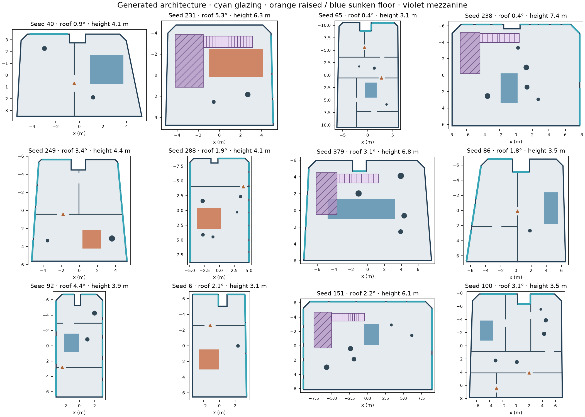
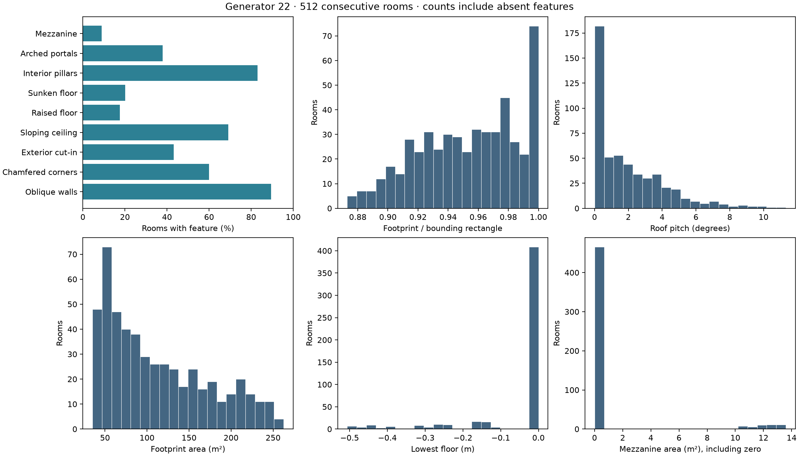
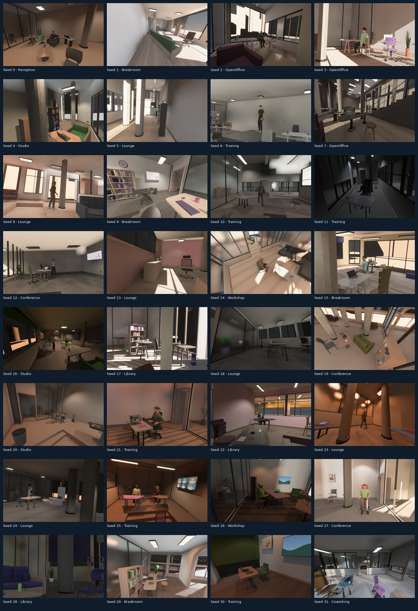

# Architectural envelopes and validation

The primary building envelope is now a sampled polygon rather than a rectangular
prism. The same serialized `EnvelopeProgram` drives construction, furniture and
human support, camera sweeps, visibility proposals, motion barriers and export.
The neighboring office and the original non-indoor scene modes remain available.

The [project-page explorer](https://mosure.github.io/bevy_zeroverse/project/#architecture)
shows all 32 captured rooms, four cameras, both endpoints and six matched modes, including co-visibility.
Each room has a plan and envelope section derived from its actual manifest.
The [whitepaper](https://mosure.github.io/bevy_zeroverse/project/static/papers/bevy_zeroverse.pdf)
includes current RGB/plan/section figures and population distributions; earlier
camera-baseline and motion studies are retained separately as reference evidence.



These are twelve examples selected by architectural feature coverage from the
512-room audit, independent of rendered appearance. Cyan marks exterior apertures;
orange and blue show raised and sunken floors; violet marks mezzanine decks and
stairs. Triangles indicate arched portals. Dimensions are metres. The roof pitch
is the slope of the actual ceiling plane, not a texture or a tilted camera.

## Built geometry and constraints

- Footprint taper, corner chamfers and exterior cut-ins vary continuously. Floors
  and roofs are triangulated against the concave outline; the cut-in stays empty.
  Each exterior edge has its own aperture, inset frame, sill and shade program.
- Signed roof gradients vary in both horizontal axes. Wall tops, partition tops,
  pillar caps and fixture anchors follow the same plane. Exterior attachments
  use the actual wall frame and require solid backing beside the apertures.
- Elliptical portal profiles have curved headers and separate trim. Pillars vary
  in location, radius and section; they occupy circulation space in all placement
  and navigation checks.
- Raised and sunken floor patches have actual treads and vertical risers. Furniture
  and static people require one flat, supported footprint; proposals spanning a
  discontinuity are rejected. Camera paths continuously check the outline and
  split floor crossings at patch boundaries.
- Taller rooms can contain a furnished mezzanine with slab, supports, continuous
  stairs, guarded landing, glass guard panels and handrails. Lower-level fixtures
  attach to the deck underside. Stairs reserve clearance before furnishing.
- The reconstruction AABB includes negative floor depth. Courtyard ground and
  exterior context carry `OvoxelExcluded`, even when inside the rectangular AABB.
  The occupied voxel geometry follows the actual constructed surfaces.

`envelope/{sampling,polygon,construction,queries}.rs` separates sampling, polygon
operations, mesh construction and shared spatial queries. Existing rectangular
manifests with no envelope retain their construction path. Generator identity is
22 and the capture identity is v33, so earlier cache entries are not reused.

## Bounded evaluation

The new audit uses **512 consecutive seeds (0–511)**, mixed activities, density
0.65, human density 0.25 and four cameras with the default baseline policy. All
512 passed layout, support, clearance and camera checks. No failing room was
removed. The full numeric distributions, zero-inclusive counts and replayable
architectural programs accompany this review.

| Built feature | Rooms / 512 | Fraction |
| --- | ---: | ---: |
| Oblique exterior walls | 458 | 89.5% |
| Chamfered corners | 307 | 60.0% |
| Exterior cut-in | 221 | 43.2% |
| Sloping ceiling | 354 | 69.1% |
| Raised floor | 90 | 17.6% |
| Sunken floor | 103 | 20.1% |
| Interior pillars | 425 | 83.0% |
| Arched portals | 194 | 37.9% |
| Furnished mezzanine | 46 | 9.0% |

Footprints span 35.05–262.58 m² and occupy 87.3–100% of their bounding rectangles.
Roof pitch spans 0–11.32°. Floor offsets span −0.506 to +0.507 m. Mezzanine floors
are 2.654–3.037 m above the base floor, with 16–18 risers of 0.160–0.170 m,
treads of 0.282–0.310 m and a 1.08 m stair width. Each sampled mezzanine has 2–4
solid furniture instances. These are geometric constraints, not a building-code
certification.

All 512 structural signatures are distinct after quantizing dimensions to 1 cm
and excluding seeds, materials and aperture detail. This measures uniqueness
within this sample; it does not establish the effective size of a 10M-image
training distribution.



The **first 32 rooms were rendered without filtering**, with four cameras at
both trajectory endpoints: **256 views**, each in RGB, depth, normal, semantic
position and co-visibility modes at 640×400. Native Vulkan used an RTX PRO 6000 Blackwell,
Auto quality, shadows, SSAO and diffuse GI at 1,024 rays per probe. Geometry
annotations used the native float32 path. The first-view contact sheet below
includes every captured room, including dark scenes.



All 256 views passed annotation alignment. The largest per-view depth/position
p99 discrepancy was **2.87 µm**; the largest reprojection p99 was **0.00264 px**.
Maximum decoded normal-length error was **2.39×10⁻⁷**. These are consistency checks
between annotations, not comparisons with measured real-world geometry.

Every captured view contains at least four semantic classes. All 18 rooms with
people in the camera's primary functional zone contain semantic person pixels
in at least one sampled view. Twenty-two rooms contain people somewhere in the
main envelope; the three without person pixels (seeds 17, 24, 31) place those
people in other functional zones. These denominators are exported separately.
Glass follows the existing annotation-opaque policy, so RGB visibility through
a pane does not imply a visible semantic person. Individual human visibility is
not inferred from class-level person pixels.

Scene construction through capture/export took 1.44–4.49 s per room, median
2.17 s, excluding application startup. Each room produced eight views in six
modes. This is a bounded run on one adapter, not a sustained-throughput or memory
stability qualification.

[Four-view examples](evidence/architecture_covisibility/multiview.jpg) and
[matched RGB/depth/normal/semantic panels](evidence/architecture_covisibility/annotations.jpg)
include both first-observed mezzanines. Example selection is based on structural
coverage; it does not change the statistics above.

## Checks and reproduction

Regression checks cover deterministic replay and serialization, concave polygon
containment, continuous camera clearance, supported placement, finite mesh
attributes and winding, unobstructed exterior apertures, real roof/floor/stair
surface heights, clear door passages and competing coplanar trim faces. Geometry
surface tests exercise 96 consecutive scenes and include mezzanine construction.
The activity/density stress test exercises all ten profiles at both density
extremes over 32 seeds each: 640 configurations with eight connected cameras.
Late proposals for larger camera groups use verified free corridors and the
local sloping-ceiling height interval, retaining the same search budget,
minimum overlap, separation, spread and motion-variation requirements.
The report compares audit/capture architecture at its actual float32 precision
and checks run completion identities before aggregating captures.

The final library run passed **161 tests**, with three optional larger
qualifications ignored. Strict Clippy with human motion and the Wasm viewer
compilation both passed. The native voxel regression matched **28,571 occupied
cells and their semantic labels exactly between CPU and GPU**, retaining the
depressed floor and mezzanine while excluding the courtyard and exterior context.
[Validation commands, source hashes and logs](evidence/architecture_v22/validation.json)
record the scope of each check for this local working tree.

```sh
cargo test --lib --no-default-features --features multi_threaded -j 2
cargo clippy --all-targets --features human_motion -- -D warnings
cargo check --target wasm32-unknown-unknown --bin viewer \
  --no-default-features --features web,human_motion -j 2

cargo run --bin indoor_validate --no-default-features --features multi_threaded -- \
  --seed 0 --audit-seeds 512 --renders 32 --cameras 4 \
  --width 640 --height 400 --labels --co-visibility --no-raw --playback-steps 2 \
  --gi-rays 1024 --output out/architecture_covisibility
python scripts/report_indoor_architecture.py \
  out/architecture_covisibility docs/evidence/architecture_covisibility

# Native GPU, one static timestep, primary geometry only:
cargo test --test procedural_indoor_render --no-default-features \
  --features multi_threaded -j 2 \
  nonrectangular_envelope_voxels_exclude_context_and_keep_floor_levels \
  -- --ignored --nocapture
```

The Python report requires Pillow and matplotlib. Its [summary](evidence/architecture_covisibility/summary.json)
records the capture engine, annotation precision, configuration and input hashes.
[metrics.json](evidence/architecture_covisibility/metrics.json) holds all numeric and
categorical distributions. [architecture.jsonl.gz](evidence/architecture_covisibility/architecture.jsonl.gz)
holds the 512 footprint/roof/floor/structure/aperture programs. Full captures and
per-instance camera/object CSVs are local in `out/architecture_covisibility`.

## Limits

This remains a bounded architectural grammar. Cut-ins are on the rear facade;
the adjoining office and mezzanine decks remain rectangular. Curved exterior
walls, arbitrary multi-storey connectivity, structural analysis and code
compliance are outside this implementation. Floor and mezzanine transitions
are blocked for ARDY's level-ground motion model; actors that cannot be staged
onto suitable ground remain static with a recorded rejection reason.

The WebAssembly viewer with motion enabled passes a compilation check; this
review does not claim a new browser runtime or browser capture qualification.
Native and portable rendering retain their existing capability gates.

The rendered rooms demonstrate geometric variety and annotation consistency.
Materials, glass highlights, hair and human appearance still look synthetic.
No measured photographic-realism claim, real-building distribution fit or
10M-sample learning-utility result follows from these tests. Earlier project-page
and whitepaper measurements remain explicitly generator-21 evidence; they have
not been relabeled as generator 22.
