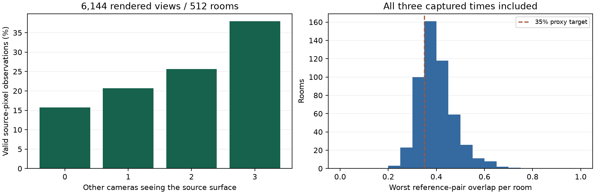

# Generator 20: camera distribution and 512-room co-visibility evaluation

This release evaluates **2,048 consecutive layouts** (24000–26047) and **512
consecutive rendered rooms** (24000–24511). No failed, dark or weak room is
replaced. Rendering uses four 320×240 cameras at normalized times 0, 0.5 and 1:
**6,144 views, 1,536 synchronized sets, 4,608 reference pairs and 18,432 directed
all-camera pairs**. Furnishing density is 0.65 and static human density 0.25.
Native lights and shadows are enabled; baked GI is disabled for this geometry
audit. Four 128-room process chunks preserve their individual capture identities.

The [camera report](evidence/camera_v20/summary.json) compares the same 2,048
layouts under generators 19 and 20. Object, people and architecture CSV hashes
match. Near-collinear starting groups (horizontal minor/major standard-deviation
ratio below 0.25) drop from **626 to zero**. Median starting spread increases from
0.351 to 0.474. Every new room satisfies the 33-time group checks, swept collision
checks, primary-room constraints and the proxy overlap policy. The independent
NumPy report recomputes the exported group metrics from sampled paths. Legacy
exports contain endpoints only; this limitation remains in the comparison.


The [co-visibility report](evidence/camera_v20/covisibility_report.json) evaluates
all ordered camera pairs at each captured time. It reconstructs a per-source-pixel
membership mask using actual depth and calibration, excluding the source camera.
Projection must be inside the other frustum, and depth must agree with the nearest
target pixel within **0.01 m + 0.002 × target depth**. Occluded and out-of-frustum
points do not count as shared.

This is an **independent rendered-depth diagnostic**, not a count of the production
GPU annotation masks. The production [co-visibility annotation](co_visibility.md)
uses a different symmetric tangent-plane test. The refreshed gallery validates and
exports those exact GPU masks for two selected example rooms. Both conventions
treat glass as the first opaque geometric surface; neither measures reflected or
refracted RGB content.

| Other cameras seeing a valid source pixel | Fraction |
| --- | ---: |
| 0 | 15.73% |
| 1 | 20.69% |
| 2 | 25.60% |
| 3 | 37.98% |

The denominator is **471,859,197 valid source-pixel observations**, not unique 3D
points. There are 471,859,200 total image pixels. A surface can contribute again
from another view or time; camera and time observations within a room are
correlated.

Reference-pair overlap averages **53.36%**, with median 52.73%, minimum 20.50% and
5th percentile 34.86%. **245/4,608 pairs (5.32%)** miss the requested 35% proxy
estimate. No room has a reference pair below 10%. All 1,536 camera graphs remain
connected when edges require 10% bidirectional overlap; 74 become disconnected
at 35%. The mean of each room's worst reference pair is **40.12%**, which must not
be confused with the mean over all pairs. Every tail remains in the reports.



The same captures have no view with at most two visible semantic classes.
All **357 rooms containing primary-room people** contain person pixels in at
least one captured view. This is a room-level presence check, not per-person
coverage. Runtime camera poses match the manifest exactly in the exported
comparison. The largest per-view p99 depth/position disagreement is 0.00000406 m;
the largest p99 reprojection error is 0.002741 pixels. These checks establish
calibration/annotation consistency, not photographic realism.

The [full population export](evidence/camera_v20/metrics.json),
[group CSV](evidence/camera_v20/camera_groups.csv),
[per-view co-visibility](evidence/camera_v20/covisibility_views.csv),
[directed pairs](evidence/camera_v20/covisibility_pairs.csv), and
[synchronized sets](evidence/camera_v20/covisibility_times.csv) retain denominators,
units, individual seeds and measurements. JSON retains completion/run identities,
source hashes, script hashes, configurations and the weakest sets.

## Reproduction

Use the generation code for generator 20; keep raw depth outputs. AnnyBody assets
must be available under `assets/burn_human`. The first chunk also performs the
larger layout audit; subsequent chunks audit their own 128 rooms. The independent
report checks matching configurations, completion, unique consecutive seeds and
the expected total without editing any capture run ID.

```sh
cargo build --bin indoor_validate
target/debug/indoor_validate --seed 24000 --audit-seeds 2048 --renders 128 \
  --cameras 4 --width 320 --height 240 --playback-steps 3 --labels --no-gi \
  --asset-root . --output out/camera_release/after
for scene_seed in 24128 24256 24384; do
  target/debug/indoor_validate --seed "$scene_seed" --audit-seeds 128 --renders 128 \
    --cameras 4 --width 320 --height 240 --playback-steps 3 --labels --no-gi \
    --asset-root . --output "out/camera_release/after_$scene_seed"
done
python scripts/indoor_covisibility_report.py \
  out/camera_release/after out/camera_release/after_24128 \
  out/camera_release/after_24256 out/camera_release/after_24384 \
  --expected-scenes 512 --workers 4 --output docs/evidence/camera_v20
```

For the matched placement comparison, run the 2,048-layout audit with the
generator-19 source at `b2f7edc` into `out/camera_release/before` (zero renders),
then run:

```sh
python scripts/indoor_camera_group_report.py \
  out/camera_release/before out/camera_release/after \
  --seed 24005 --output docs/evidence/camera_v20
python scripts/build_camera_evaluation.py
```

The builder derives the paper macros, figures and project-page block from these
reports. The gallery uses a separate full-lighting capture recipe in
[project_page.md](project_page.md). Tests check analytic plane overlap,
occlusion, asymmetric intrinsics, membership cardinality, self/unknown-bit
exclusion and graph connectivity. A four-room cross-check reproduces the existing
reference-overlap report exactly.

This bounded study does not requalify the historical SigLIP2 or throughput
measurements, prove photographic realism, establish unlimited-process memory
stability, or measure downstream training utility. The older v18 appearance and
performance results remain labeled separately. Production generation should keep
its process lifetime limit.
