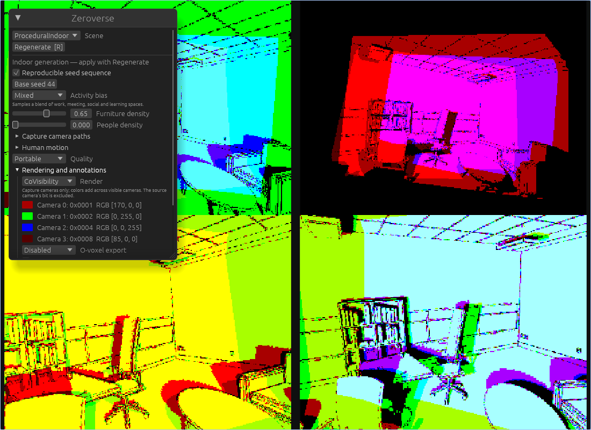

# Co-visibility annotations

`co-visibility` records which **other capture cameras** see the surface at each
source pixel at the same timestep. It includes projection, image bounds, clipping
planes and occlusion. The editor camera is excluded. This is measured visibility,
separate from the indoor camera placement policy's overlap estimate.

Enable it alongside other capture modes:

```sh
cargo run -p bevy_zeroverse_burn --bin zeroverse_gen -- \
  --scene-type procedural-indoor --seed 44 --indoor-human-density 0 \
  --cameras 4 --samples 4 --width 320 --height 240 \
  --render-modes color depth co-visibility --ov-mode disabled \
  --output-mode fs --output out/shared_views --no-ui
```

For the viewer, select **Rendering and annotations → Render → CoVisibility** and
**Cameras and playback → Show capture camera grid**. The render control includes
a camera legend. A direct launch is:

```sh
cargo run --bin viewer -- --scene-type procedural-indoor --indoor-seed 44 \
  --num-cameras 4 --camera-grid --render-mode co-visibility
```

The same preview works in WebGPU with
`?scene_type=procedural-indoor&num_cameras=4&camera_grid=true&render_mode=co-visibility`.



The editor retains its RGB view. Camera-grid slots and legend bits follow ascending
`CaptureCameraIndex`, with entity order as the fallback. Use unique indices when
creating cameras programmatically. Preview images have a one-frame display delay;
the capture/export path waits for the current frame's complete annotation.
Browser dataset readback is not supported; use the native generator for exports.

## Numeric contract

Each pixel contains a **u16 membership mask**. Bit `i` identifies camera `i` in
that sample's ordered legend, consistently across every view and timestep. The
source camera's own bit is always zero. For example, `0b1010` means that cameras
1 and 3 see the surface. Camera count must be 1–16; larger sets fail validation
instead of silently truncating identities. A single camera is valid and has no
co-visible pixels.

Safetensors chunks contain:

| Tensor | Type | Shape / content |
| --- | --- | --- |
| `co_visibility` | U16 | `[batch,time,camera,height,width,1]` |
| `co_visibility_valid` | U8 | Same shape; 1 means the source pixel hit geometry |
| `co_visibility_metadata_i` | U8 | UTF-8 JSON convention and camera legend for sample `i` |

Folder exports contain `co_visibility_TTT_CC.npz`, a lossless additive-color PNG
with the same stem, and `co_visibility_metadata.json`. The NPZ has membership and
validity arrays of shape `[height,width,1]`. **Mask zero / validity one** is an
unshared surface; **mask zero / validity zero** is background. PNG alone cannot
distinguish these cases. Membership remains integer and lossless even when the RGB
capture uses JPEG. Co-visibility-only datasets are supported.

Rust `View::co_visibility` and the raw Python FFI buffer use RGBA float32:
`[mask, popcount(mask), source_valid, 0]`. All 16-bit integers are represented
exactly in float32; they do not pass through an HDR float16 intermediate.
The PyTorch dataloader returns U16 membership and U8 validity. Use the NumPy helper
for individual masks and exact preview decoding:

```python
from bevy_zeroverse_dataloader import co_visibility as cv

visible_in_camera_3 = cv.camera_visible(sample['co_visibility'], 3)
rgb = cv.mask_to_rgb(sample['co_visibility'][0, 0, ..., 0], count=4)
assert (cv.rgb_to_mask(rgb, count=4) == sample['co_visibility'][0, 0, ..., 0].numpy()).all()
```

The dataloader render-mode name is `co_visibility`. Rust uses
`RenderMode::CoVisibility`; CLI and viewer URL values use `co-visibility`.
Co-visibility works with static scenes, camera trajectories and moving humans;
all views use the same frozen capture timestep. It does not require ARDY or any
other learned model.

## Additive colors and shared legend

A camera contributes to one RGB8 channel: `channel = i % 3`. With `k` cameras
assigned to that channel, `rank = i / 3` and `scale = floor(255 / (2^k - 1))`,
its channel value is `scale * 2^(k - 1 - rank)`. Add the contributions of all set
bits. Every supported combination decodes uniquely, without channel overflow.
The palette adapts to camera count; the same count and ordering give the same
palette in every scene. For four cameras the colors are `(170,0,0)`, `(0,255,0)`,
`(0,0,255)` and `(85,0,0)`.

Some contributions become dark at large camera counts; read the legend or decode
the masks to inspect one camera. Stored PNGs are exact codes. Screenshots, scaled
viewer images, JPEG and color grading are **not** safe numeric representations.
Browser compositing shifted some displayed code values by 1–2 in the measured
fixture; the browser smoke test allows three RGB8 levels of display error.

## Visibility definition and cost

The geometry raster is shared with float32 depth, position, normals, semantics
and temporal flow. One compute dispatch projects source surfaces into all other
cameras, checks their nearest target pixel, and compares both local tangent
planes. The tolerance is `max(1 mm, 0.0001 * target_depth_metres)`. This avoids the
large false occlusions that a raw depth difference causes on sloping surfaces.

This is raster visibility at the chosen resolution. Silhouettes, thin objects,
small curved surfaces and nearby surfaces within the tolerance can be ambiguous.
Glass is treated as the first opaque geometric surface, consistently with the
other geometry annotations; the mask does not describe refracted/reflected RGB
content or translucency. Membership need not be symmetric between individual
pixels because projected points can fall between target pixel centers.

Work scales as `O(pixels * cameras²)`. There is one geometry raster per camera,
not one per camera pair. World positions, normals and memberships use reused GPU
texture arrays, and no CPU readback is required for the interactive preview.
Additional atlas storage is `48 * max_width * max_height * camera_count` bytes;
per-camera float32 membership targets require another 16 bytes/pixel. Viewer-only
preview targets add 16 bytes/pixel. Export compacts membership plus validity to
3 bytes/pixel before compression. Existing geometry buffers and readback staging
are additional. Disabling the mode releases its atlas and preview attachments;
an unused annotation does not compile its pipelines or allocate its targets.

## Validation

See [the measured validation report](co_visibility_validation.json). The bounded
suite checks analytic occlusion and sloped surfaces, moving geometry, coexistence
with optical flow, out-of-order camera IDs, mixed resolutions, all 16 membership
bits, idle reuse, teardown, Rust/Python serialization and malformed-data rejection.
Four indoor seeds, four cameras and three timesteps were exported through the
headless CLI; all 48 PNGs decode exactly to their numeric masks. An object-scene
co-visibility-only compressed chunk also loads correctly in Python.

On an RTX PRO 6000 Blackwell / Vulkan, a fixed-room diagnostic at four 320×240
views measured approximately 0.05 ms for the additional GPU visibility pass.
It reused one 14.06 MiB atlas for 16 captures. The small end-to-end timing difference
was within run-to-run variation. This is a bounded diagnostic, not a throughput or
memory-stability guarantee for arbitrary resolutions and camera counts.

Reproduce the focused checks:

```sh
cargo test --lib co_visibility
cargo test --test co_visibility_render -- --ignored --nocapture
cargo test -p bevy_zeroverse_burn --test co_visibility_roundtrip
# With the built FFI extension and Python dependencies available:
PYTHONPATH=crates/ffi/python python -m unittest crates/ffi/python/test_co_visibility.py
cargo run --bin indoor_bench -- --scenes 16 --warmup-scenes 4 \
  --seed 44 --cameras 4 --width 320 --height 240 --human-density 0 \
  --fixed-scene --no-gi --gpu-timings --co-visibility --output out/covis_bench
```

After serving a current WASM build, run
`python scripts/smoke_co_visibility_browser.py --output out/covis_browser` to
check all four source-bit exclusions, the shared palette and the RGB editor.
