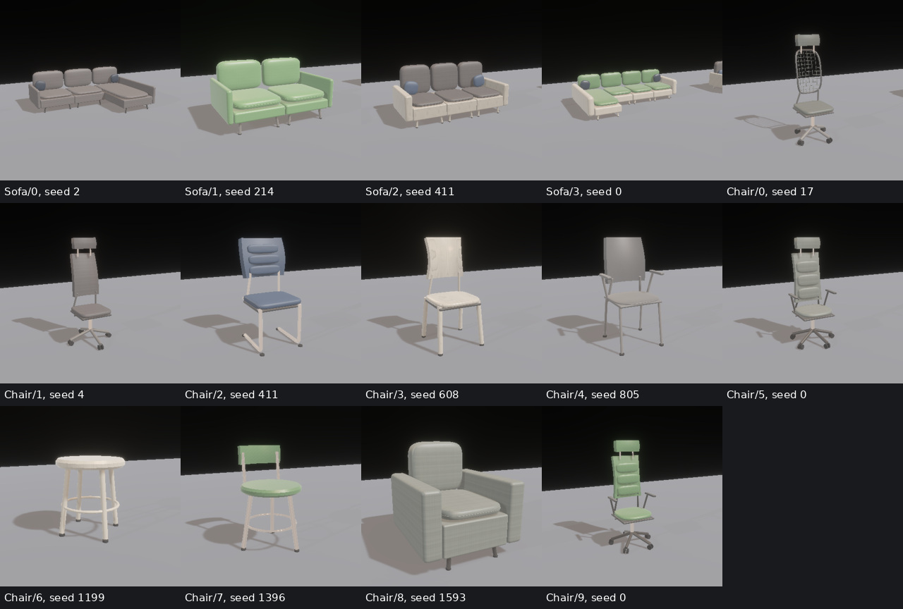
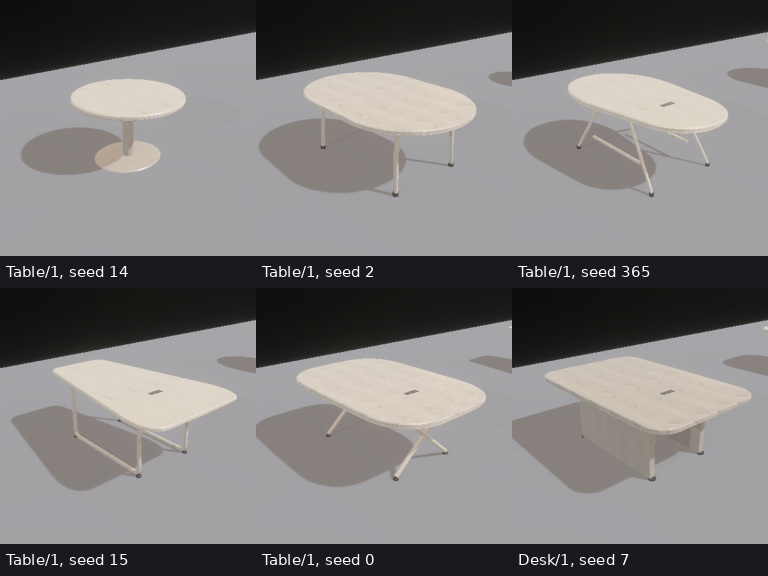
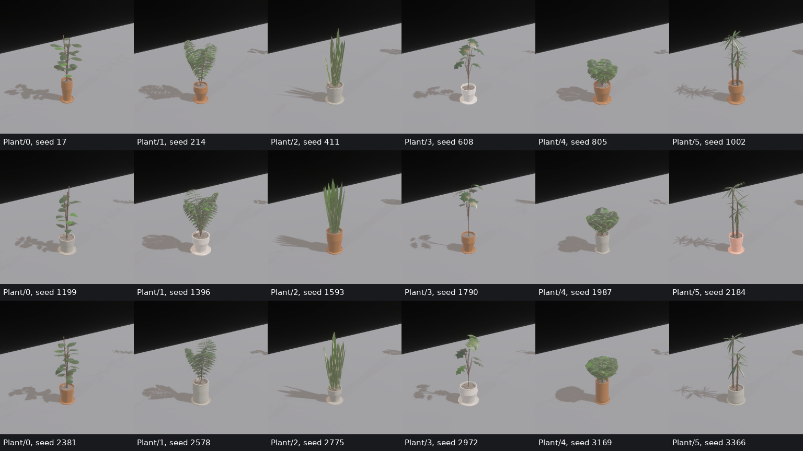
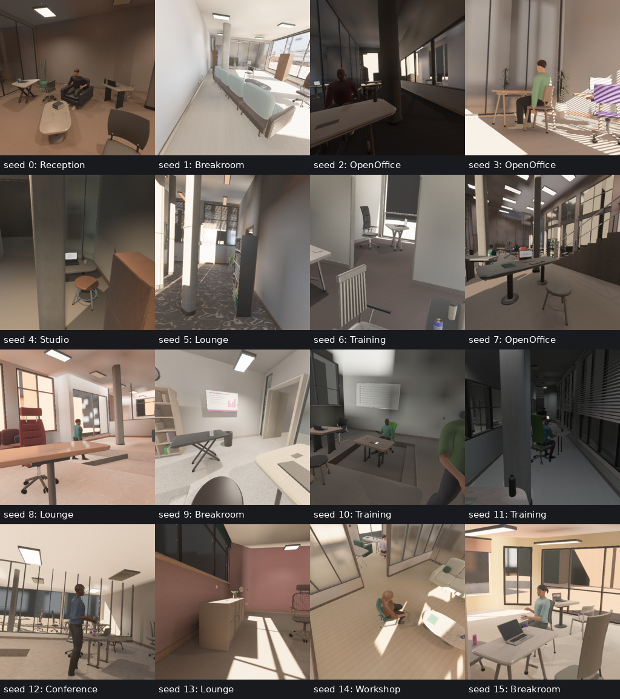
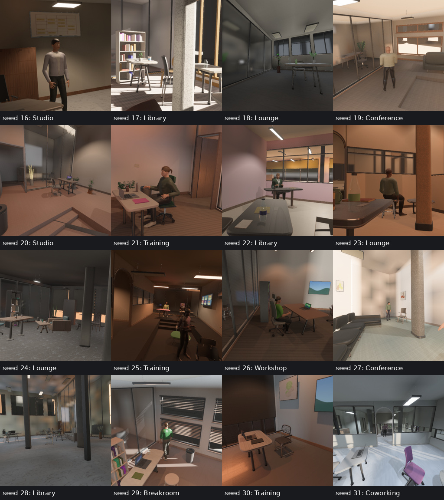
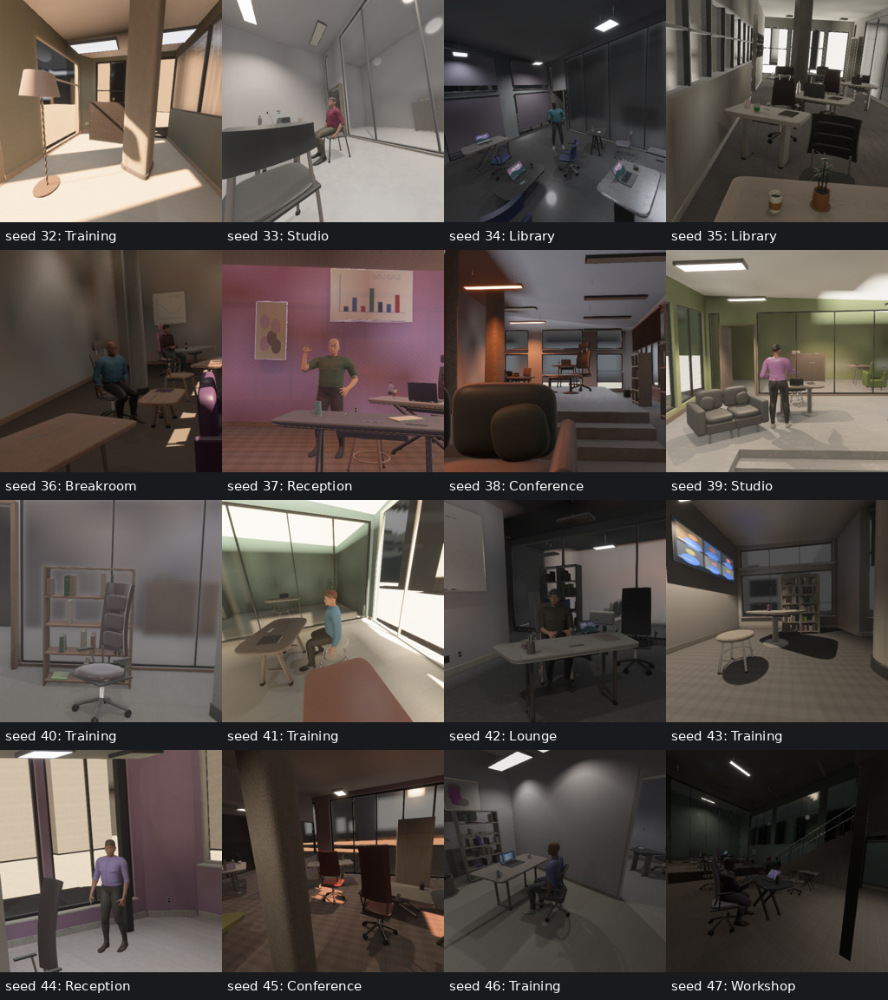
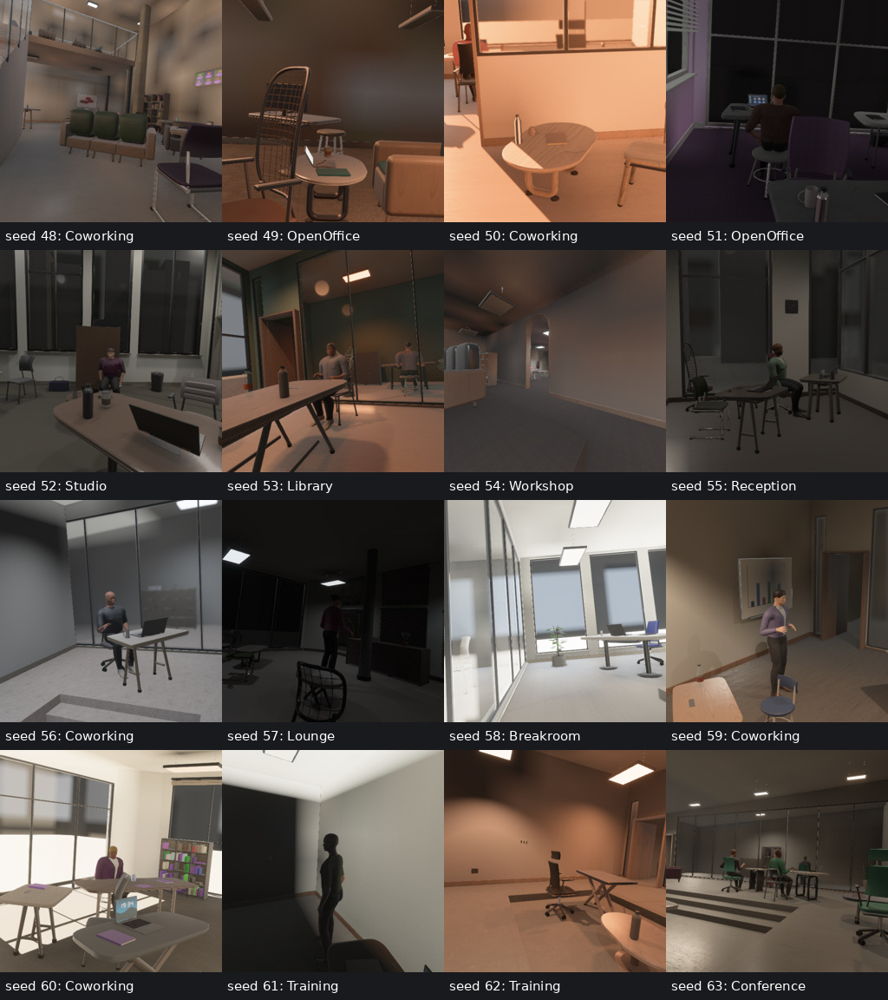
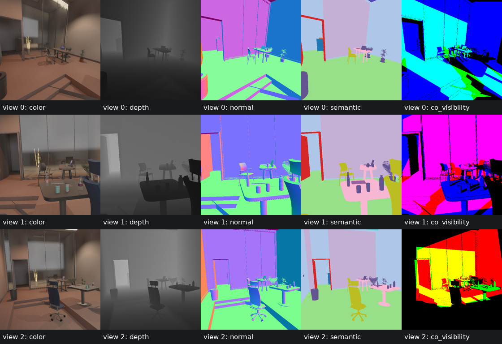

# Procedural geometry quality

The indoor generator samples continuous construction programs for room envelopes,
structural columns, seating, table tops/supports and potted plants. Dimensions,
curvature, taper and assembly details vary within manufacturing and placement
constraints. The captures and metrics below are bound to the
[qualification receipt](evidence/geometry_quality/receipt.json).
This is a source-bound geometry snapshot. The subsequent
[human clothing and motion qualification](human_quality.md) has its own current
source identity, denser human audit and render evidence.



## Construction

Seats, sofa backs and loose pillows use closed shaped cushions with independent
plan roundness, crown and shallow compression. Their top/bottom cloth panels and
perimeter boxing have metric UVs and a shared smooth normal field. Sofa cushions
have separate piping. A cushion has 704 triangles; equal finish/semantic parts
remain batched within each object.

Suspension chair backs have curved strands attached to a rounded perimeter frame,
with actual openings in the geometry. Padded lumbar panels follow the back's
contour. Cantilever chairs and loop table frames use continuous bends instead of
intersecting capped rods. Closed sweeps correct accumulated frame twist and weld
both wrap seams exactly. Backless stools remain present.



Table tops blend convex superelliptic and capsule outlines. A projective taper
preserves convexity. Prop placement tests the actual top, and mounting plates fit
inside its narrow end. Legs vary in taper and section aspect; pedestal bases have
a shaped edge and contact the floor. Top and underside finishes follow their
construction material. Wood retains metric grain along the long axis.



Planters sample belly, neck, wall thickness, lip and physical fluting. They have
inner walls and separate saucers. Soil and surface stones fit the actual hollow
profile. The tested botanical forms remain below 20,000 triangles per plant.

Structural columns vary continuously from elliptical to rounded square sections,
with aspect, rotation, taper and collar height. Their sections fit the collision
radius; joined collar/shaft rings avoid duplicate internal caps, and the top meets
the analytic sloping roof. Optional serialized profiles preserve legacy decoding.
The existing envelope programs still provide concave/oblique plans, arches,
sloped ceilings, level changes and mezzanines.

## Qualification

A consecutive 1,024-seed audit used mixed activities, furniture density 0.65,
human density 0.25 and three primary-room cameras. Every seed passed layout,
clearance, support, finite-attribute, normal and triangle-winding checks. Actual
mesh construction was checked for all 1,024 seeds with `--audit-geometry`.

The audit contained 440 concave envelopes, 914 with oblique edges, 695 sloped
ceilings, 385 with archways, 843 with pillars and 90 mezzanines. These features can
co-occur. Median mesh size was 292,965 triangles; the 95th percentile was 656,053.
There were no area-tolerance collapses in furniture or architecture. The audit
reported 2,673 such faces in inherited person geometry; this is retained in the
receipt, so this review does not claim universally nondegenerate human meshes.

| Sampled construction control | Instances | P05 | Median | P95 |
|---|---:|---:|---:|---:|
| Chair seat crown exponent | 7,105 | 2.913 | 3.906 | 4.898 |
| Cantilever chair bend, m | 1,027 | 0.027 | 0.046 | 0.063 |
| Suspension back strand pitch, m | 1,263 | 0.036 | 0.047 | 0.059 |
| Table capsule blend | 9,087 | 0.014 | 0.144 | 0.731 |
| Tapered leg ratio | 3,047 | 0.621 | 0.800 | 0.982 |
| Loop table bend, m | 1,512 | 0.027 | 0.046 | 0.063 |
| Upholstery cushion crown | 1,587 | 2.899 | 3.726 | 4.591 |
| Column section exponent | 1,845 | 2.158 | 3.565 | 7.372 |
| Column section aspect | 1,845 | 0.642 | 0.817 | 0.981 |
| Column taper ratio | 1,845 | 0.848 | 0.922 | 0.992 |
| Planter belly ratio | 2,251 | 0.829 | 0.926 | 1.024 |
| Planter neck ratio | 2,251 | 0.830 | 0.922 | 1.011 |

These are sampled program controls, subsequently constrained by object dimensions.
The new leg/bend/lattice distributions count only constructions that use those
controls. Preset counts and scalar variance do not establish perceptual diversity
or learning utility for ten million samples. Full histograms, primary/neighbor
object counts and placement heatmaps are in
[metrics.json](evidence/geometry_quality/metrics.json); the
[object CSV](evidence/geometry_quality/objects.csv) retains transforms and sizes.

## Native renders and annotations

All 64 consecutive rooms, seeds 0–63, were captured at three 512×512 views.
Native Auto quality retained shadows, SSAO, bloom, reflections, glass transmission
and baked diffuse GI. No dark or sparse samples were removed. The following
sheets show camera zero for every room; the isolated object galleries above are
illustrative construction coverage rather than distribution samples.






RGB, depth, normals, position, semantics and co-visibility passed aligned capture
checks for all 192 views. Native geometric planes used direct float32 targets.
The worst per-view reprojection P99 was 0.002616 pixels, depth/position P99 was
0.000002862 m, normal-length error was 0.000000239 and camera-pose error was zero.
Each view contained 6–15 semantic classes. Median directed peer visibility was
58.5%; median visibility shared with at least one peer was 77.9%. Placement proxy
estimates and measured pixel overlap remain separate.



The co-visibility previews have corresponding exact 16-bit membership masks and
separate validity PNGs in the evidence folder. Color alone is not the numeric
annotation. Additional aligned examples cover rooms 3, 5, 18 and 54.

People remain imperfect: 8 of the 48 rooms containing primary-room people never
showed them in the captured semantic views. Hair and some materials remain
visibly synthetic. Photographic accuracy against a path tracer and downstream
training utility have not been qualified by this geometry review.

## Reproduce

The core qualification passed 215 tests; three large qualification tests remained
explicitly ignored. Workspace/all-target Clippy passed with warnings denied.
The WebGPU viewer compiled with `web,human_motion`; browser rendering was not
rerun. Thin-polygon regression seeds 202 and 1,013,005 passed. Captures used the
registry WGPU build recorded in the receipt. Shared-GPU capture timing includes
PNG export and active downstream training, so it is not a controlled throughput
comparison.

```sh
cargo run --release --bin indoor_validate -- \
  --seed 0 --audit-seeds 1024 --audit-geometry \
  --cameras 3 --width 512 --height 512 --renders 64 \
  --labels --co-visibility --no-raw --asset-root "$PWD" \
  --output out/geometry_review
cargo run --release --example review_furniture -- out/seating_review seating
cargo run --release --example review_furniture -- out/plant_review plants
```

The Rust validator produces generator identity, distribution/coverage metrics,
per-seed topology diagnostics, captures, calibration and overlap reports. The
receipt records the actual library source, package versions, renderer and input
file hashes. Full local capture records are under `out/geometry_quality/final`.
This work has not been committed, pushed or published.
