# Procedural hair cuts and supported long grooms

Indoor people retain the `burn_human` Anny surface and skeleton. Hair now includes
long straight, wavy, curly and layered falls, asymmetric bobs, braids, twin braids,
high and low ponytails, locs, buns, pixie cuts and shorter grooms. Continuous cut
and grooming parameters change silhouettes within these topologies. This is a
local construction and rendering qualification; photographic strand realism is
not established. The [receipt](evidence/hair_quality/receipt.json) binds the
galleries, audits and model artifacts to their actual generator source.

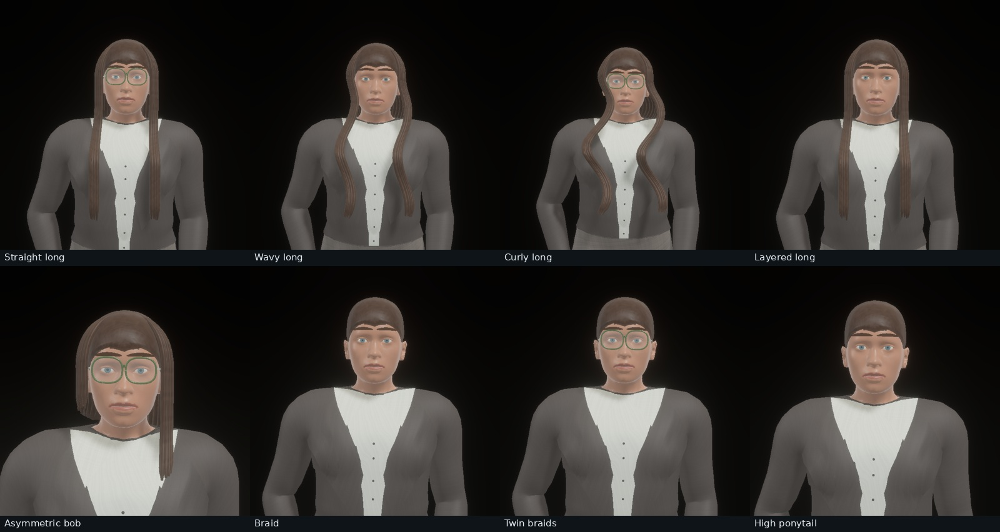
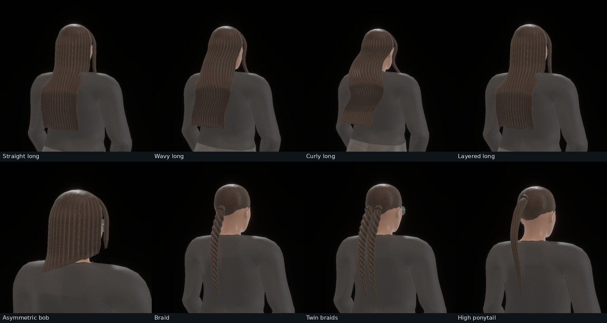

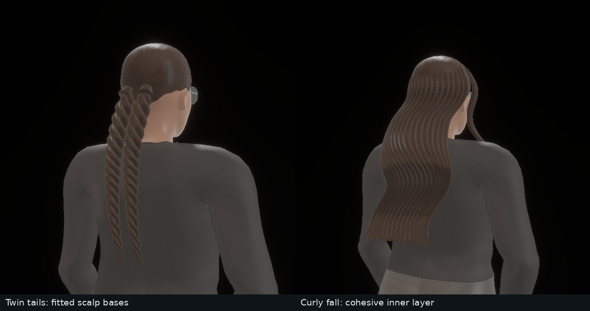

These fixtures fix the Anny female shape anchor at 0.95, source person seed 0,
body proportions, palette, pose and continuous grooming program, and vary the
cut topology. Review cameras frame each groom's actual bounds at a fixed 32-degree
field of view; these are appearance comparisons, not matched camera calibration
experiments. Alternating glasses are deliberate review coverage. Original
640×640 PNG pixels and serialized appearances accompany the receipt.

## Construction and motion

Loose lengths use closed, overlapping elliptical tresses rather than extending a
scalp shell radially over the shoulders. Narrow front falls and the rear mass
route around the actual Anny neck/chest/back profile. Coherent wave envelopes
keep neighboring locks together; seeded spacing, layer cuts, sweep and curl
vary the surface and tips. Loose rear falls include a thin, closed inner layer
fitted to the same lock paths, preserving head-width coverage around the torso
and filling gaps between locks. Tapering is confined to the final 2–4 cm at
reference stature, and sparse wisp centreline offsets are capped at 3 mm.
Locs retain separate round
sections. Plaits weave three bundles; ponytails vary attachment height and free
length. Each tied root is fitted independently to its own side of the actual
scalp, above the hairline, with a buried gathered base and a smooth transition
into its braid or tail. Bangs project their combed
paths onto the actual upper forehead instead of connecting bounding-box corners.
Short cuts vary hairline, side taper, part and crown volume. Afro volume uses
multiscale relief with broader roughness and reduced directional reflection;
its fine coiled structure remains approximate.

All additions use opaque geometry with metric fibre UVs, welded wrap normals
and tapered closed ends. There are no alpha-card fringes. The scalp chart has a
regular tangent frame at the crown; a longitude singularity had caused a bright
anisotropic zigzag. Collapsed scalp/hairline triangles are excluded during
construction. Separate neutral albedo, normal and spatial roughness maps,
directional dielectric reflection and independently sampled pigmentation retain
the existing shared scene texture bank.

Scalp and temple roots follow the head. Supported lower lengths smoothly blend
toward the torso, using the same height-based weights in static construction,
GPU skinning and annotation deformation. This prevents head rotations from
swinging an entire long fall through the chest or shoulder. It is a supported
groom approximation, without physical strand dynamics or cloth/hair collisions
solved each frame. Placement reserves conservative hair envelopes, and motion
admission checks the dressed geometry at generated and interpolated poses.

Each person still has one hair mesh, irrespective of lock count. Atlases are
shared and mipmapped; the change adds no per-person images, model initialization
or downloads. Static actors do not initialize motion generation. Motion prepares
the groom once and updates bones during playback. A controlled throughput
comparison was not run on the shared training GPU.

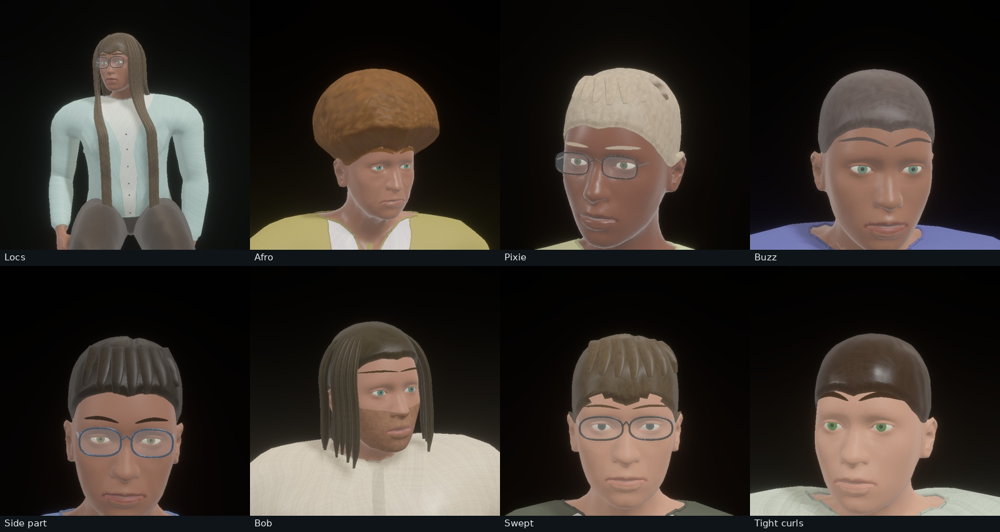
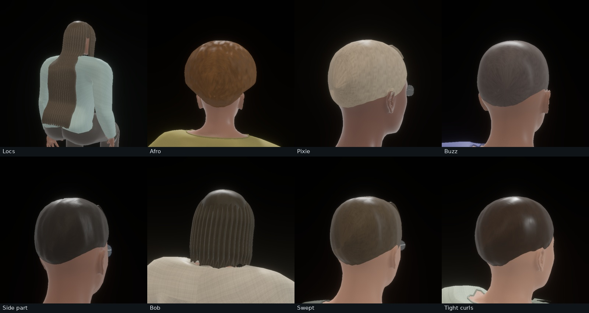
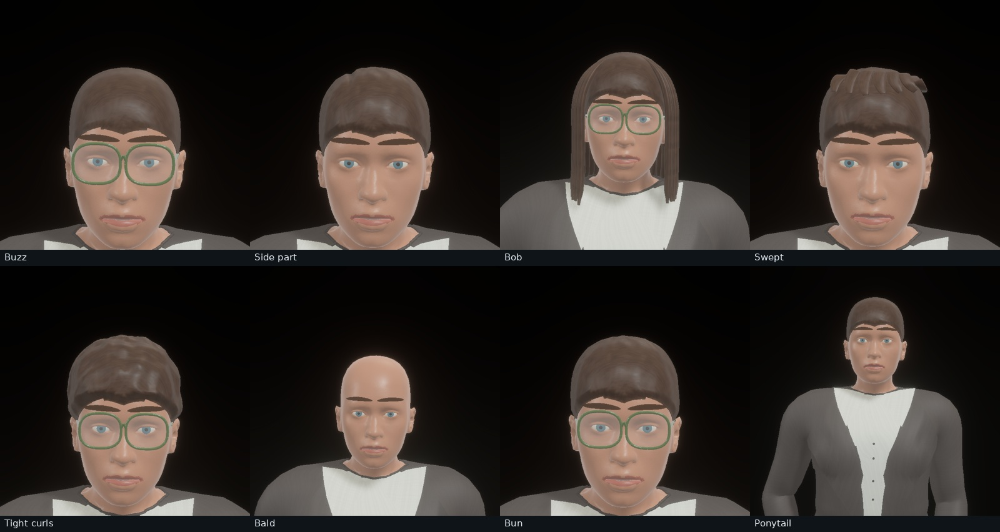
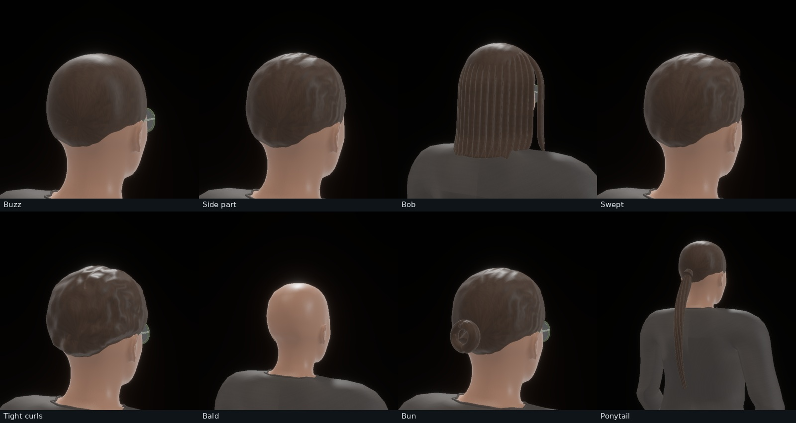

The independent fixtures use source seeds 16–23 with natural sampled poses;
their styles are forced for coverage. These fixtures are isolated review people,
not generated furnished-room layouts. Scene-level correctness and distribution
measurements below use unmodified sampled people.

## Sampled space

`appearance.hair_program` is serialized and replayable independently of the
body/palette sampling stream. It includes free drop, layers, spread, sweep,
wave length, curl radius, clump width, bangs, tie height and sparse flyaways.
Existing cap length, part, volume, hairline and grey controls remain active.
Style IDs 0–7 retain their previous meanings; 8–18 add new topologies. Style
sampling covers all 19 types independently of the sampled body shape.

A consecutive 256-room cohort, seeds 0–255, at furniture density 0.65 and human
density 0.7 contains **1,328 people** and all 19 hair types, with 49–91 instances
per type. All rooms pass layout, clearance and actual construction checks.
The [metrics](evidence/hair_quality/metrics.json) export named style counts,
continuous control histograms and the existing placement heatmaps. Metrics schema
15 and generator identity 26 describe this cohort.

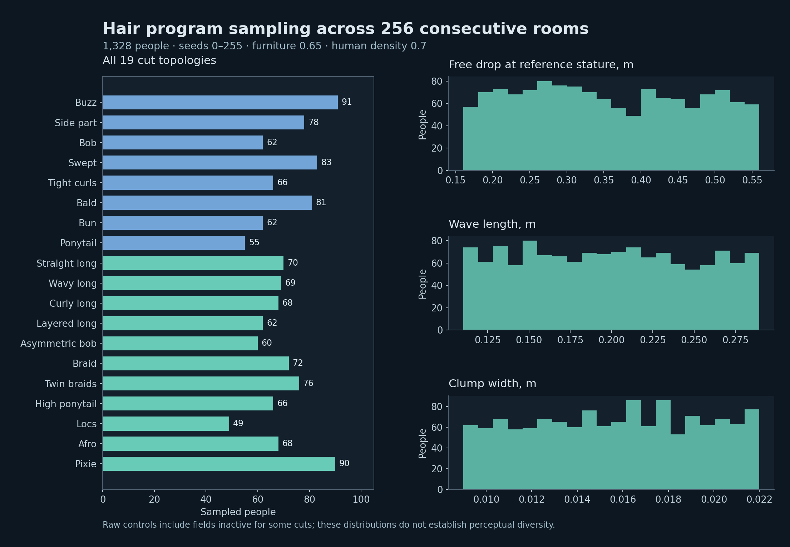

| Sampled control | P05 | Median | P95 |
|---|---:|---:|---:|
| Free drop, m at reference stature | 0.183 | 0.348 | 0.537 |
| Layer fraction | 0.142 | 0.471 | 0.812 |
| Spread factor | 0.880 | 1.062 | 1.257 |
| Sweep | −0.582 | −0.014 | 0.583 |
| Wave length, m | 0.119 | 0.198 | 0.281 |
| Curl radius, m | 0.0072 | 0.0164 | 0.0259 |
| Clump width, m | 0.0097 | 0.0158 | 0.0215 |
| Tie-height fraction | 0.207 | 0.480 | 0.748 |

These are sampled control distributions, including fields inactive for some
styles, such as free drop on a buzz cut. Actual lengths depend on stature,
topology, layering and pose. Selector counts and numeric variance do not measure
perceptual distances, effective dataset entropy or 10M-sample learning utility.

## Native rendering and annotation checks

Actual construction of the 256 rooms produced **153,792,941 triangles**, with
zero faces flagged by the geometry audit's degeneracy tolerance. The
[per-seed audit](evidence/hair_quality/geometry_audit.json) retains the raw counts.
This is bounded seed coverage, not a guarantee for every possible parameter set.

Eight consecutive rooms, seeds 0–7, were captured from three 512×512 views each
with native Auto quality, shadows, SSAO, bloom, diffuse GI and specular transmission
retained. No rooms or views were selected by image quality. All eight rooms show
some person pixels, which does not establish visibility of every individual.
The 24 views contain 8–15 semantic classes each.

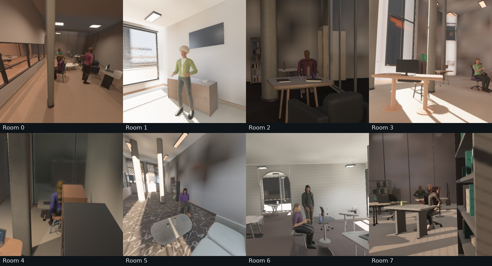
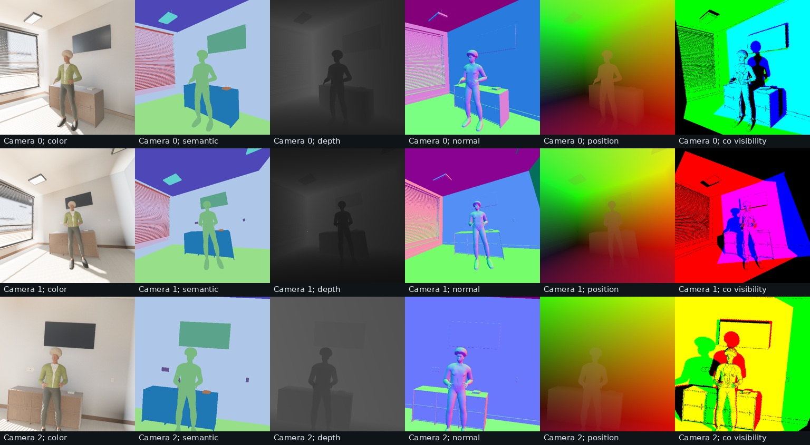

Worst per-view reprojection P99 is **0.00246 pixels**; depth/position P99 disagreement
is **2.87 µm**, and maximum normal-length error is **2.39×10⁻⁷**. Camera pose export
matches exactly in these captures. Directed rendered peer visibility has
P05/median/P95 of **0.210/0.615/0.829**. Captures use direct float32 annotations.
[Capture checks](evidence/hair_quality/room_capture_checks.json) retain the
renderer, alignment, scene bounds, person pixel counts and co-visibility results.

The real-model motion probe planned 64 consecutive rooms, then generated two
consecutive scenes with up to two actors each. Three clips were admitted;
one requested actor remained static because no collision-free behavior fit the
available space. Admitted styles include long straight hair and locs. Cached
ARDY/Llama artifacts loaded once across the two generated scenes.

Twenty views cover two cameras at five synchronized scene times per room with
RGB, semantic, depth, normal and optical flow. No expected valid static flow
pixels were missing; worst static-flow reprojection P99 is **0.00417 pixels**.
Only room 1 shows moving-person pixels, with 332 over its sampled views. This
small motion probe checks admission and annotations, not close-up temporal hair
quality. Rejections and kinematics are retained in the receipt.

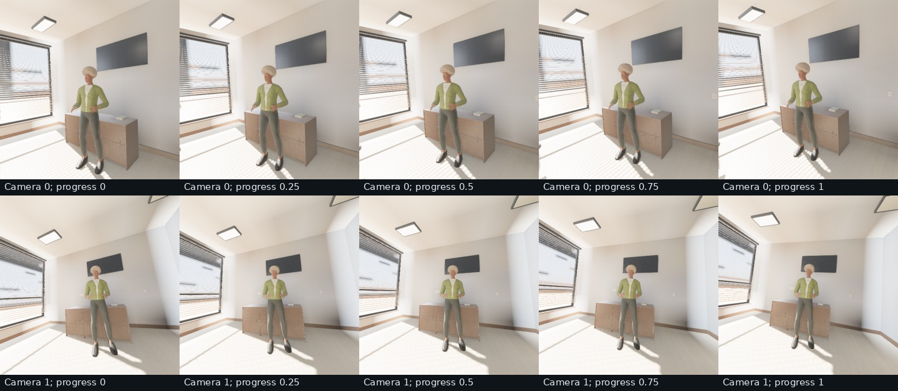

The final core suite passes **239 tests**, with three explicit qualification
tests ignored. Strict workspace/all-target Clippy and the motion-enabled WebGPU
viewer compile pass. A browser runtime review was not repeated. The upstream
`burn-cubecl` future-compatibility notice remains separate from Clippy results.
This local source uses the existing wgpu-core/wgpu-hal 29.0.4 patches recorded
in its provenance; it is not registry-only or release qualification.
The tied-root regression spans two head-size envelopes, five tie heights,
two scales and all five tied cuts; full Anny construction tests additionally
cover every cut on male/female shape extremes. The capture engine records
`hair=5` for this attachment and loose-mass construction.

## Reproduction

Run from the repository with the bundled Anny reference installed. Motion uses
the existing model loader/cache; the first uncached run can download its models.

```sh
cargo test --lib --features human_motion
cargo clippy --workspace --all-targets --features human_motion -- -D warnings
cargo check --target wasm32-unknown-unknown --no-default-features \
  --features web,human_motion --bin viewer
cargo run --release --example review_humans --features human_motion -- \
  out/hair_review/long --female --standing --hair-start 8 --same-person
cargo run --release --example review_humans --features human_motion -- \
  out/hair_review/short --female --standing --hair-start 0 --same-person
cargo run --release --example review_humans --features human_motion -- \
  out/hair_review/varied --female --hair-start 16 --seed 16
cargo run --release --bin indoor_validate --features human_motion -- \
  --seed 0 --audit-seeds 256 --audit-geometry --cameras 3 \
  --width 512 --height 512 --renders 8 --human-density 0.7 \
  --labels --co-visibility --no-raw --asset-root "$PWD" \
  --output out/hair_review/rooms
cargo run --release --bin motion_validate --features human_motion -- \
  --seed 0 --seeds 64 --render-seeds 2 --flow \
  --policy '{"fraction":0.8,"max_actors":2,"frames":120,"batch_size":2,"max_attempts":2}' \
  --output out/hair_review/motion
```

Hair remains visibly synthetic in closeups: cap shading, regular aggregate locks,
fine curls and flyaways need further physical/perceptual qualification. There is
no calibrated strand BSDF, multiple fibre scattering or dynamic grooming solver.
The galleries are renderer outputs, without generative-image enhancement.
