# Procedural human clothing, appearance and motion

Indoor people retain the skinned `burn_human` Anny body and rig. Continuous garment
cuts, trouser silhouettes, constructed footwear, local cloth creases, facial
dimensions and groom parameters expand the appearance space. Motion samples
obstacle-aware travel programs after furnishing placement and admits the actual
dressed render geometry. This is a local
construction and annotation qualification, not a claim of photographic humans.
The [receipt](evidence/human_quality/receipt.json) binds all evidence to the
renderer, package versions, source and model artifacts used.

The [long-hair review](hair_quality.md) separately qualifies the expanded cut
programs with current front/rear galleries, construction audits and motion checks.
The cohort and receipt below retain their own source identity.

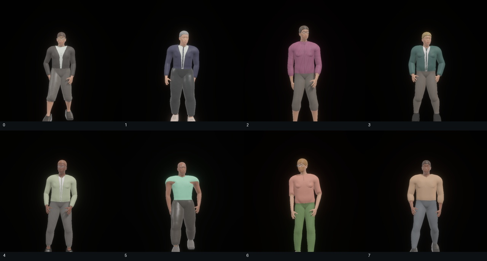
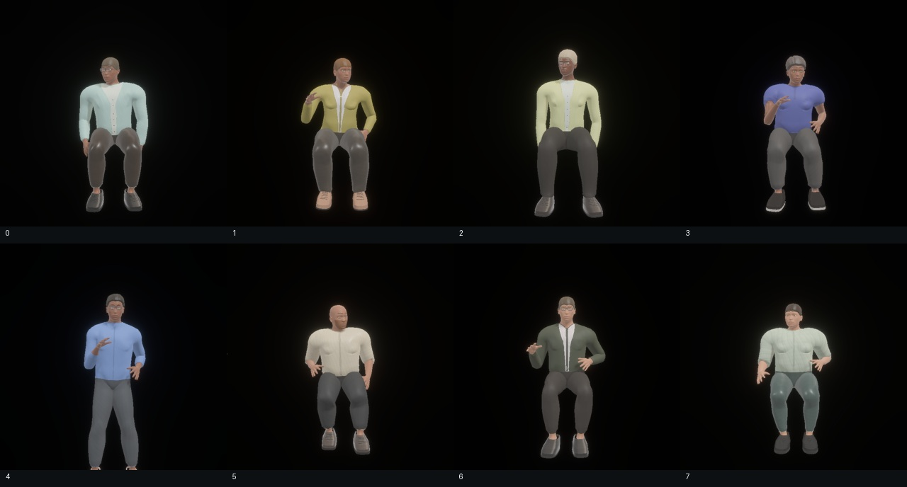

## Clothing construction and PBR

The wardrobe includes tees, polos, shirts, knitwear, cardigans and blazers.
Within each, sewn programs independently vary neckline width/depth/roundness,
sleeve and trouser coverage, ease, torso drape, collar/placket dimensions and
pocket dimensions/presence. Leg straightness and hem width continuously vary
calf taper and the knee-to-ankle silhouette. Their parameters are serialized with
the person; legacy appearance records decode with defaults.

Garment cuts split triangles along the neckline, sleeve and trouser hems while
sharing interpolated positions and UVs across material boundaries. Bare hands
remain skin and receive no garment displacement. Torso contours bridge small
anatomical depressions with smooth, nearly elliptical sections and a supported
front panel. Leg sections bridge the calf contour with bounded displacement,
fading at the bare ankle and waist. Twenty localized crease fields concentrate
around hems and bending joints, with bounded relief;
there is no whole-body periodic sine displacement. Collars, lapels, pockets and
plackets project onto the dressed triangles and retain Anny skinning during motion.

Woven garments reuse bounded scene texture banks. Jersey/knit garments use a
separate stockinette loop program with correlated albedo, height, roughness and
occlusion; its one neutral atlas is shared per room and generated only when used.
Actor tint, textile scale and rotation vary independently. Normal/data maps use
linear channels and mipmaps. These are procedural aggregate PBR approximations,
not measured cloth BSDFs or a cloth dynamics simulation.

## Constructed footwear

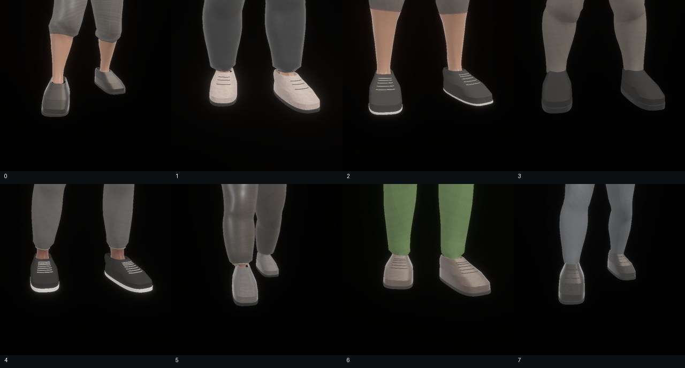
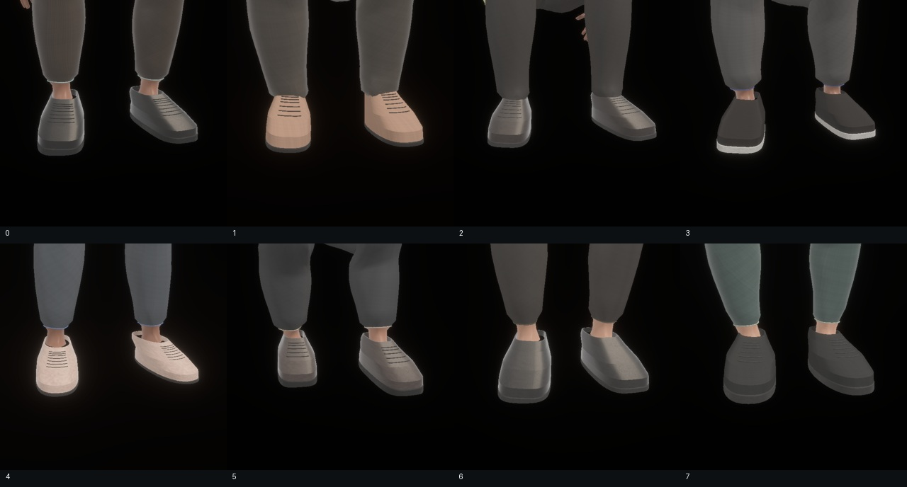

Shoes use independent meshes for the upper, beveled rubber sole and optional
laces. A body-fitted last follows the actual ankle and foot dimensions, with
continuous toe room, toe roundness, heel width, vamp height, collar height and
sole thickness. Closed collars follow the ankle section rather than the broad
forefoot. Canvas/leather finishes and upper/sole colors vary independently of
the garment palette. Scene texture banks supply albedo, normal and roughness
maps with metric UVs; no per-person image is allocated.

During motion each shoe is rigidly attached to its own Anny foot bone; articulated
toe bones cannot stretch the upper or laces. All parts retain the person semantic
label and participate in person bounding boxes, export and motion admission.
The largest sampled construction uses about 5,032 triangles per pair. These
stylized lasts provide construction diversity, not scanned footwear fidelity.

## Face and hair

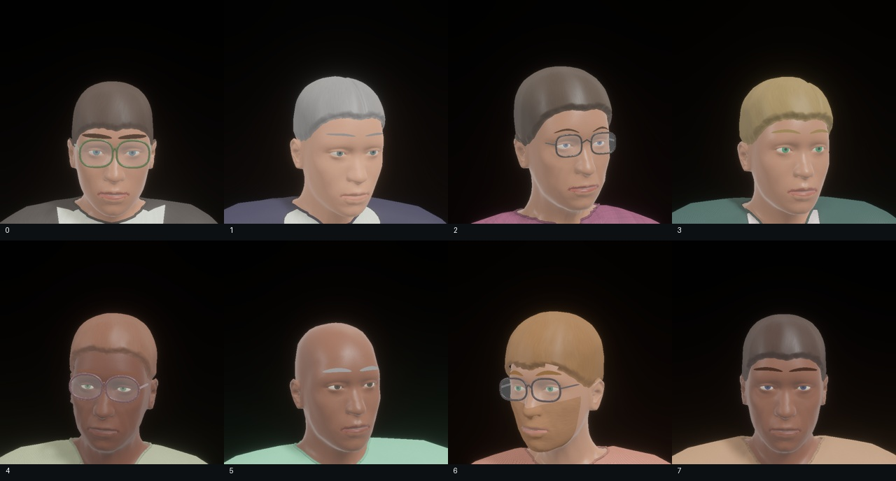
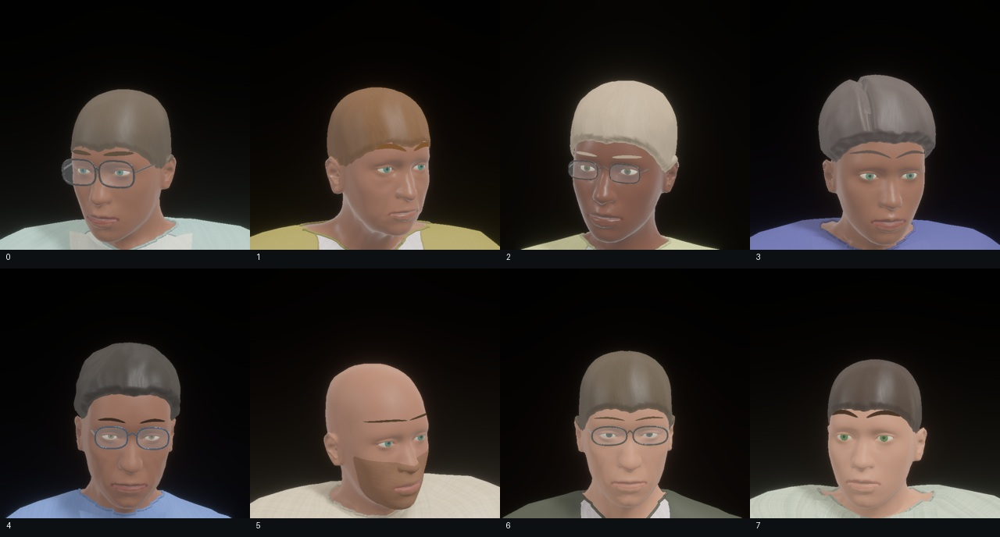

Iris pigment is sampled independently of skin melanin. Brow width/thickness/arch,
lip tint, stubble density and eyewear frame tint/metallicity vary continuously.
The lip mask retains anatomical mesh ownership. Stubble splits facial triangles
across the facial bones rather than adding coincident alpha planes. Skin and hair
have separate neutral albedo/normal/roughness maps.

Opaque scalp and tied-hair geometry vary volume, hairline height, length, part,
curl and grey share. Smooth seeded clump fields change the aggregate silhouette;
warped fibre microstructure and directional rough PBR replace regular stripes.
Brow, frame and lens attachments follow the head during motion. Studio images
force eight groom styles and alternating glasses for construction coverage; they
are illustrative, not random distribution samples. The room audit below uses
unmodified sampled appearances.

## Measured appearance space

A consecutive 256-room audit at furniture density 0.65 and human density 0.7
sampled 1,367 people. Every room passed layout and clearance validation, and actual
mesh construction was audited for all seeds. Sampled outfits were polo 246,
cardigan 234, knitwear 230, shirt 229, blazer 219 and tee 209. Each of eight groom
selectors appeared 154–180 times; dimensions and fields vary within selectors.
Full categories, scalar histograms and placement heatmaps are in
[metrics.json](evidence/human_quality/metrics.json).

| Continuous control | P05 | Median | P95 |
|---|---:|---:|---:|
| Neckline depth, m | 0.0129 | 0.0615 | 0.1100 |
| Garment ease, m | 0.0087 | 0.0163 | 0.0241 |
| Trouser ease, m | 0.0059 | 0.0140 | 0.0222 |
| Knee-to-ankle trouser coverage | 0.256 | 0.891 | 0.983 |
| Leg straightness | 0.187 | 0.538 | 0.931 |
| Hem width factor | 0.734 | 1.029 | 1.314 |
| Torso drape | 0.213 | 0.544 | 0.880 |
| Local fold amplitude, m | 0.00098 | 0.00240 | 0.00388 |
| Shoe toe room, m | 0.0055 | 0.0104 | 0.0154 |
| Shoe sole height, m | 0.0107 | 0.0180 | 0.0252 |
| Shoe collar raise, m | 0.0020 | 0.0247 | 0.0475 |
| Shoe toe roundness | 2.388 | 3.287 | 4.122 |
| Hair volume factor | 0.606 | 1.091 | 1.597 |
| Brow width, m | 0.0348 | 0.0420 | 0.0492 |

These are sampled controls, not perceptual distances. For collared outfits the
effective neckline depth is reduced during construction. Clothing remains a
body-derived shell: the audit contains 937 person faces below its area tolerance
across 143,679,225 total triangles. Architecture and furnishings had no such
faces. [Per-seed topology](evidence/human_quality/geometry_audit.json) retains
these counts; this qualification does not assert universally nondegenerate people.

## Motion programs and admission

Motion remains optional: absent policy creates no worker, device or model load.
Enabled generation uses the existing cached ARDY/Llama loaders, batched requests
and independent per-scene/per-actor noise. Static people remain in mixed scenes.
Travel programs sample lateral bends, partial returns and corner radii in metres.
Routing considers placed furniture and room boundaries. A fillet is accepted only
when its swept segments remain clear; otherwise the original corner is retained.
Return routes reserve a physical semicircular turnaround with offset outgoing
and incoming lanes, avoiding a zero-tangent cusp and instantaneous heading reversal.
Waypoints and headings follow the resulting route. Short return prompts explicitly
ask the actor to turn around and come back.

Locomotion admission measures maximum root excursion, allowing return walks
whose endpoint lies near their start. Stationary headings use the Anny/ARDY facing
conversion. Validation includes skinned hair, garment and face attachments at
generated and interpolated poses, with a conservative broad phase. Playback
retains bone uploads rather than performing CPU cloth simulation every frame.

Across 256 consecutive planning rooms, 414 feasible requests produced 222 distinct
texts and 82 action-program signatures. The audit observed eight gaits, 33 action
types, and locomotion, gesture, exercise, dance, floor and idle programs. Travel
recipes included 105 bends, 35 direct paths and 12 returns. Continuous speed,
amplitude, repetition timing, path shape and action ordering also vary. The pinned
tokenizer measured a maximum of 45 of 64 tokens including the header. Counts are
planning coverage, not proof the model performs every requested behavior.
See [prompt distributions and examples](evidence/human_quality/prompt_distribution.json).

Four consecutive rooms were actually generated with the real models, two actor
slots per room, 120 frames, batch size two, ten diffusion steps and at most two
attempts. Models loaded once across the run; four generation batches and one
text-embedding cache hit were recorded. Five clips passed admission. One slot
per room in rooms 0–2 could not find a collision-free plan. These three people
retained static poses; the rooms were still captured. All five feasible model
requests passed admission, including a return march in room 0. This small run
does not establish an unrestricted model success rate.

| Room / admitted behavior | Horizontal root path, m | Waypoint error P95, m |
|---|---:|---:|
| 0 / return march | 2.648 | 0.061 |
| 1 / tiptoe | 1.333 | 0.038 |
| 2 / shuffle | 1.918 | 0.125 |
| 3 / calf raises | 0.287 | 0.054 |
| 3 / tiptoe | 2.427 | 0.087 |

Raw clips use 20 fps and 5.95 seconds. Diagnostics record root velocity,
acceleration and joint angular-speed distributions in physical units, separately
from normalized capture progress. They are not perceptual quality thresholds.
Clip joint-speed P95 ranged from 0.585 to 1.706 rad/s; longer and human-rated motion
qualification remains necessary. [Summary](evidence/human_quality/summary.json)
links the numbers to per-clip records and all rejection reasons.

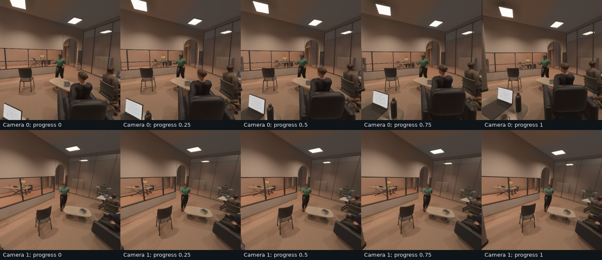
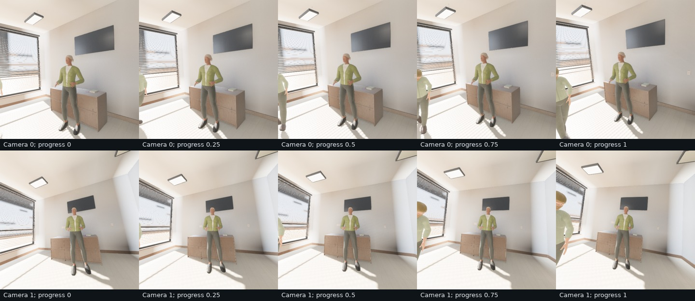
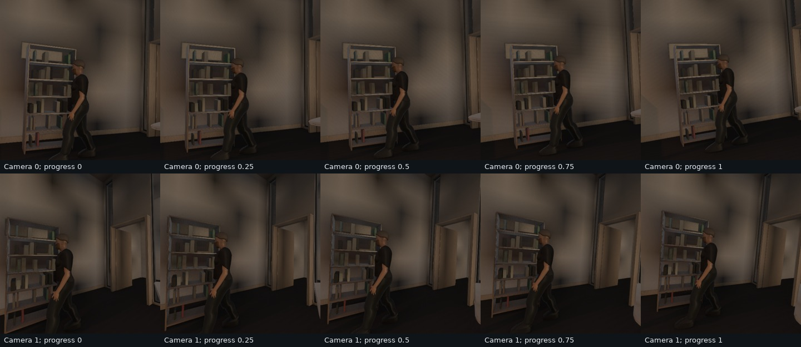
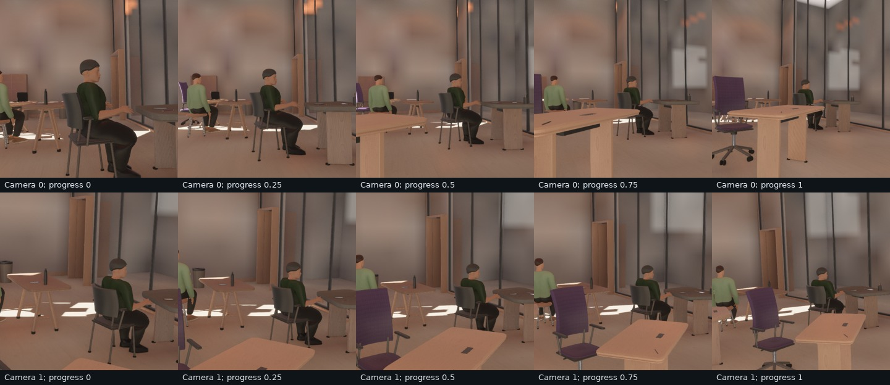

The motion gallery retains every room. Moving people were visible in room 1,
with 26,913 moving-person flow pixels summed across intervals/views. Rooms 0, 2
and 3 had no moving-person flow pixels in these views. Their hidden actors still
passed geometry admission, but those RGB captures do not establish visible
performance of the return march, shuffle, calf-raise or room-3 tiptoe behaviors.

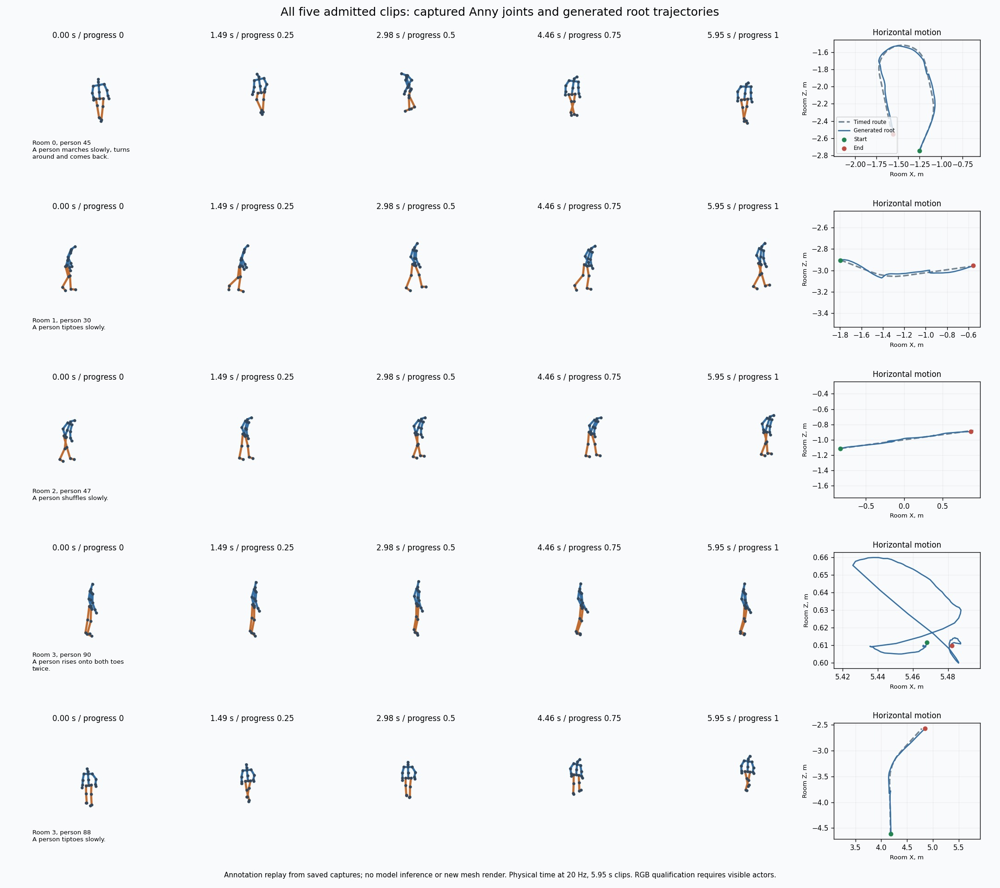

The [focused replay records](evidence/human_quality/motion_pose_replay.json)
show every admitted actor's saved Anny pose annotations
at five physical times and overlays its generated root trajectory on the timed
navigation route. It reuses the captured records without loading a model or
rendering a new mesh. This establishes pose/path inspection for hidden actors;
it cannot establish their clothing appearance in RGB.

## Production room captures and annotations

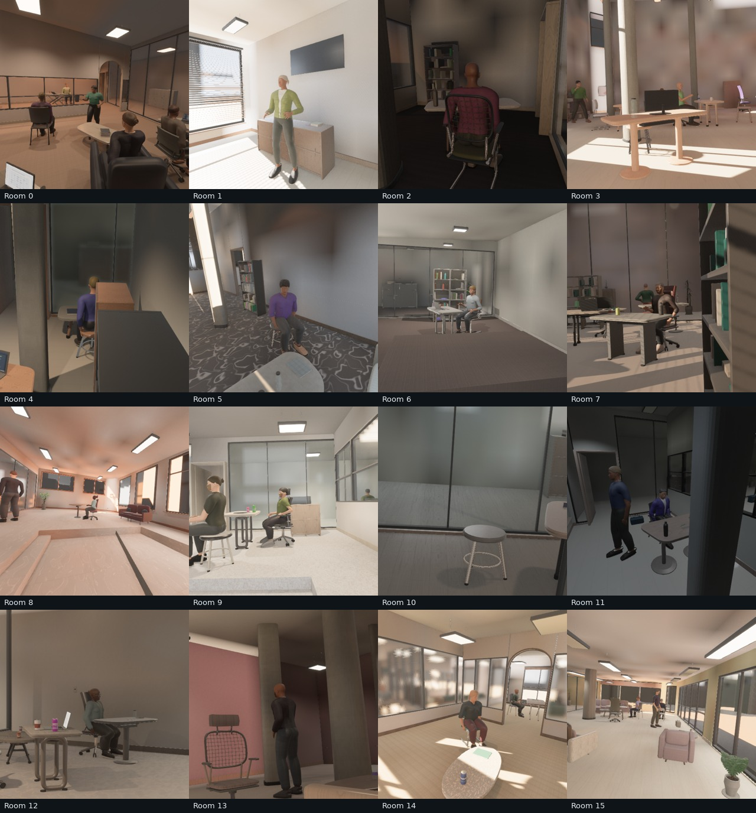
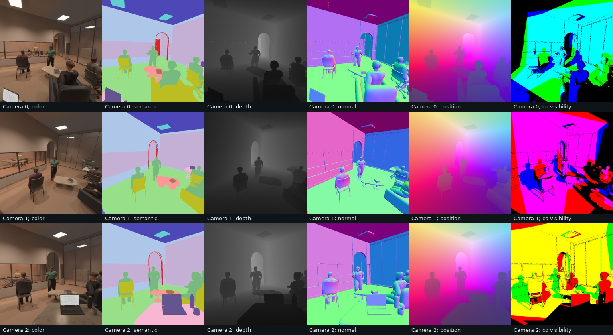

Sixteen consecutive rooms were captured at three 512×512 views with native Auto
quality, shadows, SSAO, bloom, specular transmission and baked diffuse GI retained.
Fifteen of sixteen rooms showed people in at least one semantic view. Room 10's
people were hidden in all three views; visibility of every person is not ensured.
Each of 48 views had 6–16 semantic classes. RGB, depth, normals, position,
semantics and co-visibility passed aligned checks.
The largest per-view reprojection P99 was 0.002470 pixels, depth/position P99 was
0.000002861 m, and normal-length error was 0.000000239. Camera-pose error was zero.
Geometric attachments used direct float32 targets. Median directed peer visibility
was 56.5%; median visibility shared with any peer was 77.4%.

The four motion rooms additionally produced 40 views across five timesteps with
depth/normal/semantic and forward optical-flow/motion-vector checks. All expected
static-flow validity pixels were present; the largest static reprojection P99 was
0.002423 pixels. Flow measures displacement over the captured interval, not viewer
FPS. Final-timestep vectors and validity are zero. Capture metadata records readiness,
model admission and the policy that planned moving people are omitted from static
indirect transport while retaining live direct shadows.

## Qualification limits and reproduction

Hair remains an aggregate sculpted surface; faces, eyewear, snug cloth and
stylized footwear remain visibly synthetic. Some trousers retain overly glossy
or anatomical contours despite the sampled cut. Garments do not simulate
gravity/contact during playback. The galleries are deliberately unretouched and
retain dark views, occlusion and admission failures. No photographic accuracy
against a path tracer, broad motion success rate, unlimited-run memory stability
or ten-million-sample learning utility is established by this audit.

The final source passed 236 core tests, workspace/all-target Clippy with warnings
denied, and motion-enabled WebGPU viewer compilation. Three large qualification
tests remained explicitly ignored; browser runtime was not rerun. Native captures
used the root manifest's existing local WGPU patches, included in the source hash,
so this is not registry-only qualification. GPU activity was shared with downstream
training and these timings are not a controlled throughput benchmark. Work remains
local and unpublished.

```sh
cargo test --lib --features human_motion
cargo clippy --workspace --all-targets --features human_motion -- -D warnings
cargo check --target wasm32-unknown-unknown --no-default-features \
  --features web,human_motion --bin viewer
cargo run --release --example review_humans --features human_motion -- \
  out/human_review/standing --standing
cargo run --release --example review_humans --features human_motion -- \
  out/human_review/seated --seed 16
cargo run --release --bin indoor_validate -- \
  --seed 0 --audit-seeds 256 --audit-geometry --cameras 3 \
  --width 512 --height 512 --renders 16 --human-density 0.7 \
  --labels --co-visibility --no-raw --asset-root "$PWD" \
  --output out/human_review/rooms
cargo run --release --bin motion_validate --features human_motion -- \
  --seed 0 --seeds 256 --render-seeds 4 --flow \
  --tokenizer out/human_quality/tokenizer.json \
  --policy '{"fraction":0.8,"max_actors":2,"frames":120,"batch_size":2,"max_attempts":2}' \
  --output out/human_review/motion
```

`--tokenizer` is an optional audit input downloaded from the official ARDY text
manifest; model inference itself uses the cached model loaders. Its hash is in
the receipt. The Rust tools generate the distributions, metadata, raw diagnostics
and captures. Full records are retained locally under `out/wardrobe_quality/final_*`.
