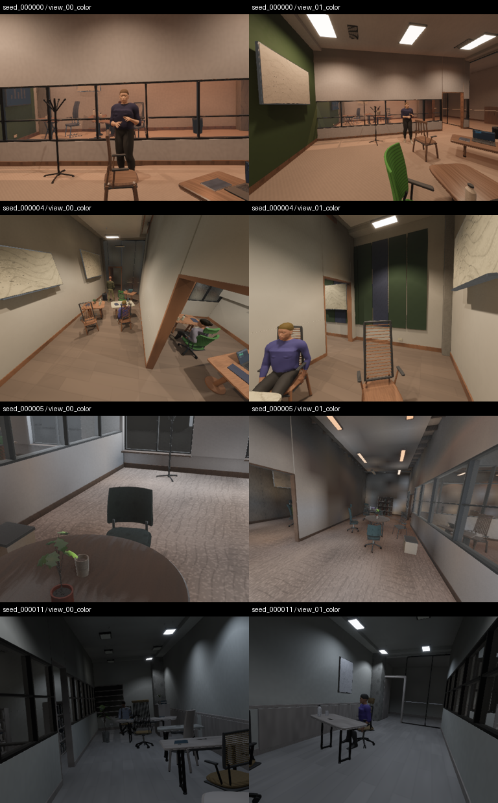
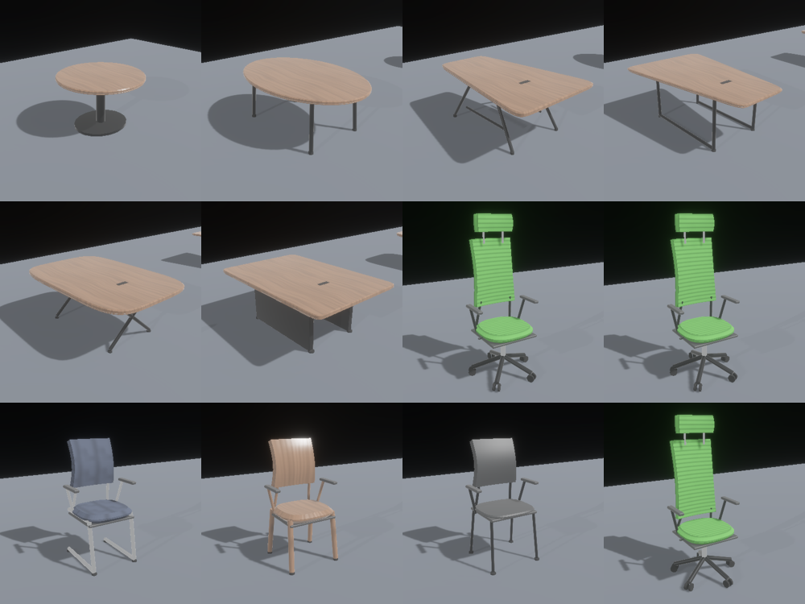
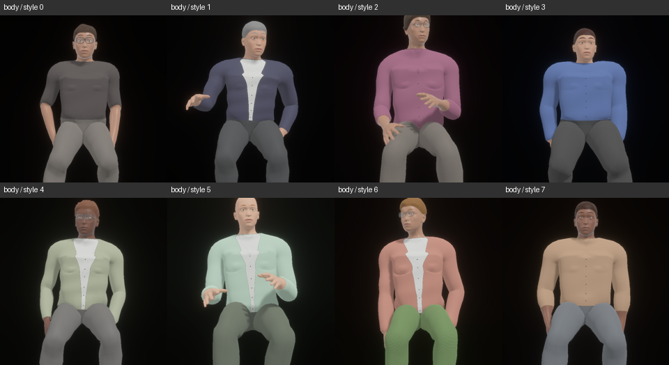

# Indoor generation 13: capture readiness and visual review

> **Archived evaluation.** This report describes its recorded build. Use the
> [documentation index](README.md) for current capabilities and defaults.

Headless capture now waits for the current scene, its assets, generated human
trajectories and indirect lighting before enabling capture cameras. GPU asset
uploads and pipeline compilation then gate readback. Generator 13 also expands
continuous furniture, clothing, glazing and lighting parameters. This is a local
validation of those changes, not evidence of photographic realism or 10M-sample
learning utility.

The [measurements](evidence/indoor_v13/summary.json),
[parameter distributions](evidence/indoor_v13/rooms/metrics.json),
[capture distributions](evidence/indoor_v13/rooms/capture_distribution.json) and
[placement heatmaps](evidence/indoor_v13/rooms/placement_heatmaps.svg) retain the
audit. [Source and artifact hashes](evidence/indoor_v13/provenance.json) identify
the final local snapshot; no release or remote CI run was performed.



## Capture contract

`src/sample/readiness.rs` owns the preparation barrier. Pending procedural
construction, unresolved assets, unfinished primitives, pending lighting and
motion generation all hold it closed. An applied motion policy requires a
nonpending `Ready` report with the **current scene seed**. A completed report from
the previous room cannot release the new room. Failed preparation remains a
capture error instead of producing an incomplete sample.

Headless capture cameras remain inactive during preparation and after a pending
readback has already been submitted. The render device can still upload assets
and run inference. Once preparation finishes, `src/io/image_copy/readiness.rs`
checks render meshes, GPU images, prepared standard materials and shader
pipelines. Existing transform settling frames remain in place before readback.
The capture metadata exports `capture_readiness` and `render_readiness`, including
the seed, blocker, blocked update count, missing GPU assets and pipeline count.

Sampling owns playback time, starts at normalized time zero and advances only
through the configured steps. Explicit camera path lengths of zero now produce
an exact static transform, without target jitter, roll or interpolation drift.
An editor camera is not created when there is no window; this also fixes a GPU
culling panic exposed by the windowless capture regression.

The [GPU regression](evidence/indoor_v13/logs/capture_coherence.log) holds assets,
pending motion and a stale motion report independently, asserting that neither
camera rendering nor copy requests start early. It then exercises float32
geometry, the legacy float16 path, regeneration, camera metadata, capture-time
ownership and interactive sampling. Three legacy float16 views had p99
reprojection errors of 1.27–1.61 pixels; that compatibility mode retains its
quantization limits. The float32 path is used for the room audit below.

## Real native and browser motion

The real [CLI run](evidence/indoor_v13/motion_cli/validation.json) generated two
rooms with two cameras, three timesteps (`0`, `0.5`, `1`) and seven channels:
RGB, depth, normal, position, semantic, optical flow and motion vectors. Both
rooms waited for matching completed motion reports. Four people received motion;
four remained static. Moving joint displacements ranged from 0.57 to 2.79 m;
static joint deltas were zero. All exported channel values were finite. O-voxel
exports contained 3,162 and 3,208 occupied cells. The process loaded the motion
models once across both rooms. A separate Cornell cube CLI smoke test passed
with RGB/depth/normal.

The final Wasm build passed an actual [Chrome WebGPU run](evidence/indoor_v13/web/report.json)
on Linux/NVIDIA. A static control loaded no ARDY/Llama models and produced
identical images. With the same fixed camera policy, the motion case accepted
two clips and changed 14,514 pixels by more than 4/255 between screenshots.
Regeneration accepted two more clips without requesting the model manifests
again. Bevy and inference used one GPU device; no GPU validation errors or
application panics were observed. The static case took 11.9 seconds and the motion
case, including regeneration, took 90.9 seconds; these are whole-test durations,
not frame-time or inference benchmarks. The console retains an unrelated favicon
404 and the upstream four-influence skinning warning.

[First moving frame](evidence/indoor_v13/web/motion_0.png) ·
[Second moving frame](evidence/indoor_v13/web/motion_1.png) ·
[Regenerated room](evidence/indoor_v13/web/regenerated.png)

The browser test uses a local mirror of the official model artifacts. It does
not qualify CDN/CORS deployment, every browser/adapter, or browser dataset
readback. One earlier browser attempt stalled before the scene-loaded log and
was cancelled; its cause was not established. A subsequent probe run and the
final-build run both completed.

## Procedural changes

| Domain | Additional sampled parameters and behavior |
| --- | --- |
| Chairs | Seat width/depth, back width, arm-pad length, base radius, leg splay and spoke count; foot geometry follows the sampled leg endpoints. Existing curvature, taper, recline, headrest and footprint programs remain. |
| Tables | Continuously sampled pedestal/base dimensions and aspect ratio; end-panel supports; wood, ceramic, plastic and concrete tops. The wood UV axis continues to follow the long table axis. |
| Clothing | Sleeve coverage, hem length, weave scale and orientation. Neutral trousers are more common; cuffs still exclude wrists, hands and fingers. |
| Hair | Solid bun and low-ponytail geometry attached to the Anny head, with seeded strand texture frequency. No transparent hair cards were introduced. |
| Architecture | Partition mullion pitch and optional transom position vary continuously. Transom endpoints are inset from mullions; overlap checks pass. |
| Materials | Shared seeded cloth warp/weft and twill programs, per-person UV variation, ceramic texture maps, and per-tile stone-vein phase/orientation. Human material generation is separated into `materials/human.rs`. |
| Lighting | Spatial fixture intensity and color-temperature gradients augment the existing solar, sky, exposure, circuit and fixture programs. Intensity remains bounded and temperature is clamped to 1,800–9,000 K. |





[Portraits](evidence/indoor_v13/people/portrait_contact.png) ·
[Bun from behind](evidence/indoor_v13/people/rear_6.png) ·
[Ponytail from behind](evidence/indoor_v13/people/rear_7.png)

The human review captures eight actors from the front and the two new styles
from behind. Hands retain skin materials and the new hair geometry attaches to
the head, but hair remains visibly stylized. Cloth textures, garment silhouettes
and facial shading still fall short of photographic people.

## Glass and lighting noise

Clear glass now samples roughness 0.005–0.045. The former 0.089 minimum was useful
for Bevy's reflection BRDF clamp but also broadened transmission blur, making
clear panes hazy. Frosted glass retains its separate roughness range. Closed
glass slabs cull backfaces to avoid a second overlapping refraction contribution.
Indoor transmission uses 32 taps natively and 16 in Wasm. Glass remains excluded
from generic procedural surface textures.

The [paired diagnostic](evidence/indoor_v13/glass/glass_comparison.png) uses two
views of seed 44 on identical **v12 geometry**, before the diversity changes.
Semantic masks matched. Across 24,919 eroded glass pixels, mean RGB change was
0.00138. Spatial Laplacian RMS increased from 0.05669 to 0.06207 as edges became
sharper. That measurement mixes image structure and noise: it does **not** prove
noise reduction. Screen-space transmission and approximate indirect lighting
remain limitations, and no new Cycles comparison was performed.

## Distribution and annotation results

The CPU audit covers consecutive seeds 0–127 at density 0.65, human density 0.5
and two cameras per room. All 128 passed geometric/procedural validation. The
metrics export contains 388 numeric distributions, category counts, correlations
and object/camera placement heatmaps. Counts include zero-count rooms.

| Measurement | Observed |
| --- | --- |
| Chairs / tables, desks and coffee tables / people | 1,497 / 1,355 / 670 |
| Room area / height | 38.17–266.86 m² / 2.65–4.80 m |
| Camera vertical / horizontal FOV | 28.60–106.14° / 37.55–121.18° |
| Cameras inside the primary room | 256/256 |
| Chair seat width fraction | 0.6601–0.7999 |
| Partition mullion pitch | 0.651–2.095 m |
| Sleeve coverage parameter | 0.00031–0.99819 |
| Table support category counts, 0–5 | 223, 209, 237, 222, 235, 229 |
| Table tops: ceramic / concrete / plastic / wood | 141 / 131 / 135 / 948 |
| Hairstyle counts, 0–7 | 87, 87, 86, 80, 75, 78, 84, 93 |
| Sun illuminance / electric target illuminance | 0.213–94,477 lux / 3.26–998.21 lux |
| Exposure EV100 | 2.97–8.58 |

Four deterministically selected strata were rendered at 512×384 with two views
each, without filtering by image quality. All completed; all four rooms showed
people in at least one view, and none triggered the report's low-class-count,
single-class-dominance, mostly-dark or substantial-clipping flags. This small
stratified cohort is **not** an unbiased population estimate; the report omits
population confidence intervals accordingly.

Across the eight views, the worst per-view p99 depth/position disagreement was
`2.861e-6 m`; worst p99 reprojection error was `0.002536 px`; maximum normal-length
error was `2.384e-7`. These checks qualify annotation alignment, not RGB realism.
The contact sheets still expose repetitive surface motifs and synthetic people.
Broader material realism, long-run memory stability and downstream learning
utility remain unqualified by this review.

## Checks and reproduction

The final library suite passed **120 tests**, with three explicitly ignored
tests. Strict workspace/all-target Clippy passed with `human_motion` and
`embedding_audit`; default viewer checking, Wasm motion building, formatting and
diff whitespace checks passed. The only compiler notice was upstream Burn
0.21 future incompatibility. Logs are retained under
[`evidence/indoor_v13/logs`](evidence/indoor_v13/logs).

```sh
cargo test --lib --features human_motion
cargo test --features human_motion --test capture_coherence -- --ignored --nocapture
cargo clippy --workspace --all-targets --features human_motion,embedding_audit -- -D warnings
cargo check --bin viewer
cargo fmt --all -- --check

cargo build --features human_motion --bins --examples
cargo build -p bevy_zeroverse_burn --features human_motion --bin zeroverse_gen
target/debug/indoor_validate --seed 0 --audit-seeds 128 --renders 4 --stratified \
  --cameras 2 --width 512 --height 384 --density .65 --human-density .5 \
  --no-raw --labels --output out/review_v13/rooms_final
python scripts/indoor_capture_distribution.py out/review_v13/rooms_final --no-figures
target/debug/examples/review_humans out/review_v13/people_final
target/debug/examples/review_furniture out/review_v13/furniture_final

target/debug/zeroverse_gen --output out/review_v13/motion_cli \
  --samples 2 --workers 1 --chunk-size 2 --seed 0 \
  --scene-type procedural-indoor --indoor-density .35 --indoor-human-density .7 \
  --indoor-gi-rays 64 --width 160 --height 120 --cameras 2 \
  --playback-steps 3 --playback-step .5 \
  --render-modes color depth normal position semantic optical-flow motion-vectors \
  --ov-mode cpu-async --ov-resolution 24 --timeout-secs 900 --no-ui \
  --output-mode fs \
  --human-motion '{"fraction":0.7,"max_actors":4,"frames":120,"batch_size":2}'

cargo build --bin viewer --target wasm32-unknown-unknown \
  --no-default-features --features web,human_motion
# Use wasm-bindgen CLI 0.2.128 to match Cargo.lock, then serve the wrapper/assets.
python scripts/validate_human_motion_web.py --headed \
  --url http://127.0.0.1:8789/ --model-root http://127.0.0.1:8789/models \
  --seed 0 --timeout 240 --output out/review_v13/web_final
```

The real-motion CLI run preceded the final per-tile floor-vein change, exact
static-camera branch and `render_readiness` metadata addition. The GPU regression
preceded only the exact static-camera branch. Final room, furniture, people and
browser evidence uses the final implementation; tests and Clippy cover that
implementation. The evidence intentionally distinguishes those run boundaries.
