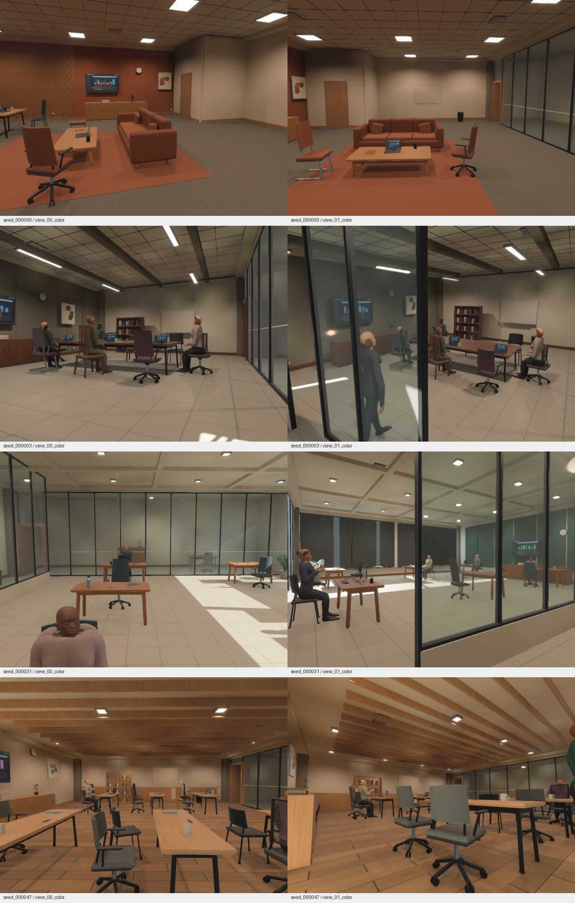

# Local generator-v5 scene and startup review

This is an uncommitted local revision on top of `f81f163`, using capture-v7.
No release or CI run qualifies these changes. The previous generator-v4 reports
remain historical evidence; they do not qualify the new human surfaces or layouts.

## Changes

The viewer discovers catalogs on the IO pool, loads only requested model categories,
and activates a sampled material's texture maps only when a primitive uses it.
Basic Object, Room and Cornell scenes no longer load the unrelated GLTF catalog
or AnnyBody. An empty texture catalog retains the neutral-material fallback.
Custom primitive material palettes are honored. Interactive GPU asset preparation
has a 32 MiB/frame upload budget; native capture waits for asset and scene readiness.

Native indoor generation prepares AnnyBody phenotypes and retargeted surfaces on
the compute pool while retaining the previous scene. The bounded 24-person cache
shares geometry between rendering and GI. People use the real `burn_human` reference
surface and all skinning influences, with procedural garment material regions,
closed collar/cuff boundaries, hair, eyes and eyewear. Eight support-aware pose
families include seated work/conversation and standing reading/presenting/walking.
These are static poses, not animated interactions or cloth simulation.

Four floor-plan families share the same usable zones and architectural obstacles
across furnishing, people and camera planning: open hall, corner service core,
window gallery and divided suite. The building envelope remains rectangular.
Six chair families vary frames, backs, seats, arms and orientation; four laptop
families vary chassis, keyboard, dimensions and opening angle. Furniture groups
rotate within their usable zones. Six existing potted botanical forms remain,
with additional daylit planting positions. Desk content mixes monitors and laptops.
Three fixture designs vary spacing, mounting height, color temperature and output;
daylight strength and evening sun elevation also vary.

Floor plans, furnishing groups, chairs, computers and human retargeting now have
separate modules. Distribution exports include their categorical counts, chair
yaw, laptop hinge angles, human head yaw, lighting targets, existing camera
intrinsics and placement heatmaps. Generator and capture identities changed to
prevent mixing earlier output with this geometry.

## Startup investigation

Measurements use the development-profile `viewer_profile` binary at 800x600,
on NVIDIA RTX PRO 6000 Blackwell / Vulkan / driver 610.43.02. The profiler forces
continuous rendering when unfocused. It measures process startup and CPU schedule
intervals, excluding Cargo compilation. Legacy scenes are randomly sampled; these
are bounded diagnostics, not an identical-scene statistical benchmark.

The original Object diagnostic loaded about 1.8 million mesh vertices and 112
images and submitted only four frames in 20 seconds. Demand loading reduced a
later Object sample to 2,814 vertices and 22 images; first submission was 1.30 s
and the longest frame gap was 261 ms. First submission alone does not prove that
every asset is visible.

Room still stalled for about 2.84 s per 32 MiB texture preparation batch. A debugger
sample found glibc `rep movsb` copying a 4 MiB image into device-local BAR memory
inside `Queue::write_texture`. Disabling ERMS/FSRM for one diagnostic process reduced
the maximum image preparation interval to 29 ms. The local Vulkan HAL patch now
selects host-cached coherent memory for transient write-only upload buffers; it
retains usage flags, synchronization and coherent-memory fallback. It introduces
no process-wide libc setting. See `third_party/wgpu-hal/ZEROVERSE_PATCH.md`.

Raw evidence is in `out/local_quality_before`, `out/local_quality_after` and
`out/local_quality_after/upload_stack.txt`. The debugger-interrupted run and the
environment-override experiment are not normal-environment performance results.

Normal-environment runs after the staging change:

| Scene | First submission | Maximum image preparation interval | Frame gap p95 | Maximum frame gap |
| --- | ---: | ---: | ---: | ---: |
| Object, 10 s | 1.02 s | 6.7 ms | 16.3 ms | 254 ms |
| Room, 15 s | 1.27 s | 28.1 ms | 17.2 ms | 247 ms |
| Indoor, seeds 31–33, 15 s | 1.30 s | 6.0 ms | 16.7 ms | 956 ms |

These are the `*_final.json` profiles. The indoor run regenerated every five seconds;
its first scene event arrived at 1.83 s. Occasional scene construction still blocks
the main schedule for up to 955 ms: background human preparation does not move all
material synthesis, GI preparation or mesh/tangent creation off that schedule.
The upload fix does not establish hitch-free regeneration or performance on other
drivers. Other development processes were active during these diagnostics.

## Validation and limits

The 512-seed layout audit in `out/local_quality_audit` found zero invalid layouts
and covered all four furnishing layouts, four floor plans, six chair families,
four laptop families, three fixture designs and eight human poses. It exported
2,048 cameras, CSV tables, distributions and placement heatmaps. This establishes
observed coverage of those discrete families, not photographic quality across
every seed or uniform coverage of their Cartesian product.

The Rust library suite passed 73 tests, with three long qualifications intentionally
ignored. Clippy passed with `-D warnings` for project targets; upstream nightly
future-compatibility warnings remain. The full workspace check, including the
Burn dataset CLI and FFI crates, passed. The process/dataset contract script passed
eight self-tests and now accepts an explicit expected generator version.

Native renders and aligned annotation reports are in `out/local_quality_renders`:
four stratified seeds (0, 3, 31, 47), two cameras and three trajectory steps produce
24 views at 800x600. All captures completed without render errors. Pose discrepancies
were zero; the largest per-view p99 reprojection error was 0.00260 pixels and p99
depth/position disagreement was 3.82 micrometres. Clipped RGB fractions were at most
0.295%. PNGs are previews; annotation validation uses the native float32 planes.



Inspect the actual images as well as geometry and distribution checks. The rooms
remain visibly synthetic: people need better hair, faces and clothing; surface
appearance is repetitive; furnishing density and architectural grammar remain
limited. Diffuse GI is approximate. No new matched Cycles qualification or
unlimited-process memory claim is made for this revision.

The Wasm feature profile retains procedural geometry and PBR, with native GI and
SSAO disabled. Human preparation is cooperative on the browser thread, not a
threaded Wasm implementation. People require serving the bundled AnnyBody files;
`indoor_human_density=0` omits them. Browser dataset readback remains unsupported.
The Wasm build/check passed. Local Chromium WebGPU Auto and Portable checks also
passed with the inspector enabled, AnnyBody people and regeneration from seed 31
to 32. The checks observed continuing GPU submissions, changed rendered pixels,
and no inspector-registration/picking warnings or renderer errors. Evidence:
`out/local_quality_web_final/report.json`. This is a debug artifact served over
localhost, not a network startup benchmark or qualification of all browsers.

Reproduce the bounded viewer diagnostic with:

```sh
ZEROVERSE_PROFILE_OUTPUT=out/viewer_profile/room.json \
  cargo run --bin viewer_profile -- --scene-type room --width 800 --height 600
```

Use `ZEROVERSE_PROFILE_SECONDS` to change the default 20-second observation. Direct
binary execution requires `BEVY_ASSET_ROOT` to point at the checkout; `cargo run`
provides the asset root normally. Use the main viewer for interactive inspection:

```sh
cargo run --bin viewer -- --scene-type procedural-indoor --indoor-seed 31
```
