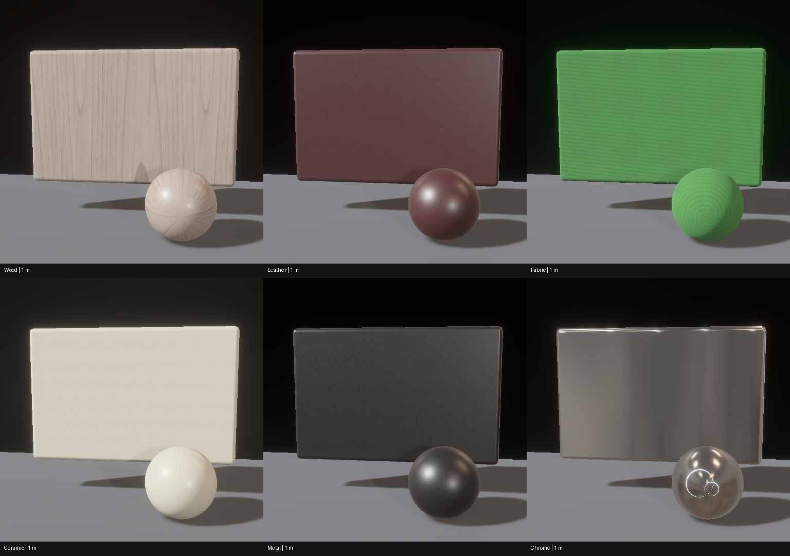
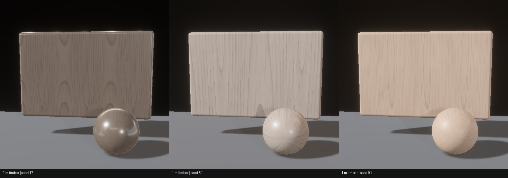
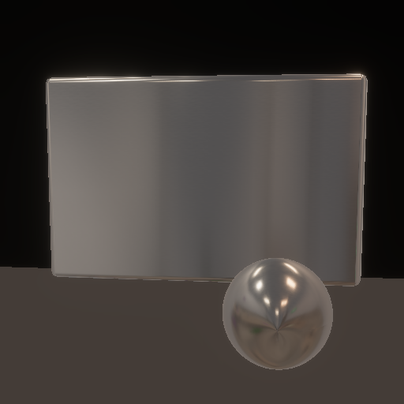
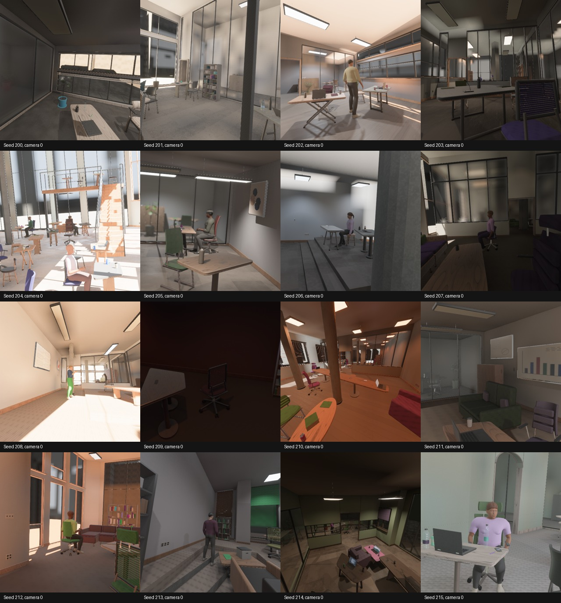
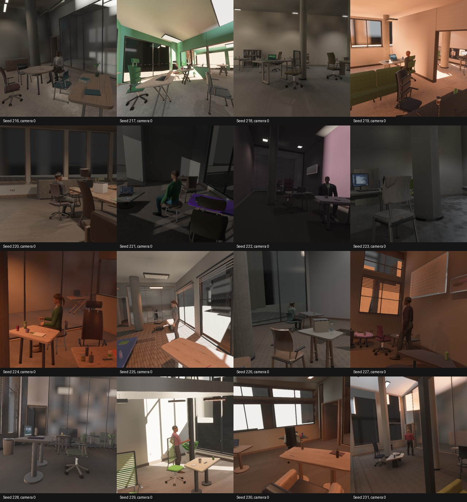

# Procedural material quality

The current appearance contract is `capture-v37` / `finishes=5`. Geometry stays
at generator 22. Resume checks distinguish the new RGB contract.



These one-metre panels use the production materials and PBR capture path. The
rounded samples use smooth geometry and metric UVs. The review records fixed
key/fill illuminance, an independently standardized room reflection environment,
and no uniform ambient light. Display conversion is sRGB without exposure edits.
[25 cm close-ups](evidence/material_quality/closeups.jpg) resolve substrate detail.

## Materials and reflections

Timber intersects offset and tapered cylindrical growth with a tileable cut
field. Continuous cut offsets, uneven earlywood/latewood, ring pigmentation,
elongated pores and sparse branch knots replace narrowly repeated parallel
bands. Floor planks have independent cut identities. The physical transverse
repeat is 22–65 cm; pores resolve at roughly 2–6 mm in these bounded maps.

Chrome uses a conductive base layer, 0.06–0.24 sampled perceptual roughness and
roughness-dependent anisotropy. Micron scratches affect scattering; an 8-bit
normal map cannot resolve their slopes without introducing visible artificial
bumps, so chrome does not bind that map. Painted furniture metal remains a
dielectric. Leather has pebbled creases, textiles have rounded crossing yarns,
and paint/ceramic have restrained stipple rather than mineral veins.

Reflections use the generated triangle assemblies, material colors/textures and
visibility-tested photometric lights. Native preparation reuses the same BVH
for diffuse transport and the reflection environment. Web builds use the same
reflection program. Radiance is linear HDR in cd/m², stored in float16 cube maps;
it is not clipped into an 8-bit grey dome. The specular chain uses GGX importance
sampling and source footprints; the diffuse map uses cosine convolution. The
64×64 specular and 16×16 diffuse maps occupy 274,416 bytes in total, about 132 KiB
more than the former pair, with the same two GPU texture bindings and no extra
render cameras or passes. Native tracing uses the shared bounded preparation
pool.

Normal/roughness filtering retains unresolved relief as a broader specular lobe.
The clearcoat shader integration supplies the correct geometric coat normal
under Bevy's normal prepass and preserves optional coat normal maps. All other
substrate maps remain 256×256 with mip chains and shared finish palettes.




## Qualification

The [receipt](evidence/material_quality/receipt.json) binds actual render settings,
source identity, saved plane hashes, shading comparisons and generation timings.
The room cohort contains 32 consecutive seeds (200–231), three 512×512 views and
RGB, depth, normals, position, semantics and co-visibility. No dim or sparse room
is filtered out. The matched control covers 12 rooms / 36 views: all 180 geometric,
semantic and co-visibility planes are byte-identical, while all 36 RGB planes
change. Objects, humans, cameras, envelope, facade and dimensions are unchanged.




The independent normal-prepass/forward swatches retain clearcoat agreement.
The receipt reports per-material mean, tail and maximum differences; sharp chrome
highlights remain sensitive to normal-prepass precision. HDR storage, face
orientation, cross-face sampling, constant-radiance convolution, tile seams,
physical scales, map packing and material metalness have regression coverage.

The reflection environment remains approximate: one static origin provides no
per-object parallax or live moving-human reflections, and secondary bounce energy
uses an ambient approximation. Direct-light proxies coexist with reflected
emitter surfaces. These are real-time PBR renders, not a qualified specular path
tracer. Photographic realism and ten-million-sample learning utility remain
unproven.

## Generation cost

Three interleaved runs per condition cover 32 rooms, three 512×512 views and six
modes, with four warmup rooms excluded per run. Full Auto effects and human
density 0.25 are retained. No compilation runs overlap these timings.

| Appearance implementation | Views/s per run | Aggregate views/s |
|---|---|---:|
| Previous, optimized scheduling | 9.886, 10.100, 9.674 | 9.884 |
| Current HDR/material program | 8.182, 8.455, 8.385 | 8.339 |

The current appearance program is **15.6% slower** in this matched diagnostic.
The reflection tracing/convolution is an added CPU preparation cost. Both
conditions use published WGPU 29.0.4; the downstream training workload shares
the machine. This does not isolate adapter throughput or establish that the
extra appearance work is free. Scheduling gains reported separately in
[generation defaults](generation_defaults.md) describe the scheduling change,
not a claim that this appearance update preserves its earlier RGB or timing.

## Reproduce

```sh
cargo run --example review_materials -- out/materials 81
cargo run --example review_materials -- out/materials-forward 81 --no-normal-prepass
cargo run --example review_materials -- out/materials-close 81 --close-up
cargo run --example review_materials -- out/materials-ibl 81 --ibl-only
cargo run --bin indoor_bench -- --scenes 32 --warmup-scenes 4 --seed 200 \
  --cameras 3 --width 512 --height 512 --co-visibility --asset-root "$PWD" \
  --save-samples --output out/material-rooms
```

The Rust review exports material recipes, review photometry, the HDR environment,
base PBR maps, RGB and geometric normal planes. The room benchmark exports
lossless planes, manifests, annotation checks and preparation/capture timings.
Performance qualification uses an external consumer workspace resolving published
WGPU 29.0.4 without inheriting the root checkout's existing WGPU patches. Shared
production/training activity remains a timing confound; no such process is stopped
or reconfigured for the review.
