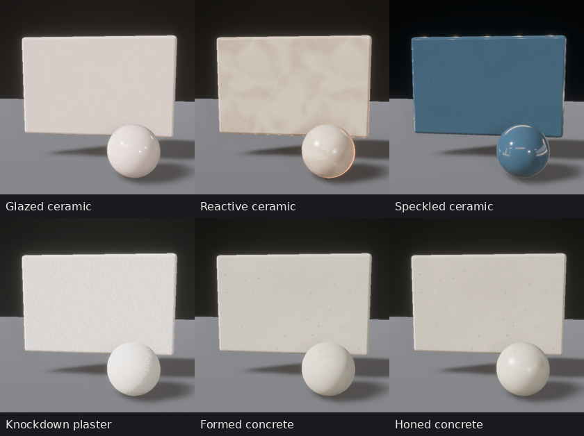
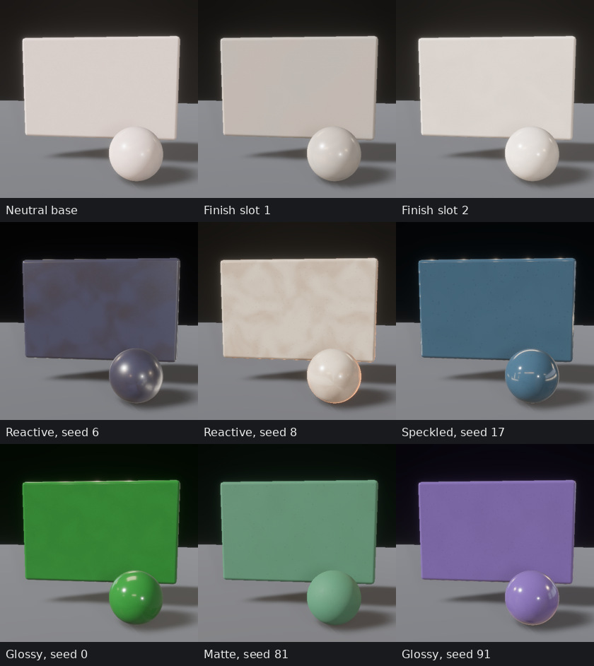
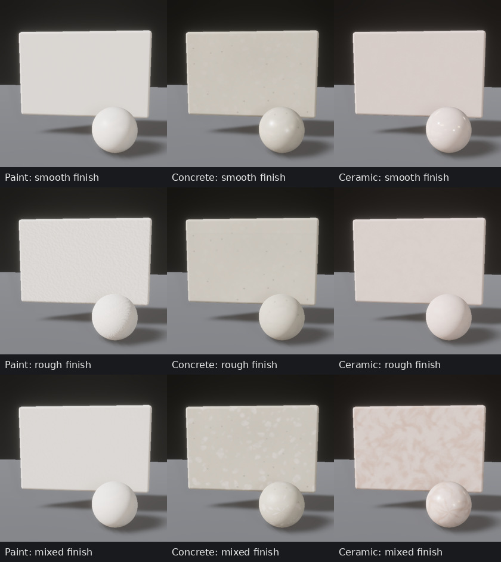

# Procedural material quality

The material qualification below is bound to the source recorded in
[the qualification receipt](evidence/material_quality/receipt.json). For current
room and furniture construction, see the [geometry review](geometry_quality.md).
The subsequent [human review](human_quality.md) qualifies garment-specific knit
maps, hair microstructure and actor appearance against its own source snapshot.
Material streams stay independent of room geometry, cameras and actor poses.



These are production PBR materials, generated from recorded Rust programs without
photographic texture precursors. The panels span 25 cm. Fixed key/fill lighting,
scene-derived reflections and unedited sRGB display conversion expose both
texture and scattering. Smooth finishes are deliberately included: painted
surfaces and manufactured glazed ware need not be visibly bumpy.

## Fired ceramics and glazes



Ceramics have their own fired-body/glaze program rather than receiving wall
plaster noise. Continuous parameters control body grain, turning pitch and
strength, melt-flow warping, thickness variation, reactive pigment, iron-like
speckles, crazing, gloss and coating roughness. Color, relief and scattering use
correlated inclusion and melt footprints. Glaze highlights range from broad
matte/satin lobes to glossy reflections. Wheel marks preserve the vessel's
circumferential direction rather than rotating into vertical stripes.

The pigment multiplier is applied once. New ceramic maps carry relative
reflectance, so neutral, cream, dark and chromatic items can share a glaze
structure without multiplying an already colored atlas. Each room can use three
independently sampled glaze structures through its twelve finish slots. Three is
a cache budget, not a global catalog of three styles: every room seed samples new
continuous programs. Finish slots retain independently sampled neutral or colored
pigments and the corresponding glaze's PBR settings.

These fields approximate glaze appearance; they do not simulate kiln chemistry,
volumetric glaze transport or geometry-dependent pooling. Reactive fields are
informed by [glaze variegation](https://digitalfire.com/glossary/variegation);
normal maps and scattering remain raster PBR approximations.

## Paint, plaster and ceiling finishes

Paint has a separate thin-film application program over the larger plaster
relief. It varies sprayed-droplet size and shape, peak knockdown, elongated roller
stipple, fine orange peel, brush marks, trowel passes, overlap sheen and subdued
repair patches. Coarse texture, fine film relief, pigment variation and gloss are
separate controls. Matte paint does not receive an artificial clearcoat. The
same approach supports accent walls and ceilings with independent recipes.



The rows above hold seed 1 and swatch geometry fixed while recording smooth,
rough and mixed finish controls. The exact overrides are in the receipt. They
exercise the review tool's continuous controls; they are not a room-distribution
sample or a fitted mixture. The broader gallery below uses unmodified sampled
finishes and a recorded stone-floor selection.

## Concrete, aggregate and stone

Concrete adds cast-form impressions, nominal board width, joint relief and tone,
bleeding streaks, cement-curing variation, trowel passes, sand exposure and sparse
casting air voids. Polishing attenuates casting relief and lowers roughness.
New concrete recipes do not sample geological marble veins. Angular/stretched
aggregate sections vary in size, edge shape, pigment and internal mineral grain,
avoiding a sheet of identical flat circular dots.

Concrete uses a 512² atlas to resolve smaller inclusions and voids over its
35–90 cm repeat domain. Stone floor atlases also use 512² maps, with independently
cut tile phases, multiscale mineral deposits, filtered branching veins, polish
and metric grout. Terracotta and soil retain their separate colors and scales.
Periodic, finite-resolution atlases approximate nominal physical spacings; these
programs are not a geological or concrete-manufacturing simulation. Casting
voids, finishing texture and inherent color variation are consistent with the
surface factors described by [ACI](https://www.concrete.org/frequentlyaskedquestions/faqid/787.aspx).


Sub-texel round inclusions preserve projected area as filtering grows. An
integration regression checks coverage across radii and footprints. Thin veins,
cracks and seams fade with their footprint. Main normal/roughness mip chains
carry unresolved relief into GGX scattering instead of erasing it or introducing
sparkling high-frequency normals. These are approximations to filtered transport,
not path-traced reference agreement.

## Timber, foliage and upholstery


The [close-ups](evidence/material_quality/closeups.jpg) use the same seed at a
25 cm scale. Rounded BRDF samples have metric latitude UVs, which compress near
sphere poles; the planar panels are the texture-scale reference.

Timber varies growth-field cuts, earlywood/latewood, pores, branch knots, stain
absorption, bleaching, pore fill and varnish. Face and end grain share their
finish identity. Bark retains irregular ridges and fractures. Blade-aligned leaf
atlases vary vein count/rake/curvature, chlorophyll patches, cream variegation,
wax and diffuse transmission; atlas edges clamp and the midrib stays on the blade
fold. Leaf derivatives use a sampled reference blade size, an approximation
across the different generated leaves.

Fabric retains explicit over/under crossings, rounded yarn crowns, crimp, bundles,
twill advances and herringbone turns, with independent dye, slub, fuzz and lustre.
Leather varies grain scale/stretch, pore depth, creases, pigment, nap, polish and
coating. Wardrobe and furniture share bounded structure atlases with independent
tints. Painted furniture metal remains dielectric; chrome is conductive and uses
the room reflection environment. These systems remain part of the swatch,
prepass and room checks.

All color atlases use sRGB reflectance; normal and ORM maps are linear. ORM stores
occlusion in R, perceptual roughness in G and metalness in B. Relief derivatives
use metric UV scale. Diffuse color does not contain baked lighting. See
[Filament's material properties](https://google.github.io/filament/notes/material_properties.html)
for the distinction between reflectance, roughness and coating controls.

## Diversity audit

The [Rust audit](evidence/material_quality/substrate_audit.json) samples **1,024
seeds / 37,888 recorded recipes** across roles and floor choices. For the target
finishes it generates **1,152 production map sets across 128 consecutive seeds**:
paint, accent, ceiling, concrete, three ceramic structures, terracotta and stone
floor. There are **zero exact map-set duplicates**. Fingerprints include actual
color/normal/ORM pixels and mips; seed-bearing recipe hashes alone are not evidence
of visual diversity.

| Sampled parameter, 5th–95th percentile | Range |
|---|---:|
| Ceramic perceptual roughness | 0.120–0.642 |
| Ceramic reactive mix | 0.00009–0.787 |
| Ceramic speckle radius | 0.20–0.63 mm |
| Ceramic turning pitch | 2.33–7.76 mm |
| Concrete perceptual roughness | 0.355–0.879 |
| Concrete formwork strength | 0.004–0.901 |
| Concrete nominal board width | 9.3–27.2 cm |
| Concrete air-void radius / depth | 0.96–3.84 / 0.21–1.25 mm |
| Paint relief amplitude | 18–569 µm |
| Paint nominal spray spacing | 2.82–8.67 mm |
| Paint nominal roller spacing | 1.99–5.29 mm |
| Paint perceptual roughness | 0.441–0.949 |

Descriptors contain 8×8 spatial means of linear RGB reflectance, roughness and
normal slope, applying each recorded recipe's base pigment. Per-item finish-slot colors are
reviewed separately in the rendered swatches. The report retains raw
nearest-neighbor distances and covariance ranks, and adds cohort-standardized
ranks. Shape-only descriptors remove each map's spatial mean in those five
channels before standardization. Their covariance participation ranks are 27.3
for ceramic, 35.8 for paint and 35.0 for concrete. Mean color/finish still dominates
the full-map descriptors; spatial ranks quantify this sample's texture variation.

These are diagnostics of the actual maps and recorded parameter distributions.
They do not establish perceptual independence, spacing in a trained image model,
photographic realism or useful transfer from ten million rooms. The continuous
programs support large-scale sampling; ten-million-sample learning utility still
needs a downstream qualification experiment.

## Render and correctness qualification

All **64 consecutive rooms, seeds 200–263**, have three 512² views and six modes:
RGB, depth, normals, position, semantics and co-visibility. **All 1,152 planes are
finite**, and all 192 co-visibility planes pass source-bit, membership, count and
validity checks. Dim and sparse rooms remain included.

Geometry regression checks retain **960 byte-identical depth/normal/position/
semantic/co-visibility planes** against the recorded geometry control. All 192
RGB planes change; all 64 nonmaterial manifests and camera/bounding-box/pose
metadata remain identical. The receipt records the control identity and hashes.


All nonchrome swatches agree with forward shading without the normal prepass
within one 8-bit channel value. Chrome retains a maximum difference of twelve
values; its full error statistics are recorded. **211 core tests pass**, including
seed replay, periodic seams, physical ranges, inclusion-area filtering, map
encodings/mips, ceramic tint independence, bounded sharing and readable older
recipe JSON. Workspace Clippy passes with warnings denied. The motion-enabled
WASM viewer compiles; this review does not include a new browser GPU render run.
Native captures use a consumer with published WGPU 29.0.4.

The run retains Auto quality, shadows, GI and human density 0.25. Timing is
diagnostic on a shared device with active training: 1.51 completed rooms/s after
four warmups, 0.818 s median and 1.089 s p95. This is not a controlled throughput
comparison. RSS grows during the short run; memory and asset measurements remain
in the receipt. Unlimited-process memory stability is not qualified here.
Reflection environments and secondary bounce energy remain approximations, and
there is no new Cycles reference or photographic-realism qualification.

Texture generation remains procedural, on the shared bounded four-worker native
pool, with the same serial program on WASM. The two additional shared ceramic
atlases and larger concrete atlas add at most **5 MiB** over the preceding texture
budget, including mips. There are no per-mug or per-person atlas allocations,
extra material-model downloads, or new shader texture-binding requirements.

## Reproduce

```sh
cargo run --example audit_materials -- out/material-audit.json \
  --focus-finishes --map-seeds=128
cargo run --example review_materials -- out/materials 81 --close-up \
  --floor-style=2 --surfaces=Paint,Concrete,Ceramic
cargo run --example review_materials -- out/materials-glaze 1 --close-up \
  --surfaces=Ceramic --variant=2
cargo run --example review_materials -- out/materials-rough 1 --close-up \
  --surfaces=Paint,Concrete,Ceramic --wall-texture=0.9 --wall-knockdown=0.8 \
  --concrete-formwork=0.95 --concrete-polish=0.05 --ceramic-gloss=0.12
cargo run --bin indoor_bench -- --scenes 64 --warmup-scenes 4 --seed 200 \
  --cameras 3 --width 512 --height 512 --co-visibility --asset-root "$PWD" \
  --save-samples --output out/material-rooms
```

The Rust tools export recorded controls, recipes, maps, executable provenance and
rendered views. Finish-slot resampling cannot combine with substrate overrides,
which would otherwise be discarded. The existing Rust publication pipeline owns
project-page/paper generation and its source/capture freshness checks. Shared
production and training jobs were not stopped or reconfigured for this review.
