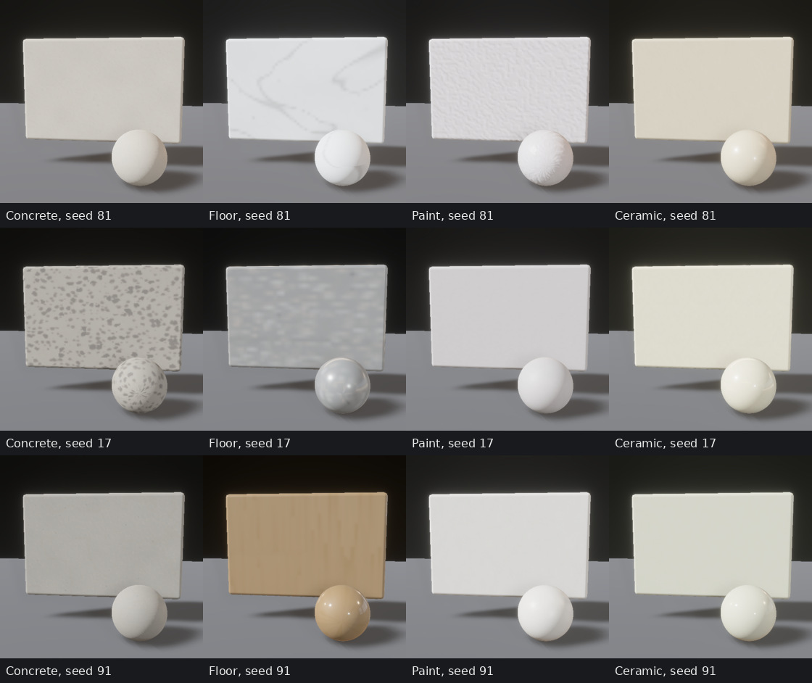
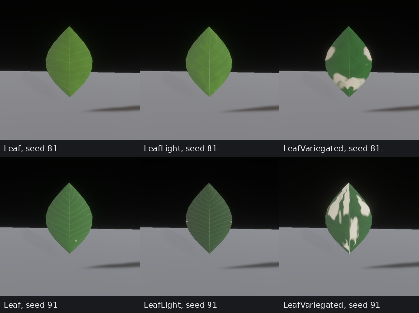
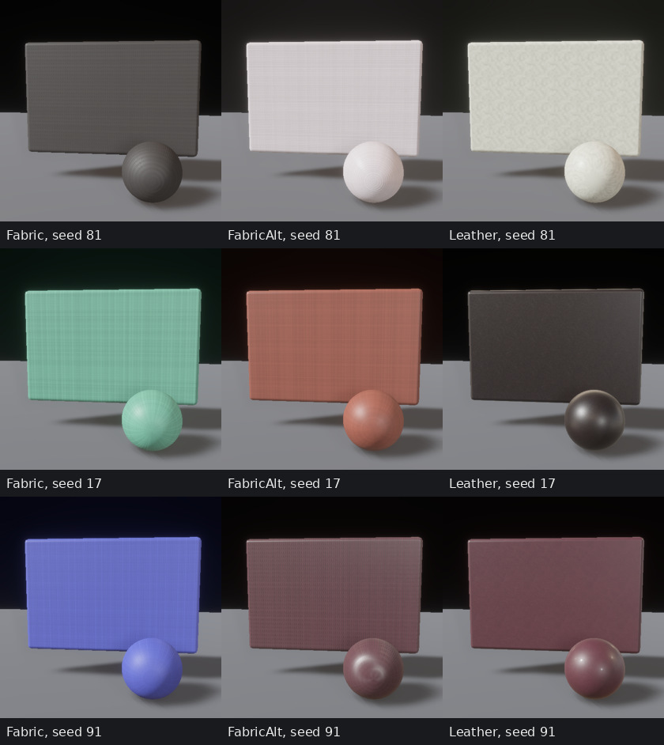
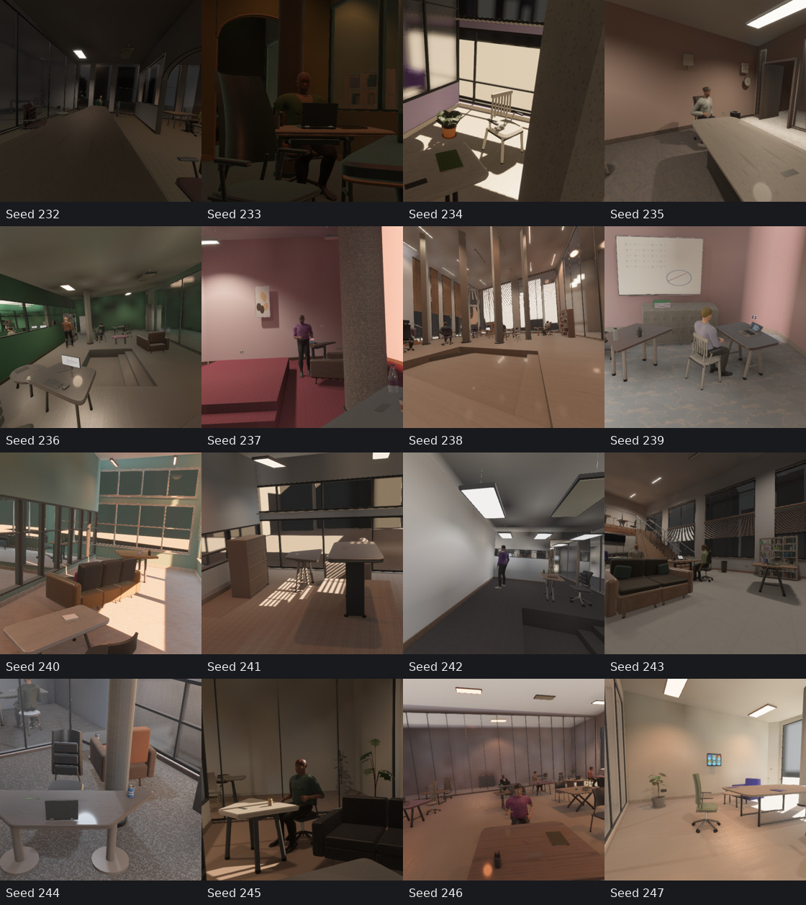
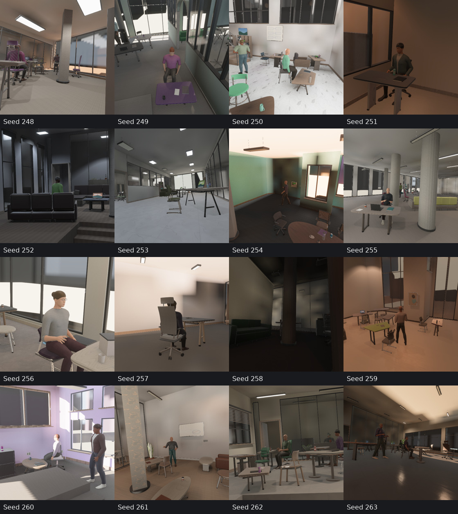

# Procedural material quality

The current appearance contract is `capture-v39` / `finishes=7`; geometry stays
at generator 22. Recipes record continuously sampled substrate and finish
parameters. Material generation has independent random streams, so changing
appearance preserves room geometry, cameras, semantic attachments and actor poses.


These one-metre panels use the production materials and PBR capture path.
Rounded samples use smooth geometry and metric UVs; foliage uses the actual leaf
blade mesh and its atlas. Fixed key/fill illuminance and a standardized room
reflection environment expose the finishes without uniform ambient lighting.
The [25 cm close-ups](evidence/material_quality/closeups.jpg) resolve smaller
features. Display conversion is sRGB with no exposure edits.

## Minerals, paints and wall finishes



The mineral program blends cement paste, irregular exposed aggregate, pores,
multiscale deposits, branching level-set veins and independently sampled polish.
Aggregate placement, size, edge shape, mineral tint and exposure vary separately.
Thin veins and chip edges are filtered against the atlas footprint instead of
turning into isolated dots or regular grids. Tile cuts have separate deposit
phases and metric grout. Concrete roles can continuously blend toward mineral
stone; stone floors vary veining, polish and matrix reflectance. Terracotta and
soil use related granular/pore fields with their own metric scale and colors.
These fields approximate surfaces; they are not geological or soil simulations.

Paint, drywall/plaster and ceiling finishes vary spray/stipple scale, texture
amount, peak knockdown, directional roller relief, trowel fields, pinholes,
pigment variation and gloss. Pigment changes remain subdued; wall texture comes
principally from correlated relief and scattering, rather than colored noise.
Glazed ceramics vary clearcoat and coat roughness, with optional fine crackle.

The rows above use recorded review controls: seed 81 selects stone floor style,
marble mix 1 and wall texture 0.8; seed 17 selects stone floor style, marble mix
0.05, wall texture 0.05 and stain strength 0.05; seed 91 selects timber floor style
and stain strength 0.85. Unspecified factors retain their sampled values. These
are inspection fixtures, not a hand-selected room distribution.

## Timber and foliage


Timber intersects offset and tapered growth fields, with uneven earlywood/
latewood, elongated pores and sparse branch knots. Cuts vary continuously and
floor planks have independent cut identities. Stain color/absorption, bleaching,
pore fill, grain contrast, varnish strength and varnish roughness vary separately.
Face and end grain share their finish identity; independently sampled cuts
remain distinct. Bark has irregular axial ridges, fractures and micrograin.
The physical transverse timber repeat spans 22–65 cm.



Leaf atlases anchor the midrib to the blade center and vary secondary vein count,
rake, curvature, widths, chlorophyll patches, cream variegation, wax and diffuse
transmission. Absolute green/cream reflectance prevents dark base colors from
turning pale variegation into dark green. Atlas sampling clamps at blade edges;
wall-style texture rotation and random phase do not move veins off the midrib.
Normal derivatives use sampled reference blade dimensions, an approximation
across differently sized leaves. The shader does not simulate full spectral leaf
transport. Pots and stems retain their separate terracotta/soil/bark materials.

## Fabric, clothing, leather and PBR



Fabric has explicit over/under crossings, rounded yarn crowns, crimp, irregular
diameters, bundles, twill advances and herringbone turns. Warp/weft dye variation,
slub, fuzz, filament detail and scattering vary independently. Patterns dye yarns;
they do not add broad sinusoidal height bands. V-direction yarn spacing spans
1.2–3.5 mm and relief spans 60–220 µm. Carpet adds a pile field at its floor scale.
Leather varies cell spacing, grain stretch, pore depth, rounded crowns, creases,
pigmentation, polish, nap and clearcoat. Grain spacing spans 0.8–2.4 mm along V;
relief decreases with polish. Clothing shares textile maps with independent
actor colors, scale and orientation. Its normalized Anny atlas uses an approximate
two-metre reference, rather than measured garment UVs.

Programs generate correlated sRGB color, tangent-space normal and linear packed
R=AO, G=perceptual roughness, B=metalness maps. Color mixtures use linear
reflectance. Dielectric maps have zero metalness; chrome alone is conductive.
Chrome varies roughness and anisotropy and excludes an unresolved scratch normal
map. Joint normal/roughness mip filtering broadens unresolved microrelief.
Textile directional GGX scattering approximates aggregate fiber reflection; it
is not a measured cloth multiple-scattering BSDF or a separate sheen lobe.
Normal maps do not alter geometry depth or geometric-normal annotations.

Twelve finish slots share three texture structures per upholstery role and two
per timber/foliage role. Only used additional structures are prepared, with at
most eleven extra map sets (about 11 MiB including mip chains). Maps are 256²,
except 512² timber/stone floor atlases; their increment is approximately 3 MiB.
The bounded native worker pool prepares maps; WASM uses the serial fallback.
There are no new map allocations per person or leaf.

Reflections use generated triangle assemblies, material appearance and
visibility-tested photometric lights. The HDR environment uses GGX specular
prefiltering and cosine diffuse convolution. Its 64² specular/16² diffuse cube
maps occupy 274,416 bytes, with no extra render cameras or passes.


## Measured procedural coverage

The [Rust audit](../examples/audit_materials.rs) checks 1,024 consecutive seeds
across 37 role/floor choices: all 35 roles, with the floor resolved in three
styles. The [machine-readable audit](evidence/material_quality/substrate_audit.json)
records parameter quantiles, hue distributions, map fingerprints and variance.
It observes 346 fabric and 361 alternate-fabric weaving topologies, each with
continuous dimensions, dye and scattering parameters. A 32-seed cohort generates
**1,120 production map sets with zero exact duplicates** across the audited
substrates, structure groups and floor styles. Full recipe hashes also differ,
but hashes containing seeds are not evidence of visually distinct samples.

| Base recipe factor, 5th–95th percentile | Range |
|---|---:|
| Concrete roughness / aggregate exposure | 0.466–0.878 / 0.002–0.921 |
| Stone floor roughness / marble blend | 0.180–0.722 / 0.221–0.975 |
| Paint relief, µm / roughness | 18–569 / 0.441–0.949 |
| Timber stain strength / roughness | 0.011–0.826 / 0.211–0.793 |
| Variegated leaf cream blend / wax | 0.231–0.820 / 0.038–0.755 |
| Fabric roughness / relief, µm | 0.565–0.862 / 66–213 |
| Leather roughness / relief, µm | 0.295–0.736 / 14–81 |

Nearest-neighbor distances and covariance participation ranks use 8×8 descriptors
of linear reflectance, roughness and normal slope. Raw mixed-unit ranks are 1.98
for concrete, 1.77 for stone floors, 2.11 for paint, 2.09 for timber and 5.88 for
variegated foliage. These measure this descriptor and sample cohort; dominant
color/finish variation can obscure finer texture variation. They do not measure
image embedding spacing, photographic realism or ten-million-sample utility.

## Render qualification

The [receipt](evidence/material_quality/receipt.json) binds executable provenance,
controls, map/plane hashes and shading comparisons. All 64 consecutive rooms
(seeds 200–263) have three 512² views: **192 views / 1,152 saved planes** covering
RGB, depth, normals, position, semantics and co-visibility. All planes are finite;
all 192 co-visibility planes pass membership, source-bit, count and validity
checks. Dim and sparse rooms remain included.

Matched checks on 32 rooms retain **480 byte-identical geometric, semantic and
co-visibility planes**, while every RGB plane changes. Nonmaterial manifest
fields and calibration, bounding-box and pose metadata remain identical in all
32 rooms. The matching control is identified explicitly in the receipt.





All nonchrome swatches agree with the forward path without the normal prepass
within one 8-bit channel value; chrome's highlight maximum is twelve values,
with the full error statistics retained. Seed replay, periodic seams, leaf atlas
alignment, physical scales, map encodings/mips, dielectric metalness, changing
structure maps and wardrobe sharing have regression coverage. Workspace Clippy
passes with warnings denied. The native capture consumer uses published WGPU
29.0.4; the WASM viewer compiles with human motion. This review does not include a
new browser GPU render run.

The room cohort retains Auto lighting, shadows, GI and human density 0.25. Saved
capture timings are diagnostic on a shared device with concurrent release-package
compilation: 2.05 completed rooms/s after four warmups, with
0.324 s median and 1.108 s p95. This is not a throughput comparison. RSS grows during this short run;
asset counts and memory measurements remain in the receipt. It does not qualify
unlimited-process memory stability. Reflection environments remain approximate:
a static origin has no per-object parallax or live moving-human reflections,
and secondary bounce energy uses an ambient approximation. Photographic realism
and ten-million-sample learning utility remain unproven.

## Reproduce

```sh
cargo run --example audit_materials -- out/material-audit.json
cargo run --example review_materials -- out/materials 81
cargo run --example review_materials -- out/materials-close 81 --close-up \
  --floor-style=2 --stone-mix=1 --wall-texture=0.8
cargo run --example review_materials -- out/materials-finish 91 --close-up --variant=2
cargo run --example review_materials -- out/materials-ibl 81 --ibl-only
cargo run --bin indoor_bench -- --scenes 64 --warmup-scenes 4 --seed 200 \
  --cameras 3 --width 512 --height 512 --co-visibility --asset-root "$PWD" \
  --save-samples --output out/material-rooms
```

Review factor overrides cannot be combined with finish-slot resampling; otherwise
resampling would replace the requested factors. Rust examples export recorded
recipes, maps, executable provenance and RGB/normal captures. The Rust publication
pipeline owns page/paper capture and generation order. Shared production and
training jobs are not stopped or reconfigured for this review.
