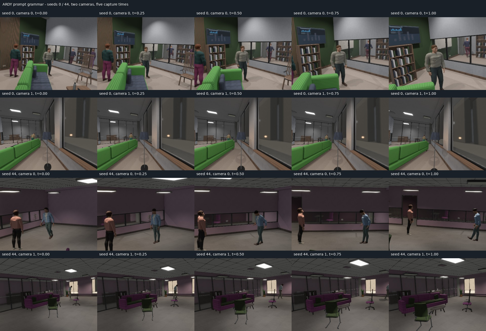

# Procedural human motion prompts

The motion planner now samples composable action programs instead of selecting
from a short list of sentences. Forty atomic actions and eight gaits combine
with handedness, side, repetition, continuous amplitude, pauses, posture, gaze
and arm carriage. Travel programs can include two distinct action stops, with
intervening travel expressed in both text and timed waypoints. The catalog,
sequence construction and tests are separate modules under
[`src/human_motion/prompts`](../src/human_motion/prompts.rs).

An example admitted by ARDY in the rendered check:

> A person shuffles slowly, stops and sways the hips left and back once, shuffles
> again, stops and waves the right hand once, then resumes shuffling with relaxed
> shoulders.

Actions carry duration, clearance, headroom and support requirements. Backward
and sideways travel condition heading separately from route direction. Gait
pace follows available travel time; optional modifiers cannot displace essential
action clauses or contradict hand actions. Family weights and the inspector
controls are documented in [human motion configuration](human_motion.md).
Explicit user prompts are preserved. No model is initialized to sample prompts
or when motion is disabled.

Every automatic request exports a versioned `prompt_recipe`, including the
sampled template bindings, timing, amplitude, repetitions and spatial envelope.
The recipe records intent; it is not a label proving the model performed the
action. Sampling retains each actor's chosen family through its main geometry
search before trying enabled fallback families, reducing retry bias toward easy
stationary gestures. Feasibility and model admission still affect the output
distribution.

## Measured coverage, 2026-09-27

The CPU audit used 128 consecutive seeds, mixed layouts, density 0.35, human
density 0.7 and two cameras. Motion selection and navigable staging fractions
were both 1.0, with 160-frame clips, sequence proposals at 0.8 and energetic gait
proposals at 0.2. These settings intentionally exercise sequences more often
than the default policy.

| Planning metric, before model admission | Result |
| --- | ---: |
| People in generated rooms | 780 |
| Feasible requests | 668 |
| Unique prompt texts | 462 |
| Unique action programs | 192 |
| Atomic actions observed | 37 / 40 |
| Gaits observed | 7 / 8 |
| Requests with two action stops | 74 |
| Maximum tokens including encoder header | 52 / 64 |

Program signatures exclude wording, handedness, repetition, amplitude and
timing, so lexical variants alone do not increase the action-program count.
The final family counts were locomotion 240, gesture 187, idle 124, exercise 56,
dance 52 and floor actions 9. Jogging did not appear in these constrained room
paths and clip durations. Grammar tests exercised all 40 actions and all eight
gaits; this is distinct from their feasibility in furnished rooms.

The [distribution JSON](evidence/motion_prompt_grammar/prompt_distribution.json)
contains all frequency tables and one example per observed program. The
[summary](evidence/motion_prompt_grammar/summary.json) records policy, source
hashes, tokenizer identity, device, test results and per-actor measurements.
Independent grammar tests checked 2,956 distinct prompts across two corpora
with the pinned upstream tokenizer; the longest used 53 of 64 tokens including
the header. This is sampled token coverage, not an exhaustive proof for every
possible combination. Runtime token validation remains active.

## Real-model and rendered check

Seeds 0 and 44 contained nine people. Eight had feasible requests, and all eight
were admitted after inference and the existing geometry/contact checks. One
person remained static because no safe behavior fit. Four admitted programs
contained two action stops. Measured net horizontal root displacement for the
five traveling actors ranged from 1.189 to 2.916 metres. Both rooms shared one
model load and used batches of four.



Twenty 384×288 views covered five times per camera, with RGB, depth, normal,
semantic, optical-flow and motion-vector outputs. Pose IDs, person bounds and
ceiling-light bounds passed the existing validator. Normal length error stayed
below 2.4e-7; maximum per-view static-surface reprojection p99 was 0.00318 pixels.
There were no missing static flow correspondences, and terminal flow and masks
were zero. Moving-person flow covered 48,254 source pixels across the checked
views, counting observations across cameras and times.

The gallery shows travel and changing poses, including airborne poses. Five
time samples at this resolution do not establish gesture fidelity, correct hand
articulation or realistic contact throughout a clip. People and materials remain
visibly synthetic. The planner's conservative checks and this small accepted
sample do not prove collision freedom across every interpolated triangle or
10M samples. Clothing physics, photographic realism and downstream learning
utility are not established by this prompt upgrade.

Native validation ran on an RTX PRO 6000 Blackwell with Vulkan. Both the native
viewer build and the `web,human_motion` Wasm viewer check passed; browser runtime
was not requalified in this change. The full library run passed 115 tests with
three ignored; after correcting retry bias, all 16 motion tests passed again.
Strict workspace Clippy passed. The existing upstream `burn-cubecl` future
compatibility notice remains.

## Reproduction

Use the upstream cached `llama/ardy-llm2vec-8b/v1` tokenizer. Its SHA-256 for this
run was `e134af98b985517b4f068e3755ae90d4e9cd2d45d328325dc503f1c6b2d06cc7`.
Token-only checks do not load model weights.

```sh
cargo build --features human_motion --bin motion_validate --locked

target/debug/motion_validate --seeds 128 \
  --tokenizer /path/to/tokenizer.json \
  --policy '{"fraction":1,"locomotion_fraction":1,"sequence_fraction":0.8,"energetic_fraction":0.2,"max_actors":16,"frames":160,"batch_size":4}' \
  --output out/motion_prompt_grammar/planning

target/debug/motion_validate --seeds 0 --render-seed-list 0,44 --flow \
  --policy '{"fraction":1,"locomotion_fraction":1,"sequence_fraction":0.8,"energetic_fraction":0.2,"max_actors":16,"frames":160,"batch_size":4}' \
  --output out/motion_prompt_grammar/render

ZEROVERSE_PROMPT_TEST_TOKENIZER=/path/to/tokenizer.json \
  cargo test --lib --features human_motion --locked human_motion -- --nocapture
```

Full captures and source clips remain under `out/motion_prompt_grammar` locally.
The durable evidence directory includes per-seed motion requests, accepted
plans, capture metadata, annotations, aggregate measurements, gallery and logs.
