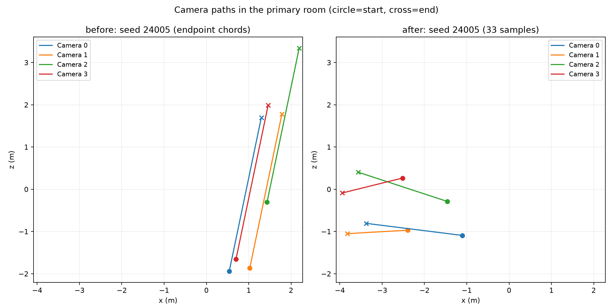
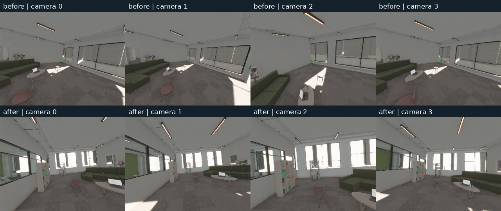
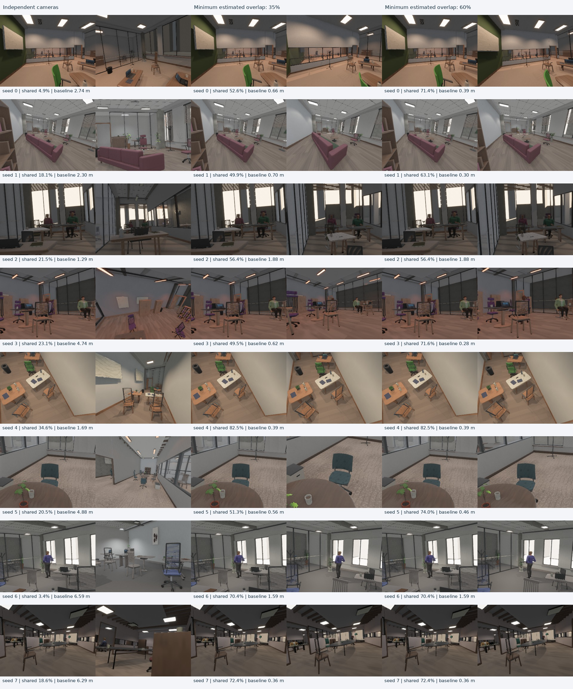

# Multi-view camera sampling

Procedural indoor cameras previously passed visibility tests independently. They
could occupy the same room yet look at different furniture, or see opposite faces
of the same object. Pointing at one target, intersecting frusta, and sharing a
semantic class do not establish visible geometric correspondences.

The `indoor_camera.multiview` policy (default since generator 18) samples a connected camera set for
reconstruction. Existing object, Cornell and legacy room modes retain their
samplers. Object/Cornell views already target a central region, but do not enforce
surface overlap; the new constraint currently applies to `procedural-indoor`.

## Configuration

Pass this JSON through the viewer or generation CLI's `--indoor-camera`, Python's
`BevyZeroverseConfig.indoor_camera`, or the existing dataset configuration:

```json
{
  "primary_room": true,
  "multiview": {
    "min_overlap": 0.35,
    "min_baseline": 0.25,
    "max_baseline": 3.0,
    "min_spread": 0.25,
    "trajectory_variation": 1.0
  }
}
```

All five nested fields have the defaults above: `"multiview": {}` enables the
policy. Generator 18 enables this policy by default. Set `"multiview": null` explicitly for independent sampling. The dataset CLI defaults to four cameras when `--scene-type procedural-indoor` is selected; explicit camera counts take precedence. Viewer camera counts remain explicit so an editor-only review does not render additional unseen views.
`min_overlap`, `min_spread` and `trajectory_variation` are in `[0,1]`; baseline bounds are metres and must satisfy
`0 < min_baseline <= max_baseline <= 100`. A zero overlap threshold retains the
nearby-camera proposal and baseline constraints; use `null` to disable grouping.

The inspector exposes **Shared geometry across views**, minimum estimated overlap
and pair separation/reference baseline, group spread and independent path variation
under **Capture camera paths**. Edits take effect on
explicit regeneration, preserving slider behavior.

- Every additional camera must overlap **camera 0**, in both directions. This
  creates a connected reference graph, with O(N) edges. For N>2, overlap between
  arbitrary nonreference cameras is not required.
- The score is the fraction of all sampled image pixels whose first geometric
  surface is also inside the other frustum and unoccluded there. The lesser of
  the two directional scores must pass. This avoids a narrow view inside a wide
  view passing solely because its own pixels are covered.
- Full capture aspect ratio, per-camera focal length and orientation enter the
  test. It samples 13×9 rays at normalized times `0, .25, .5, .75, 1`. Near/far are
  0.1/50 m, matching the indoor camera. Glazing occludes annotation surfaces.
- Cameras retain independently sampled focal lengths, different targets/rolls and
  nonzero translation. Baseline is Euclidean camera-center separation, not path
  length. Since generator 20, every camera pair must satisfy `min_baseline`,
  including pairs that do not contain camera zero. `max_baseline` still applies
  only to reference pairs. Both bounds are checked at 33 synchronized times.
- Groups of three or more must retain `min_spread` at all 33 times: the horizontal
  minor/major standard-deviation ratio of camera centers. Zero permits a line;
  the default 0.25 rejects nearly collinear groups. Stereo has no spread constraint.
- Paths vary their headings, travel distances and curvature around the reference
  route, with bounded deformation for long routes. At default variation, every
  moving pair must have at least 0.15 normalized RMS displacement difference
  after removing its starting offset. Thus translated copies cannot pass. This
  threshold scales with `trajectory_variation`; zero allows a rigid rig. Entirely
  static pairs are exempt. Every full path still passes swept collision and
  primary-room checks. Route deformations are rejected if they hit furniture.
- Proposals sample baseline uniformly in metres and random offset directions. Failed
  sets retry up to eight reference views, each allowing 384 proposals per extra
  camera. An impossible request fails clearly; thresholds are never weakened.
- The CPU sampler loads no models and submits no GPU work. Reference ray samples
  are reused across candidate views. Disabled sampling follows the original
  camera RNG sequence. Furniture, materials and humans use separate seed streams.

A larger overlap threshold concentrates views on the same surfaces, reducing the
proportion of unmatchable training pixels. It can also narrow accepted baselines
and focal-length differences. Use baseline bounds to control the parallax regime,
then inspect overlap **and** triangulation-angle distributions. Very small
baselines can provide many matches while contributing little depth information.
The measured 35% policy below is a practical starting point, not a demonstrated
optimum for a downstream model. Mixed easy/hard training can use separate
configuration cohorts instead of forcing every scene to nearly identical views.

For fixed cameras set `path_length_min` and `path_length_max` to zero. These bounds
control each camera's temporal travel, independently of the multi-view baseline.
A single-camera request remains valid; it has no pairwise constraint.
For a translating stereo rig with exactly fixed baseline, also set
`trajectory_variation: 0`. For a collinear array set `min_spread: 0` explicitly.
High overlap, long paths, large separation and a broad footprint can conflict in
a furnished room. Such requests fail within the bounded search instead of
silently returning clustered cameras. Spatial group checks are sampled, not a
continuous-time guarantee; collision checks retain their swept-path bound.

Rust callers can use `IndoorManifest::resample_cameras(count, settings, aspect)`;
failure preserves the prior camera set. The manifest records settings, aspect
ratio, intrinsics and complete trajectories. `camera_overlap()` returns estimated
reference edges at the five check times. `camera_group_geometry()` returns the
worst separation, spread and motion scores at 33 times. Rotation augmentation
preserves scores. Older archived settings missing the two new diversity fields
deserialize with those fields disabled; new requests with omitted fields receive
the new defaults. Generator 20 and capture identity v31 prevent dataset resume
from mixing the changed camera samples.

## Measured overlap and dataset qualification

These are **proxy geometry constraints**, not exact pixel guarantees. The sampler
uses scene collision envelopes and structured chair parts, not every rendered
triangle. Thin geometry, holes, moved people and times between check samples can
change actual overlap. Textureless surfaces and transmitted glass RGB also differ
from geometrically matchable content.

CPU dataset metrics now include `camera_overlap.csv`, bidirectional overlap,
baseline and triangulation-angle distributions in `metrics.json`, and the exact
camera policy. The audit, metrics and live scene use the same policy/aspect.
Schema 9 also exports `camera_groups.csv`, `camera_paths.csv` (33 times per camera),
and four `camera_group_*` distributions. These detect clustering and copied
trajectories that reference overlap alone cannot detect. Independently check the
exported scores and draw a path comparison with:

```sh
python scripts/indoor_camera_group_report.py out/after \
  --output out/camera_group_report --seed 24005
```

Optional additional cohort directories must contain identical seeds, architecture,
objects and people. Older exports without paths are reported as endpoint checks
only; they are not treated as complete trajectory measurements.

For actual visible overlap, capture depth and run the independent report:

```sh
cargo run --bin indoor_validate -- \
  --seed 0 --audit-seeds 128 --renders 8 --cameras 2 \
  --width 320 --height 240 --human-density .25 --playback-steps 3 --labels \
  --indoor-camera '{"multiview":{"min_overlap":0.35,"min_baseline":0.25,"max_baseline":3.0}}' \
  --output out/multiview
python scripts/indoor_multiview_report.py out/multiview --previews \
  --require-min-overlap 0.3
```

The Python report needs NumPy (and Pillow for previews). Retain raw captures; do
not pass `--no-raw`. It reprojects each source depth pixel using exported camera
calibration, tests the target's rendered depth, and evaluates both directions at
each captured time. It writes `rendered_camera_overlap.csv` and
`multiview_report.json`, including baseline/parallax, per-room worst overlap,
misses against the requested proxy threshold and input hashes. Preview pixels
outside the shared region are darkened. Nearest target pixels use a documented
`0.01 m + 0.002*z` depth tolerance. The optional measured threshold exits nonzero
on any failing pair **after retaining the reports**; it does not silently filter
rooms or regenerate them. Use this to qualify generator settings and use the CSV
scores for pair selection. Report limitations include the sampling/tolerance and
annotation-opaque glass; these measurements do not prove learning utility.

The [expanded generator-20 evaluation](camera_evaluation_v20.md) supersedes the
small initial review below: 2,048 layouts and 512 rendered rooms, with all-camera
co-visibility and retained overlap failures.

## Initial trajectory robustness evaluation, 2026-09-28

The [group report](evidence/camera_robustness/summary.json) compares generators 19
and 20 on **128 consecutive rooms, seeds 24000–24127**, with four cameras,
density 0.65, human density 0.25 and 320×240 calibration. Objects, people and
architecture CSVs match exactly. All 128 new scenes pass layout, swept path,
primary-room, group geometry and proxy overlap validation. The independent NumPy
report reproduces the exported group scores from the sampled camera paths.

| Metric | Before | After |
| --- | ---: | ---: |
| Starting groups with horizontal spread below 0.25 | 47/128 | 0/128 |
| Median starting horizontal spread | 0.313 | 0.500 |
| Smallest pair separation observed | 0.182 m | 0.253 m |
| Median minimum pair separation per room | 0.308 m | 0.404 m |
| Median maximum reference baseline per room | 1.034 m | 1.829 m |
| Median minimum relative motion | approximately zero | 0.340 |

Legacy CSVs provide endpoints only; after-values use 33 synchronized times.
The original implementation translated every reference path, so its cameras had
the same displacement throughout playback. The new cohort's worst horizontal
spread is 0.251 and its smallest relative motion score is 0.152. Path travel still
spans 0.043–7.504 m; mean travel changes from 1.375 to 1.089 m as the stronger
constraints reject some long reference routes. This is a measured selection
effect, not a guarantee that the requested long-path fraction is achieved.



Actual captures cover **four consecutive rooms, seeds 24004–24007**, with all four
cameras at times 0/.5/1: 48 views and 36 reference pairs per version. Native
lights/shadows are enabled and baked GI is disabled for this geometry comparison.
[Rendered overlap](evidence/camera_robustness/after_multiview_report.json) averages
50.3%, with a minimum of 32.7%, compared with 61.6%/36.2% before. Both versions
pass the 30% measured gate. **Four new pairs miss the 35% proxy estimate**; they
remain in the report. Mean triangulation angle increases from 8.81° to 11.49°.
The wider camera distribution trades some overlap for parallax, while retaining
substantial shared geometry in this bounded sample.



A sequential CPU run measured 2.18 s before and 2.49 s after for 128 layouts plus
camera validation: approximately **2.4 ms extra per room**, excluding metrics,
mesh construction and rendering. No new GPU work or runtime path-validation
system was added. This is one local timing comparison, not a throughput claim.

[Validation details](evidence/camera_robustness/validation.json): 169 library tests
pass (three explicitly ignored), 59 indoor Python tests pass, strict workspace
Clippy passes, and the WebGPU viewer with human motion compiles for Wasm. Separate
16-seed audits pass for eight moving cameras and four static portrait cameras.
Library tests include 640 layout/density-extreme cases with eight cameras,
deterministic replay, archived-policy compatibility, small stereo baselines,
crossing and collinear tracks, and atomic failure. A browser runtime test of this
camera change and large-scale downstream learning qualification were not run.

Reproduce the current audit and render check:

```sh
cargo run --bin indoor_validate -- --seed 24000 --audit-seeds 128 \
  --cameras 4 --width 320 --height 240 --output out/cameras_after
cargo run --bin indoor_validate -- --seed 24004 --audit-seeds 4 --renders 4 \
  --cameras 4 --width 320 --height 240 --playback-steps 3 --labels --no-gi \
  --output out/cameras_render
python scripts/indoor_camera_group_report.py out/cameras_after \
  --seed 24005 --output out/camera_group_report
python scripts/indoor_multiview_report.py out/cameras_render --require-min-overlap .3
```

## Historical overlap evaluation, 2026-09-27

The [retained report](evidence/multiview/summary.json) compares identical seeds,
furniture, people and lighting under three camera policies. Each CPU cohort has
128 consecutive seeds, two cameras, density 0.65 and human density 0.25. All
384 scene-policy combinations passed. Actual captures cover seeds 0–7 for each
policy at 320×240 and times 0/.5/1: **144 rendered views, 72 synchronized pairs**.
Baked GI was disabled for this geometry experiment; lights/shadows stayed enabled.

| Policy | Mean rendered overlap | Worst rendered overlap | Rooms with a pair below 10% | Mean baseline | Mean triangulation angle |
| --- | ---: | ---: | ---: | ---: | ---: |
| Independent | 14.0% | 0.9% | 5/8 | 3.61 m | 55.1° |
| Minimum estimate 35% | 59.5% | 39.0% | 0/8 | 0.84 m | 9.0° |
| Minimum estimate 60% | 69.4% | 56.4% | 0/8 | 0.71 m | 7.2° |

The 60% policy missed its requested threshold in **3/24 measured pairs, all in
one room**. These remain in the report. Larger independent-camera angles above
come from their small shared regions, not more useful correspondence coverage.

CPU generation **plus layout/camera validation** took 0.18/0.98/1.62 seconds per
128-scene cohort respectively, or about 1.4/7.7/12.7 ms per scene on this machine.
These are bounded local audit timings, not isolated sampler or 10M-scene throughput
benchmarks. No rendered scenes were discarded. The small rendered sample does not
establish a population success rate or downstream training improvement.



All ten camera tests passed, covering occlusion, FOV/aspect, baseline bounds,
trajectories, four-camera connectivity, reproducibility, manifest round trips,
unchanged independent sampling and atomic failure. The full library passed
125 tests (three explicit long-running tests ignored). Strict workspace/all-target
Clippy with motion/embedding features and the Wasm viewer/motion check passed.
The three Python analytic tests check known stereo-plane overlap, occlusion,
invalid calibration, opposite views and asymmetric focal lengths. No browser
runtime or downstream training experiment was performed in this review.

A separate real `zeroverse_gen` smoke run exported two samples, two cameras and
three times, with RGB/depth/position in safetensors. Calibration, finite tensors,
policy metadata and baseline bounds survived the export. Its empty-human fixture
at 160×120 had a worst measured overlap of 34.1% for a requested 35% estimate;
this independently demonstrates why the rendered threshold should be checked.
The [CLI validation](evidence/multiview/cli_validation.json) retains those six
pairs separately from the matched comparison. All 52 indoor Python report tests
passed. The measured gate accepted the 35% cohort at 30% and rejected the 60%
cohort at 60%, preserving its failing rows.

Recreate the paired review by running the capture command above for three output
directories (omit `--indoor-camera`, use 0.35, then 0.6), adding `--no-gi` to each.
Run the report for every directory, then:

```sh
python scripts/indoor_multiview_compare.py \
  out/multiview_review/independent out/multiview_review/shared35 \
  out/multiview_review/shared60 --output out/multiview_comparison
```

This verifies identical scene manifests apart from cameras, capture settings,
resolution and time schedules before producing the comparison.
