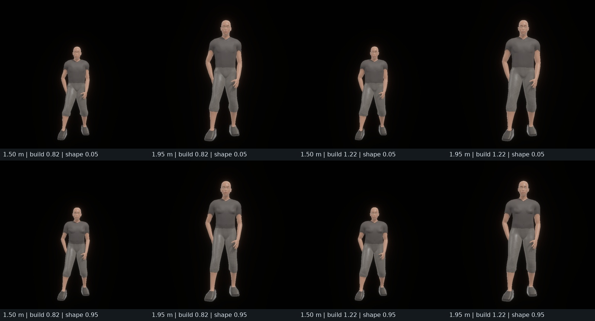
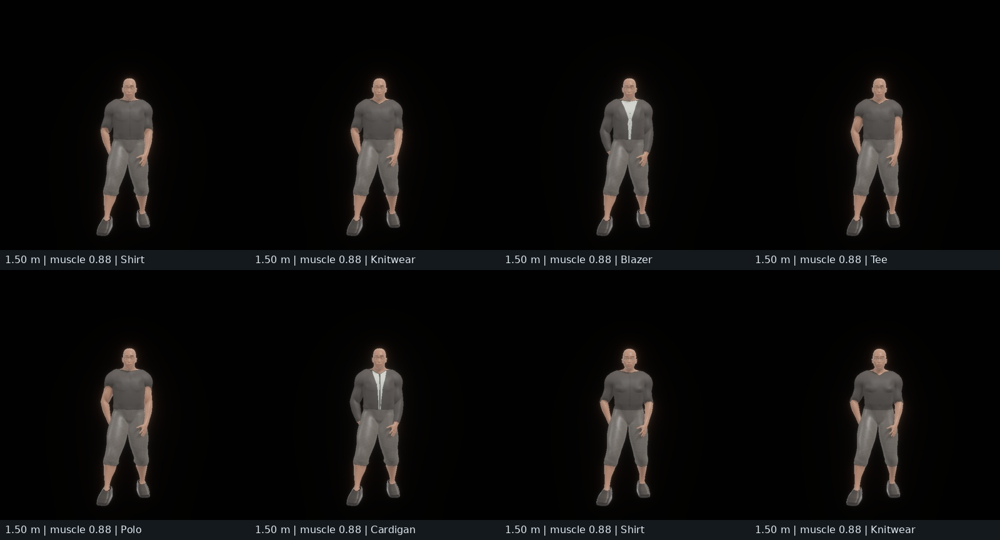
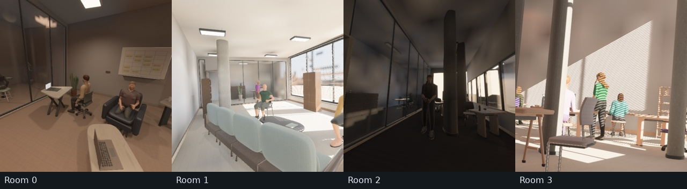
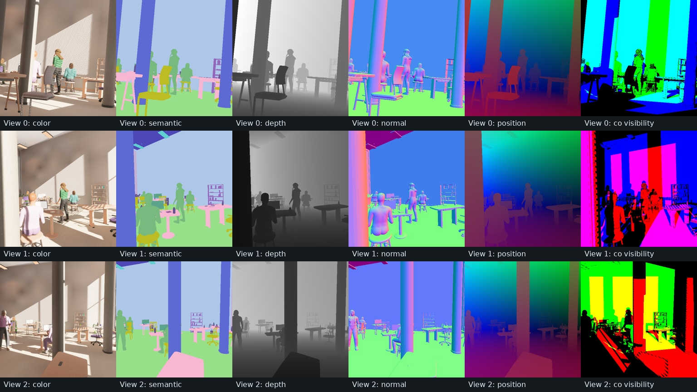

# Procedural indoor people

Indoor people use the `burn_human` AnnyBody reference surface with sampled
phenotype, pose and appearance. `--indoor-human-density` defaults to 0.25 and
accepts 0–1; zero omits both people and reference loading. The bundled reference
lives in `assets/burn_human`.

Static poses sample continuous limb, torso, stance and chair-relative parameters.
Placement checks furniture, partitions, walls, support surfaces, doorway approaches
and other people. Cameras and their complete paths avoid occupied collision
envelopes. The manifest records sampled appearance, pose, support and stable
instance identities for reproducible captures.

## Body size and shape

Standing stature is continuously sampled at 1.50–1.95 m. `stature` defines the
uniformly scaled Anny **rest-body height**, excluding hair and footwear. Sitting,
leaning and other poses change the height of the rendered bounds; that is not a
change in a person's stature. These are adult synthetic priors, not measured
population demographics.

`appearance.body_program` records continuous Anny gender-shape, adult-age, muscle
and proportion anchors. Gender-shape is independent of skin pigmentation and is
not a gender identity label. New samples use adult-age anchors 0.67–1.0, muscle
0.12–0.88 and proportions 0.02–0.90. Anny's young-adult anchor is approximately
2/3; values below that blend toward its child shape. `build` remains a continuous
0.82–1.22 placement control and maps to weight anchors 0.16–0.84. New height anchors span 0.35–0.65 as stature increases; the final rest mesh
is uniformly scaled to its specified metric height. Anny's full 0–1 height
range spans roughly 1.2–2.4 m and changes proportions, so it is not used as
the endpoints of the adult stature prior.
`appearance.body_gender`, when provided, overrides the program's gender axis.
Older serialized people without a body program retain their previous phenotype
stream for replay.

One resolver feeds static geometry, motion rest preparation and diagnostics, so
these paths use the same phenotype. Shoulder-joint and hip spans scale with
stature. Static torso retargeting preserves both the spine and shoulder axes,
including yaw, so twisted poses keep their arm roots attached. Garment cuffs
and necklines use shared vertex fields rather than each face's first bone;
adjacent triangles agree on skin/cloth boundaries. Conservative circulation
clearance is separate from these anatomical spans. Garments follow the actual
Anny surface.
Sampling and parameter metrics do not load the reference or motion models.

The Rust `indoor_validate --audit-geometry` tool checks each dressed mesh against
its placement envelope and floor contact within 3 mm. Its per-seed geometry
reports record requested stature, actual rest-body stature, shoulder-bone span,
torso width/depth, shoulder attachment offset and posed mesh bounds. Torso extents exclude arms, clothing and
hair. `metrics.json` includes all six Anny anchor distributions and the pose
shoulder span, alongside existing stature/build distributions and person
placement heatmaps.

## Occupied-room qualification

The [local receipt](evidence/human_morphology/receipt.json) binds this audit to
the body-fit qualification before the release-version bump (local crate stamp
0.29.0, generator 29), and source
`9a5203b52006b2a061a48bc52c1e21d72c875fe73e5a52b31d976ed646911c9c`.
Seeds 0–127 use mixed activity, furniture density 0.85, human density 1.0 and
three primary-room cameras. All layouts and constructed meshes passed; no seed
was filtered. The Rust audit checked 974 dressed people, 9,275 objects and
106,534,543 triangles, with zero area-tolerance degenerates. Every dressed person
fit its placement bounds without overrun and contacted its local floor within
the 3 mm allowance. Maximum rest-stature discrepancy was 0.0000001 m.

| Measured Anny rest-body dimension, m | P05 | Median | P95 |
|---|---:|---:|---:|
| Standing stature | 1.519 | 1.663 | 1.896 |
| Shoulder-bone span | 0.304 | 0.339 | 0.389 |
| Torso width | 0.307 | 0.341 | 0.387 |
| Torso depth | 0.206 | 0.229 | 0.262 |

The P95 shoulder attachment offset was 0.0265 m; maximum was 0.0417 m, below
the 0.045 m qualification bound. This measures retargeted joint displacement,
not an open surface seam.

These are **accepted people**, not an unbiased draw from the proposal ranges.
Collision admission favors shorter seated people: 718 seated people averaged
1.662 m, while 256 standing people averaged 1.724 m. The accepted stature range
was 1.500–1.950 m. The audit exposes this placement bias; it does not establish a
representative demographic mixture. Primary/neighbor occupancy, raw per-person
dimensions, anchor distributions, count denominators and heatmaps remain in
[the measured geometry audit](evidence/human_morphology/geometry_audit.json),
[human records](evidence/human_morphology/humans.csv) and
[metrics](evidence/human_morphology/metrics.json).

The staged comparison holds clothing, pigmentation and pose program constant,
varying stature, build and Anny gender-shape at selected endpoints. All full-body
cameras use the same 32-degree field of view and 4.3 m offset. Bald heads expose
morphology; this is a controlled slice, not a population sample.

The wardrobe stress slice fixes stature at 1.50 m, build at 1.22 and the muscle
anchor at 0.88. It covers all six outfit cuts on one gender-shape setting and two additional
cuts on a second setting, with identical full-body camera intrinsics. Shared-vertex cuff and neckline
classification avoids contradictory skin/cloth assignments at neighboring faces.
These are fitted surfaces, not a cloth simulation; fabric and faces remain
visibly synthetic. The [66-forward Anny calibration](evidence/human_morphology/anny_sweep.csv)
records actual height-anchor dimensions independently of retargeting and clothes.

The first four consecutive rooms were captured at three 512×512 views each on
NVIDIA RTX PRO 6000 Blackwell/Vulkan, retaining Auto-quality 2048-pixel shadows,
SSAO, bloom, glass transmission and diffuse GI. All 384 audited cameras stayed
in the primary room. Every captured room included visible person pixels, which
does not imply every actor was visible. Across 12 views, semantic class counts
were 10–15; worst self-reprojection P99 was 0.002385 pixels, worst depth/position
P99 was 0.000001907 m, normal-length error was at most 0.000000239 and exported
joint alignment error was zero. Directed peer co-visibility P05/median/P95 was
0.344/0.622/0.866.

All 251 core tests, formatting and strict workspace/all-target Clippy passed.
The 64-case morphology stress test covers short/tall, light/heavy, gender-shape,
adult-age, muscle and proportion endpoints across all six outfit and nineteen
hair types, with standing and seated construction. Separate regressions cover
torso yaw attachment and face-order-independent sleeve cuts. The motion-enabled
WASM viewer compiles; browser and generated-motion runtime qualification were
not repeated. The existing local WGPU patches are recorded in the receipt. No
release or shared-GPU throughput qualification was performed. Photographic
realism and ten-million-sample learning utility remain unproven.

Clothing, hair, footwear, eyewear and facial details are built around the body
surface with separate material roles. Garment ease, folds, finish, pigmentation
and grooming vary procedurally. Hair cuts include straight, wavy, curly and
layered long falls, asymmetric bobs, braids, twin braids, high/low ponytails,
locs, buns and shorter cuts. `appearance.hair_program` records continuous
length, layering, spread, sweep, curl, clump width, bangs and tie-height controls.
Scalp roots follow the head; supported lower lengths blend toward the torso in
static construction and motion. See the [hair review](hair_quality.md) for
front/rear renderings, parameter distributions and qualification boundaries.
This is fitted geometry rather than cloth or strand dynamics; hair, faces and
silhouettes remain visibly synthetic.

## Optional motion

Static people remain the default. The `human_motion` feature enables opt-in ARDY
text/waypoint generation, batching, cached model loaders and scene-time playback.
A configurable fraction of people can move while others retain static poses.
Models are not initialized when motion is unrequested.

Routes are planned after furnishing and clips are checked before admission.
Unsupported floor-level transitions are blocked; actors that cannot be staged
onto suitable level ground remain static with a recorded rejection reason.
Capture waits for requested trajectories and uploads to become ready. See
[human motion](human_motion.md) for prompt sampling, inference settings,
seed behavior, native/browser operation and admission limits.

## Annotations and validation

Exports associate available world-space joints, bone metadata and object bounds
with stable human IDs. Temporal capture samples poses on the same timeline as
RGB and calibrated cameras; [flow](optical_flow.md) includes supported skeletal
and garment deformation. Padded records are excluded using exported counts and
instance IDs. Semantic person pixels do not establish per-person visibility.

The occupied-room qualification above reports visibility in the current rendered
cohort. For validation commands and
annotation conventions, use the [generation guide](procedural_indoor.md),
[dataset guide](procedural_indoor_dataset.md) and [motion guide](human_motion.md).
Natural motion, hand-object contact, cloth dynamics and photographic appearance
remain separate qualification questions.
