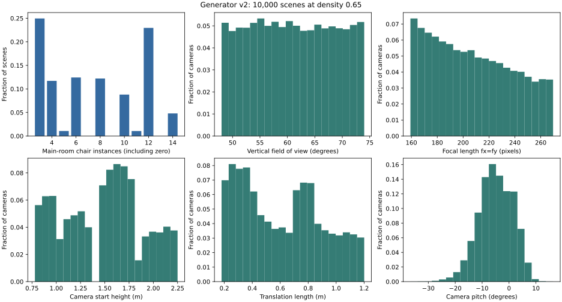
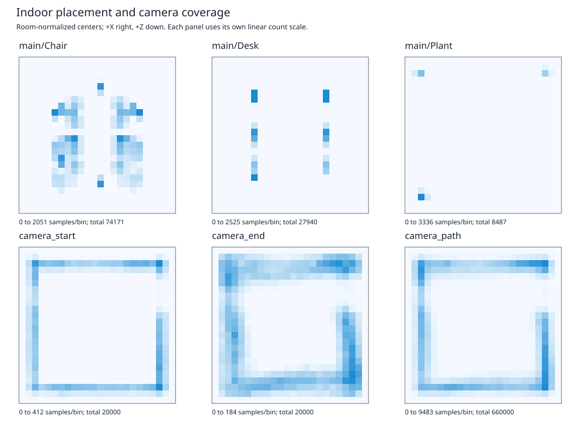

# Procedural indoor evaluation — generator v2

This is a historical v2 report. See the [current v3 evaluation](procedural_indoor_review_v3.md).
The original lighting A/B numbers below were later found to include interactive-camera motion; v3 replaces them with fixed-camera controls and exact pose-equality assertions. They must not be used as isolated lighting-effect measurements.

The indoor mode now has reproducible, tested geometry, cameras, PBR rendering,
lossless dataset exports and a working WebGPU viewer. **It is not yet a
state-of-the-art photorealistic indoor generator.** The broad visual review shows
recognizable, coherently furnished offices and conference rooms, but also repeated
room arrangements, synthetic indirect lighting, simple foliage and screens, and
limited surface wear. These are visible quality limits, not gaps that a successful
build or count histogram can resolve.

The review changed implementation as well as tests. Version 2 intentionally changes
seeded layouts and camera trajectories; retain the generator version with datasets.
Existing Cornell, object, room, semantic-room and human modes remain available.

## Findings and changes

| Area | Corrected and verified | Remaining limit |
| --- | --- | --- |
| Materials and textures | Separate material roles for furniture parts; metre-scaled UVs; tabletop grain follows the long axis; normal-map Y sign corrected; sRGB albedo versus linear normal/roughness maps; normalized normal mips and complete mip chains | Small repeating procedural texture families, limited wear/seams, shared screen appearances and limited foliage variation |
| Object construction | Real sofa/chair floor contacts, exposed book pages, separate frames/upholstery, complete conference seating, screens facing their seats | Conservative solid envelopes keep chairs pulled out; only a few furniture families and no new clothed people |
| Placement and architecture | Props checked against support bounds and peers, neighboring furniture separated, pillars and doorway apron checked, suspended luminaire clearance enforced | Four furniture grammars share a rectangular main room plus one glazed neighbor; no arbitrary building topology or complex occupancy/clutter model |
| Cameras and trajectories | Stable camera IDs, continuous collision checks including desktop props, optical-axis checks throughout actual runtime motion, explicit calibrated poses, wider translation baselines | Mostly perimeter viewpoints aimed inward; no demonstrated match to a real camera-motion distribution, lens distortion or calibrated sensor noise |
| Lighting and shadows | Cone-integrated spotlight flux, lower ambient fill, floor-lamp point lights, correct sun placement, real shadow maps, explicit controlled light/shadow ablations | Approximate environment/ambient illumination; no multi-bounce GI, area-light integration or physically calibrated sky/weather model |
| Dataset generation | Index-to-seed mapping independent of workers, explicit layout/density/quality/rotation, complete partial chunks, validated resume, fail-closed capture errors, lossless RGB/labels and Rust/Python interchange | Temporal optical flow is rejected; glass uses the first opaque geometric surface in annotation passes; no pixel-level object-instance segmentation |
| Metrics and evidence | Zero-aware per-scene counts, layout-conditioned histograms, normalized placement/path heatmaps, intrinsic/extrinsic distributions, raw CSV, semantic pixel coverage, run IDs and completion markers | Distribution coverage measures the implemented grammar, not realism or ML transfer to real offices |
| Browser support | Actual hardware WebGPU scene rendering with Auto and Portable profiles, typed seed/config URLs and explicit capability errors | Viewer support only; synchronous dataset readback is rejected on Wasm; low-limit/mobile adapters remain unqualified |

## Structural coverage

The independent CPU sweep covers **40,000 scene configurations**: seeds 0–9,999 at
densities 0, 0.35, 0.65 and 1, with four cameras each. All **160,000 camera
trajectories** and generated layouts passed their constraints. These populations
share seeds; they are not 40,000 independently sampled identities.

Tests also inspect actual constructed geometry: floor contact, notebook page
visibility by ray intersection, architectural triangle distance along camera paths,
doorway clearance, material map encodings, mesh topology, and UV orientation.
Loaded-manifest corruption tests reject pillar collisions, neighboring overlaps,
invalid supports and unsupported placement. These independent checks complement
the runtime's conservative nominal-envelope tests.

The 10,000-scene density-0.65 audit contains 2,469 conference, 2,496 lounge, 2,521
office and 2,514 training scenes. Main-room furniture/prop instances range from
18 to 57; main-room chair counts range from 3 to 14. At this density, lounge scenes
always contain three main-room chairs, while 41.59% of scenes have no main-room
plant. The metrics expose these grammar biases rather than treating every seed as
equally novel semantic content.

Camera start heights span 0.780–2.250 m and vertical FOV spans 48.000–73.997°.
Translation lengths span about 0.180–1.201 m, with a mean of 0.614 m; small vertical
motion makes the total length slightly exceed the 1.20 m horizontal family limit.
The CSV also exports actual resolution-dependent fx/fy, principal point, near/far,
pose endpoints, target, pitch and yaw. Fixed centered principal points and near/far
are reported as constant distributions, not artificial diversity.

Heatmaps use main-room-normalized object centers and 33 samples per camera path.
Neighbor coordinates are normalized separately. They describe placement, not
projected visibility or traversable free-space probability. Histograms include
zeros for absent kinds; layout-conditioned histograms use the corresponding layout
population as denominator.

## Rendered coverage and calibration

The native qualification selected the first seed observed in every
**layout × lighting × floor × furniture** cell: 4 × 3 × 3 × 3 = **108 scenes**.
There was no appearance-based rejection or replacement. Two cameras at progress
0, 0.5 and 1 produce **648 views**, each with RGB, linear depth, normals, semantics
and position at 320×240. All buffers, semantic palette values, camera calibration
and geometric alignment checks passed. All 108 first-view images were visually
reviewed in the complete contact sheets:

- [Conference: all 27 combinations](procedural_indoor/contact_conference.png)
- [Lounge: all 27 combinations](procedural_indoor/contact_lounge.png)
- [Office: all 27 combinations](procedural_indoor/contact_openoffice.png)
- [Training: all 27 combinations](procedural_indoor/contact_training.png)
- [Measured darkest and brightest views](procedural_indoor/contact_exposure_extremes.png)

A separate pass captured **72 views** from eight scenes at **801×601**, with three
cameras, three trajectory steps, whole-room rotation and an empty asset directory.
This exercises odd GPU row strides, augmented world extrinsics and independence
from image/mesh catalogs. Across both passes, 720 views and 3,600 modality images
passed. Pose matrix maximum absolute error was zero in the unrotated pass and
4.77e-7 in the rotated pass.

| Measured quantity | 648-view coverage pass | 72-view high-resolution pass |
| --- | --- | --- |
| Mean tone-mapped linear luminance, per view | 0.0975–0.3022 | 0.1069–0.2210 |
| Luminance standard deviation, per view | 0.0584–0.2825 | 0.0691–0.2132 |
| Largest fraction above 0.99 linear luminance | 0.125% | 0% |
| Depth/position disagreement, per-view p99 | 7.60–21.76 mm | 7.68–23.06 mm |
| Position reprojection error, per-view p99 | 0.66–7.35 pixels | 1.93–12.31 pixels |
| Largest normal unit-length error | 0.00161 | 0.00161 |

The annotation errors are material. Readback files are RGBA32F, but the renderer's
intermediate HDR target quantizes values to RGBA16F; exterior geometry enlarges
the normalized position range. The checks use a reported conservative float16
error budget. **This does not certify millimetre geometry labels or subpixel
correspondence.** Geometric/calibration correctness and photo quality are separate
claims. RGB signal thresholds detect blank, grossly dark or grossly clipped frames;
they are not a photographic-realism score.

The run report checks unique run IDs, completion markers and configuration
agreement before aggregating captures. An early expected-pose check incorrectly
omitted runtime zero-roll reconstruction; it was corrected and the complete pass
rerun. Partial pre-qualification outputs do not enter these numbers. Report-integrity
regressions cover stale/missing captures, incomplete runs and configuration mismatches.

## Lighting evidence

Fixed-scene ablations at 640×480 show that local shadow maps affect approximately
32.9–33.3% of pixels by more than 0.005 tone-mapped linear luminance. Removing all
direct lights affects 59.5–59.8%, with mean absolute differences of 0.0251–0.0275.
The earlier configuration was dominated by ambient fill; correcting the spotlight
cone normalization and rebalancing illumination made direct light meaningful.
The [ablation data](procedural_indoor/lighting_ablation.json) records every condition.

Turning off all shadows while leaving the sun active produces major light leakage
through solid walls. Portable therefore disables direct sun as well as shadow maps.
Its remaining unshadowed fixtures are an explicit performance/compatibility tradeoff.
No claim of measured illuminance accuracy or full global illumination follows from
these pixel-difference tests.

## Dataset and browser qualification

[Dataset qualification](procedural_indoor/dataset_qualification.json) records actual
GPU CLI/Python tests, not just serializer fixtures: one versus two export workers,
partial-chunk resume, rejected incompatible resume/overwrite, shuffled/repeated
Python indices, two spawned DataLoader workers, three time samples and two cameras
at odd 161×119 resolution. Tested manifests, camera matrices, semantic labels and
lossless RGB match across workers and storage formats. The [dataset guide](procedural_indoor_dataset.md)
describes the canonical CLI, codecs, resume contract and automatic metrics export.

The [WebGPU guide](procedural_indoor_web.md) and its linked browser evidence state
exactly which viewer modes and regeneration cases passed. The tested configuration
uses headed Chrome 153 on the NVIDIA Blackwell adapter, with explicit Linux Vulkan/
WebGPU launch flags and 48 sampled textures per shader stage. Auto/Portable
success on that adapter does not qualify baseline-limit devices, Safari or mobile.
All 20 browser mode/profile/seed cases passed startup and regeneration (40 real
screenshots). A two-camera startup grid and explicit readback-rejection check also
passed. Browser scene viewing and native dataset capture are distinct supported paths.

Native regression tests also capture Cornell and simple-room scenes after indoor
regeneration. They preserve legacy behavior; legacy human/semantic-room assets
remain necessary for those content modes. A strict workspace clippy pass, 48 root library tests, 14 Rust export tests, six
Python dataset tests and 13 report-integrity tests accompany the runtime evidence.
The native viewer test verifies both generated position and field of view.

## What is still required for the photorealism target

The checked-in gallery and full contact sheets support architectural plausibility
within the implemented grammar. They do **not** support a frontier/SOTA claim or
photographic quality across arbitrary indoor space. The largest remaining work is:

1. Better area-light shadows, glossy transport, fine indirect-visibility accuracy
   and a coherent sky/weather/exposure model, evaluated against a reference renderer.
   Version 3 now includes bounded static multi-bounce diffuse GI; see the current review.
2. Broader connected-room topology, door/corridor circulation, furniture families,
   clutter and wear, more realistic plants, clothing and human occupancy.
3. Less camera/target bias, configurable calibrated sensor models, dedicated high
   precision annotation passes and tested transparent-layer/instance policies.
4. Long-running isolated memory/throughput qualification and a scene-disjoint,
   matched real-data benchmark measuring downstream ML benefit.

The [machine-readable qualification](procedural_indoor/qualification.json) identifies
the current evidence and sources. Earlier version-1 numbers are historical, not
current validation of the version-2 generator.
