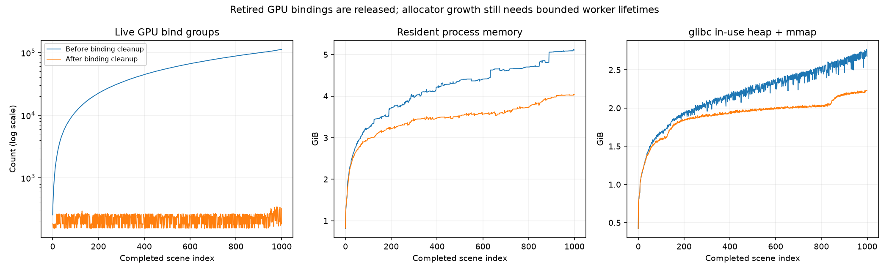

# Indoor qualification after the Bevy 0.19 migration

**Status: native, WebGPU and dataset qualification passed; finite worker
lifetimes accepted.** The current source targets Bevy 0.19.1 and retains indoor
generator version 3. A GPU-binding retention bug is fixed. The final 1,000-scene
run still shows allocator growth, so an unlimited in-process memory plateau is
not accepted. Photographic state of the art is not demonstrated. The
[qualification record](procedural_indoor/qualification_bevy019.json) and
[source/binary identities](procedural_indoor/source_identity_bevy019.json)
identify the evidence and its boundaries.

The [Bevy 0.17 review](procedural_indoor_review_v3.md) and its images, 108-cell
render sweep, high-resolution sweep and sustained timing/memory reports remain
historical evidence. They are not measurements of the migrated renderer. The
generator version describes the seeded scene grammar; the capture-engine identity
separately identifies renderer and dependency changes.

## Migration and reproducibility

The [dependency record](procedural_indoor/dependency_releases_v3.json) identifies
Bevy 0.19.1, Burn 0.21.0, `burn_human` 0.4.0 and `bevy_burn_human` 0.4.0, including
registry checksums and the dependency-lock hash. The migrated runtime artifacts
record wgpu 29.0.4. `CAPTURE_ENGINE_IDENTITY` is
`capture-v4;bevy=0.19.1;burn=0.21.0;burn_human=0.4.0;bevy_burn_human=0.4.0`.
It is saved with capture provenance and the resume contract. Older datasets remain
readable; a new capture engine cannot append to an older contract. Start a new
output directory for this migration.

The procedural generator keeps its existing rand/ChaCha stream separately from
Bevy's updated sampling dependency. Renderer integration adapts the native
float32 geometry pass, asynchronous copies, GI compute and annotation shaders to
the updated APIs. The native annotation contract remains two RGBA32Float targets:
world position plus camera-Z depth, and view normal plus semantic class ID. RGB
still passes through the renderer's HDR color pipeline. Float32 ground truth does
not imply that every RGB or illumination intermediate uses float32.

Native captures with image copiers now use CPU light clustering. A
[matched clustering control](procedural_indoor/clustering_control_bevy019.json)
found three differing RGB channels out of 76,636 in an unchanged scene with GPU
clustering, before cache cleanup was enabled; maximum difference was 0.000732422.
CPU clustering passed the tested exact replay controls. GPU shading, shadows,
GI and asynchronous readback remain active. Browser viewing retains its renderer
clustering path. This is measured replay behavior on the tested adapter, not a
cross-driver guarantee of identical floating-point output.

The [migrated residency control](procedural_indoor/render_residency_bevy019.json)
checks the view/light/prepass key maps and GPU bin-unpacking binding cache
in Bevy 0.19. The old
specialization-tick maps were removed upstream and are no longer patched here.
At 161×119 with two cameras, 64 regenerated scenes, eight fixed-scene captures,
cleanup toggling and same-seed replay preserved all five planes bit-for-bit.
GI was disabled and CPU clustering was explicitly selected for this control.
The final cleanup rerun passed with 184 live GPU bind groups and a clean process
exit. The bin-unpacking cache retained at most 32 live view/phase entries and
evicted 2,076 obsolete entries. Cache counts alone do not bound allocator or
driver memory; sustained measurements are checked separately.

The refreshed [native sweep](procedural_indoor/render_summary_bevy019.json) covers
all 108 layout/lighting/floor/furniture cells selected without image filtering
from 10,000 seeded layouts: 648 views, two cameras and three trajectory times.
Worst per-view p99 depth/position disagreement is 3.34 micrometres, and
reprojection disagreement is 0.00276 pixels. Current [conference](procedural_indoor/contact_conference_bevy019.png)
and [office](procedural_indoor/contact_openoffice_bevy019.png) contact sheets,
[count/intrinsic distributions](procedural_indoor/distributions_bevy019.svg),
[placement heatmaps](procedural_indoor/placement_heatmaps_bevy019.svg) and
[raw metrics](procedural_indoor/metrics_bevy019.json) retain the full population.
Visual review shows improved ceiling bounce and recognizable furnishing/material
separation, alongside repeated furniture families and visibly stylized people.
These measurements do not establish photographic realism.

## Current runtime evidence

| Check | Current evidence and boundary |
| --- | --- |
| Native float32 ground truth | [Independent f64 ray/triangle reference](procedural_indoor/ground_truth_precision_bevy019.json): 518 checked intersections; maximum world/depth errors 66.1/57.7 micrometres and reprojection error 0.00218 pixels. Empty geometry clears all annotations and releases geometry residency. The [fixed-policy shutdown control](procedural_indoor/teardown_control_bevy019.json) completed 40/40 oracle checks with clean process exits. |
| Motion and metadata coherence | [Migrated regression log](procedural_indoor/capture_coherence_bevy019.log) covers explicit trajectory sampling, native and legacy modes, failure recovery and scene identity. Final rebuilt-source rerun passed with a clean process exit. |
| GPU diffuse GI | [256-ray GPU versus 4,096-ray CPU control](procedural_indoor/gi_gpu_reference_bevy019.json): relative mean absolute error 17.01%, three diffuse bounces. This compares selected probe/lobe values, not rendered-image realism. |
| GI contributes to RGB | [Fixed-camera GI ablation](procedural_indoor/gi_render_ablation_bevy019.json): disabling the irradiance volume changes mean per-pixel linear luminance by 0.02736 and 0.02458 in two seed-6 views. These migration results supersede the old renderer's ablation values for the current path. |
| Legacy rendering | [Migrated legacy regression log](procedural_indoor/render_legacy_bevy019.log) retains Cornell/simple-room and annotation checks. It does not qualify optional GPU voxelization parity. |
| WebGPU viewer | [Migrated browser suite](procedural_indoor/web_qualification_bevy019.json): 20/20 cases and 20/20 regenerations passed across seeds 0/6, Auto/Portable, RGB and four displayed annotations. The [two-camera grid and regeneration](procedural_indoor/web_grid_bevy019.json) also passed. Headed Chrome 153 used NVIDIA hardware WebGPU/Vulkan with a 48-sampled-texture limit. [Wasm compile log](procedural_indoor/wasm_build_bevy019.log) is separate compile evidence. |
| CLI, FFI and Python | [Final Bevy 0.19 dataset qualification](procedural_indoor/dataset_qualification_bevy019.json) passes raw five-plane interchange, cap-1 worker replacement versus cap-0 exact RGB/labels, one/two workers, partial resume, index invariance and two spawned Python DataLoader workers. Prior `dataset_qualification_v3*` results belong to Bevy 0.17. |
| Operational process memory | [Auto256 process-memory qualification](procedural_indoor/process_memory_bevy019.json) passes 128 scenes / 384 views across eight cap-16 child lifetimes; all exits and GPU releases observed. |
| Continuous generation | [Final 1,000-scene report](procedural_indoor/generation_performance_bevy019.json): 3,000 complete views, 3.83 measured views/s, 4.04 GiB peak RSS and at most 344 live GPU bind groups. Residual allocator growth remains. |

Rendering assertions and a written result file do not override an abnormal process
exit. A [native debugger backtrace](procedural_indoor/teardown_stack_bevy019.log)
places the teardown failure at `vkDestroyDevice`
on an Async Compute Task thread while dropping a pipeline/shader after the test
completed. Disabling the pipelined render thread alone still failed in two of 20
repeats. Native image-copier capture now enables Bevy's supported synchronous
pipeline-compilation setting; render threading and asynchronous image readback
remain enabled. Before this change, 13 of 40 processes crashed despite passing
their rendering assertions. The fixed policy passed all 40 independent processes:
20 with pipelined rendering and 20 with the render-thread control disabled.
This accepts the tested shutdown regression; it is not a guarantee for all
drivers or arbitrary applications. Full dataset worker lifetimes are checked
separately below.

## Bounded child lifetimes for finite dataset jobs

The sustained Bevy 0.19 investigation found a concrete GPU resource leak:
`BinUnpackingBindGroups` inserts bindings for each retained view/phase, but does
not remove retired camera/shadow views. Its separate buffer cache already prunes
dead views. The [1,000-scene reference](procedural_indoor/generation_performance_bevy019_before_bind_cleanup.json)
finished with 112,313 live GPU bind groups, up from 256. Final-quarter live
glibc heap plus mmap allocations grew by 1.10 MB per scene despite stable
buffer/texture handle counts and bounded readback staging. Host compilation
overlapped the later reference scenes, so its timing is diagnostic.

The renderer now removes those obsolete bindings after rendering while retaining
all phases of live views. A unit test covers multiple phases, and the native
64-regeneration regression checks both exact pixels and actual live GPU bindings.
It ended with 184 live bindings. This correction uses public Bevy resources and
does not patch or fork the published dependency. The final sustained-memory
measurement below determines its effect beyond the shorter regression.

Finite indoor CLI jobs using `--per-process=true` replace a child after at most
256 captured scenes by default. `--max-scenes-per-process N` changes this budget;
`--scenes-per-child` is an alias. Explicit `0` keeps persistent children. At most
`--workers` children are alive concurrently. A positive budget with
`--per-process=false` is rejected. This policy does not restart Python's persistent
in-process engine, and does not change the other scene modes' default lifetime.

The parent assigns global sample and chunk spans before launch. A replacement
continues the same `base_seed + global_sample_index` sequence. Child boundaries
may create partial chunks, including before the final child. Compatible resumes
may change the worker count and child budget; they must preserve the capture
contract. `worker_lifecycle.jsonl` records run IDs, PIDs, reusable worker slots,
job IDs, sample/chunk spans and terminal states. A failed child stops new launches
and causes remaining children to be killed and reaped; completed outputs remain
available for inspection. See the [dataset contract](procedural_indoor_dataset.md).

This is an operational limit on each process's lifetime. It is not proof that an
unbounded renderer reaches a memory plateau. Scene complexity, camera count,
resolution, chunk size and concurrent workers still determine peak memory. Every
replacement also repeats renderer/GPU startup. Earlier 1,000-scene controls did
not establish a general bound on the live heap; constant staging buffers or GPU
handle counts were insufficient to make that claim.

The new [qualification harness](../scripts/qualify_indoor_processes.py) samples
the actual CLI process tree from `/proc` and per-PID GPU residency from NVML. It
records PID plus kernel start time, child lifetimes, parent and child RSS peaks,
worker concurrency and disappearance of each terminated child's GPU residency.
Each exited child must disappear from NVML within a 15-second grace period.
Peaks and exit/release times are observed polls, not continuous maxima or exact
event times. Other GPU processes are recorded separately.

The process qualification uses 128 scenes, a 16-scene cap, one worker, Auto lighting with
256 rays per probe, human density 0.5, three cameras, one trajectory sample,
161×119 pixels, raw five-plane output and eight samples per chunk:

```sh
cargo build -p bevy_zeroverse_burn --bin zeroverse_gen
python scripts/qualify_indoor_processes.py --quality auto \
  --output out/indoor_bevy019_bounded_process128
```

The Python environment needs `nvidia-ml-py`. The script refuses an existing output
directory, retains logs and failed outputs, and terminates its process group on
errors or interruption. Eight CPU contract tests cover teardown, PID identity,
NVML release, lifecycle spans and malformed data. It validates every safetensor
byte range, plane shape, precision/encoding tag, manifest seed and Auto256 GI
provenance without loading all image tensors into memory. Numerical image checks
are performed by the separate dataset regression.

The final run exited successfully and validated 128 samples / 384 stored views
across eight completed worker lifetimes. Observed process-tree RSS peaked at
2.42 GiB, GPU memory at 1.28 GiB, and parent RSS at 43.4 MiB. Every worker's
exit and disappearance from NVML was observed. The [machine-readable report](procedural_indoor/process_memory_bevy019.json)
retains individual lifetimes, peak measurements, release times and artifact
hashes. Polling at 100 ms observes peaks rather than establishing continuous
maxima. These measurements qualify cap 16 at 161×119, three cameras and Auto256;
they do not establish the default cap-256 peak or arbitrary high-resolution jobs.

## Upload efficiency and preserved output

Native annotation geometry and GI transport buffers now use queued uploads,
allowing submission to follow the existing asynchronous render/readback path.
A debugger captured remaining stalls inside CPU memory copies used by Vulkan
buffer and texture uploads. On this workstation, glibc's default REP MOVSB copy
path performed poorly against the driver's write-combined upload allocation.
The [matched 64-scene control](procedural_indoor/upload_comparison_bevy019.json)
compares the same queued-upload binary and seeds, discarding 16 warmup scenes:
system copies achieved 0.870 views/s and streaming copies 3.534 views/s, a
4.06-fold improvement. Median scene time fell from 3.344 to 0.861 seconds; p95
fell from 4.035 to 0.988 seconds. This is one matched pair on the recorded
NVIDIA/Vulkan hardware, not a universal or statistically replicated speedup.

Spawned indoor CLI workers on Linux/glibc/x86-64 select the measured streaming
copy policy only when `GLIBC_TUNABLES` is absent. An existing value is preserved;
an explicitly empty value selects system defaults. The parent, other platforms,
other scenes and direct/Python processes keep their existing environment. The
[dataset guide](procedural_indoor_dataset.md) records the exact setting. The
direct benchmark explicitly sets it before startup, so its recorded command is
reproducible. GPU utilization remains workload-dependent; this optimization does
not establish continuous GPU saturation.

[Before/after comparison](procedural_indoor/upload_equivalence_bevy019.json)
checked all five stored planes, cameras, intrinsics, trajectory times and manifests
exactly across five samples / 30 views, including the final GPU-binding cleanup.
Every value matched. Final native
float32-reference, GI-reference and 64-regeneration residency controls also pass
after queued uploads and GPU binding cleanup, as does the full CLI/Python dataset qualification. The
108-cell broad render sweep precedes this transport optimization; its shaders
and scene grammar are unchanged. Its evidence is supported by these explicit
equivalence checks rather than an unreported second broad sweep.

## Sustained generation after binding cleanup

The [final measured run](procedural_indoor/generation_performance_bevy019.json)
completed 1,000 scenes / 3,000 actual five-plane views with a clean exit. After
64 warmup scenes, 2,808 measured views achieved 3.833 views/s. Median/p95 scene
time was 0.764/0.954 seconds. This includes scene preparation and capture at
320×240 with three cameras, Auto256 GI and human density 0.25; PNG/dataset
encoding is excluded. The separate CLI qualification covers the writer.

Live GPU bind groups ended at 184 and never exceeded 344, versus 112,313 at the
end of the reference. Readback staging stayed at 11,059,200 bytes. Peak sampled
RSS was 4.04 GiB and matching-process GPU memory peaked at 1.46 GiB. Reported
per-process NVML SM-utilization samples averaged 24.74%; their timestamps have
gaps, so this is neither continuous occupancy nor device saturation. Device-wide
utilization includes other processes and is not attributed to the generator.
Mean scene preparation/capture times were 0.202/0.581 seconds.

The final 250 scenes still show **1.104 MB/scene growth in glibc in-use heap plus
mmap allocations**, comparable to the reference's 1.103 MB/scene. Tail RSS grows
by 1.725 MB/scene. Releasing obsolete GPU bindings fixes that resource leak and
reduces peak residency, but does not resolve all allocator/driver retention.
The mechanism of the remaining growth is unisolated. Finite CLI worker recycling
therefore remains the operational bound; direct CLI/Python generation has no
accepted unlimited-lifetime memory guarantee.

The [comparison record](procedural_indoor/binding_memory_comparison_bevy019.json),
[complete timing/memory curves](procedural_indoor/generation_performance_bevy019.svg),
and compressed [before](procedural_indoor/scenes_bevy019_before_binding_cleanup.jsonl.gz)/[after](procedural_indoor/scenes_bevy019_after_binding_cleanup.jsonl.gz)
per-scene traces retain these distinctions. Both runs use the same seeds and
settings. Compilation overlapped the later reference scenes; its timing must
not be used as an isolated causal speedup measurement.



## Distribution exports and remaining limits

Count histograms include absent classes as zero-count scenes; placement heatmaps
and camera calibration distributions remain available. Scene/object/camera/person
CSV rows and categorical counts stream. Numeric distribution export currently
retains and sorts all values to calculate exact quantiles. Its numeric payload is
at least `8 * (10 * scenes + 13 * total_cameras + 2 * total_people)` bytes, before
vector capacity and sorting overhead. At one million scenes and three cameras
per scene, the scene/camera payload alone is about 374 MiB. Child recycling does
not bound this parent-side post-processing phase. Use `--indoor-metrics=false`
when these full-population statistics are unnecessary. No bounded-memory quantile
implementation is claimed by this revision.

Indoor architecture and furniture remain composed procedural assemblies, with
neighboring rooms and exterior views through glazing. Camera paths, occupancy,
materials and lights vary across seeds. The historical large geometry audit is
documented in the [generator-v3 review](procedural_indoor_review_v3.md); the broad
[108-cell native sweep](procedural_indoor/render_summary_bevy019.json) now passes all 648 views on Bevy 0.19, with three trajectory samples per camera. The old 801×601 sweep remains historical.
Repeated room/furniture families, visibly procedural people, simplified plant
foliage and static poses remain substantial realism limits.

Visual inspection of the migrated browser output also found curved/fine band
patterns across some lit painted walls; their cause has not been isolated.
Screen/chart motifs repeat, faces/hair/hands remain simplified, and clothing
looks uniformly smooth and stiff. Portable lacks the grounding from contact and
cast shadows, while browser ceilings lack native indirect-light variation.
Successful viewer and annotation checks do not remove these visible limitations.

Auto GI uses finite rays/bounces and coarse directional probes. Probe interpolation
can leak light; reflections use a proxy environment, and full specular transport,
caustics and refractive transport are absent. Ground-truth glazing denotes the
first geometric surface rather than optical transmission. No accepted matched
path-traced or real-photograph comparison, perceptual realism score or downstream
real-data ML benefit establishes state-of-the-art photorealism here.

Wasm supports viewing with explicit capability reductions: no native GI volume,
quality-dependent shadows and legacy HDR annotation visualization. Native float32
dataset readback is not implemented in the browser. The tested desktop NVIDIA
WebGPU path does not qualify Safari, mobile devices or baseline-limit adapters.

Finite CLI jobs now run their rendering app on the main thread and finish its
lifetime before returning. The previous detached-app path failed during a cap-1
end-to-end worker test despite the isolated shader-compilation controls passing.
That failed run is retained at `out/indoor_bevy019_dataset`; the final rerun at
`out/indoor_bevy019_bounded_dataset` passes with clean process exits. Asset-free headless indoor startup also skips discovery of
legacy textures and meshes, avoiding the observed 32-second catalog scan per
cold worker. Viewers, grids and legacy scene startup retain catalog discovery.

Final native library checks pass 67 tests with three explicitly ignored, and
the Burn dataset library passes nine tests. Strict workspace Clippy and the
rebuilt Wasm viewer pass; the final browser suite repeats all 20 cases plus both
two-camera grid profiles with regeneration. The
legacy optional GPU voxelization comparison still reports 13 versus 43 CPU
voxels and skips equality; it is not qualified for parity. Its wgpu 29 binding
limit guard now accounts for all nine storage buffers in the prepare layout.
The indoor dataset path keeps optional voxelization disabled.
