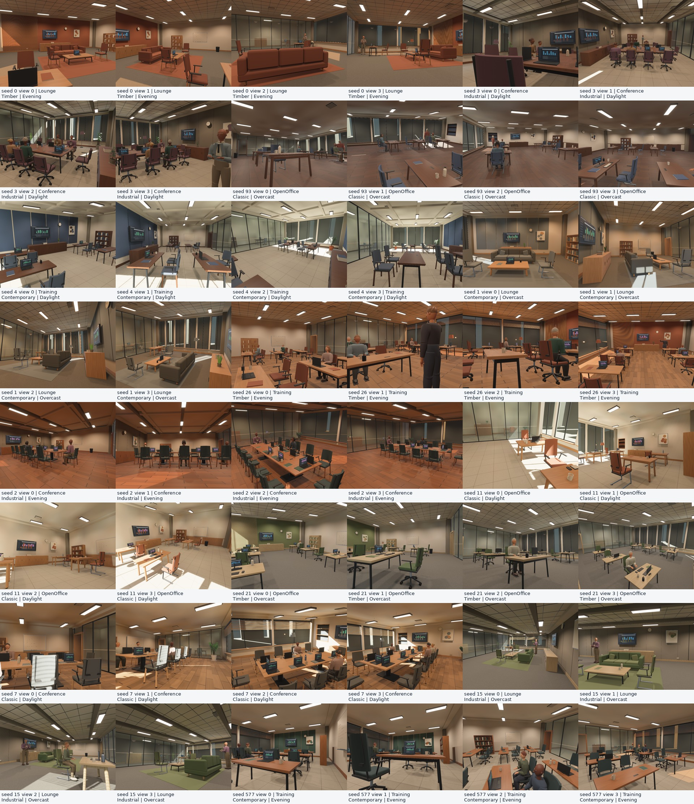
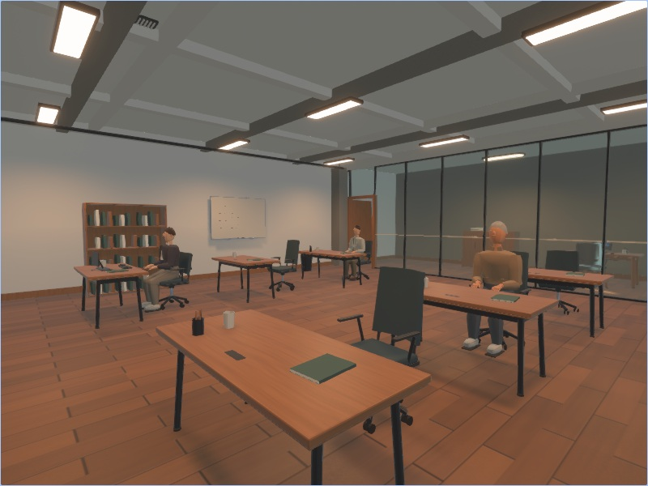
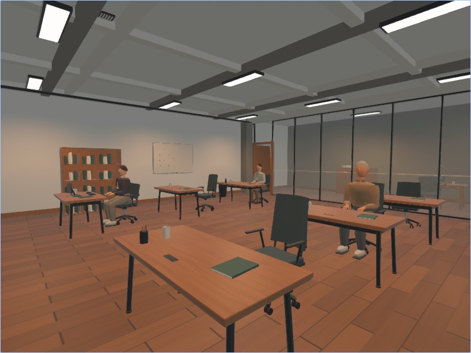

# Generator-v4 scene quality review

Generator v4 expands the asset-free indoor grammar on capture-v6, Bevy 0.19.1
and Burn 0.21.0. It changes seeded scene content, so generation cannot be resumed
into a generator-v3 dataset. Existing dataset readers and older scene types are
retained. This review describes visual and geometric qualification, not a claim
of photographic realism or a fitted distribution of real offices.

## Scene changes

* Four independently sampled architectural finish families: acoustic panels,
  timber slats, industrial joints/conduits/beams, and classic wainscot with a real
  recessed shelving opening. Ceiling choices include a coffered treatment.
  Window insets, glass partitions, neighboring rooms and outdoor views remain.
* Wider room dimensions: 7.0–13.5 m wide, 7.2–12.5 m deep and 2.8–4.05 m high;
  two through six window bays. Wall details stay outside the established
  furniture/camera clearance margins.
* Six botanical forms: rubber plant, palm, snake plant, split-leaf tropical,
  fern and dracaena. Each has a hollow pot, rim, saucer, soil, separate stem and
  leaf materials, curved leaf silhouettes and per-leaf UVs. Pots vary between
  terracotta, concrete and ceramic. Floor plants and small cabinet plants use
  the same proportional grammar.
* Keyboards with individual keys, mice, capped bottles and pen holders with
  separate pens add desk clutter. Placement uses the existing rotated support
  and overlap checks; rejected placements remain visible in the audit.

The plant approach was informed by reviewing bevy_ftb's curved lamina and branch
construction. Its code and assets were not copied. A first render inspection
found overly sparse palm/fern silhouettes; the final foliage has wider leaflets,
more fronds and a lower fern crown. The change preserves the tested bounds and
per-plant triangle budget rather than hiding it with a texture billboard.

## Validation evidence

The [4,096-seed audit](procedural_indoor/distribution_generator4.json) found zero
invalid layouts and covered all 432 layout/lighting/floor/furniture/architecture
strata. Architectural counts were 1,068 Classic, 1,036 Contemporary, 1,027
Industrial and 965 Timber. The six plant forms occurred 1,802–1,907 times each.
Main-room chairs ranged from 3 to 16 at density 0.65. This is sampled validity,
not proof over every possible seed or density.

The [exact metrics](procedural_indoor/metrics_generator4.json),
[distribution plots](procedural_indoor/distributions_generator4.svg) and
[placement heatmaps](procedural_indoor/placement_heatmaps_generator4.svg) include
zero-count object cases, camera intrinsics and paths. The audit includes 16,384
cameras; field of view spans approximately 48–74 degrees and camera height
0.78–2.25 m. Heatmaps count object centers and camera paths, not image visibility.

Twelve scenes were selected by categorical coverage before rendering, with four
cameras each at 960×720. All [48 captured views](procedural_indoor/render_summary_generator4.json)
passed annotation checks: maximum per-view p99 reprojection discrepancy was
0.00269 pixels and depth/position disagreement was 2.87 micrometres. Camera
metadata matched the requested poses exactly. These are alignment checks, not
independent physical-realism measurements. All four architectural families appear
three times in the cohort. No view was removed for appearance.

Close-ups exposed the initial sparse foliage and informed the final revision.
The [plant crops](procedural_indoor/plant_details_generator4.jpg) include
occlusion and retain their [crop provenance](procedural_indoor/plant_crop_provenance_generator4.json).
The split-leaf form lacked a useful close-up in the cohort, so seed 2955 was
selected separately using projected plant size from the audit, then rendered
with four cameras. This [targeted view](procedural_indoor/tropical_generator4.jpg)
is a morphology check, not a population-quality statistic. Plants remain
recognizably procedural at close range.

The [CLI/Python round trip](procedural_indoor/dataset_qualification_generator4.json)
passed raw RGB, label, camera and manifest equality across worker counts,
process replacement, folder/chunk outputs and resume. Three trajectory times
were captured per camera. The [browser report](procedural_indoor/web_qualification_generator4.json)
passed eight native-Chromium WebGPU cases: two seeds, Auto/Portable and RGB/depth,
each with regeneration. Auto and Portable screenshots are retained below.
Native annotation tests do not establish browser dataset capture support.

The [qualification record](procedural_indoor/qualification_generator4.json)
records binary hashes, 79 passing workspace library tests, 40 Python reporting
tests and strict all-target workspace Clippy. Plant tests cover six forms across
12 seeds, finite unit normals, nondegenerate triangles, floor contact, placement
bounds and fewer than 20,000 triangles per plant. The
[September 26 registry check](procedural_indoor/dependency_releases_generator4.json)
confirms the requested Bevy/Burn/human crates are the latest stable releases.

## Limits and release boundary

The grammar remains one rectangular room with one furnished neighboring room.
Finish diversity is broader than topology diversity. People remain stylized,
specular transport is approximate, and indirect diffuse lighting does not match
Cycles. The [physical comparison](procedural_indoor_review_v6.md) records the
generator-v3 reference results; those numbers do not measure the new geometry.

The same review records the failed 4,096-scene continuous-process memory gate.
Unlimited-process memory stability and state-of-the-art realism are unproven.
Keep the native CLI process lifetime limit enabled for production generation.
The root checkout's wgpu memory patches are not inherited by crates.io consumers;
their finite memory evidence must not be attributed to an unpatched dependency
graph. Browser Auto supports PBR and shadows, while Portable disables shadows
and expensive effects. Browser dataset readback and diffuse GI remain disabled.
