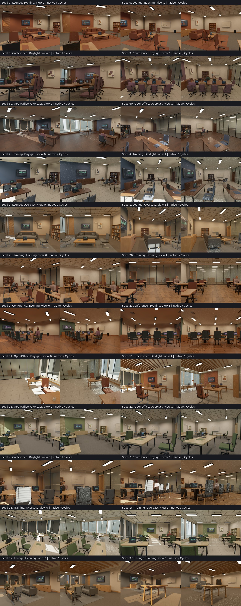

# Continuous capture and physical reference qualification

> **Archived evaluation.** This report describes its recorded build. Use the
> [documentation index](README.md) for current capabilities and defaults.

This review covers capture-v6 on Bevy 0.19.1, Burn 0.21.0, `burn_human` 0.4.0
and `bevy_burn_human` 0.4.0. Generator version 3 retains the existing seeded
architecture, furnishings and cameras. The earlier [migration review](procedural_indoor_review_bevy019.md)
records capture-v4 results; its memory and renderer results are historical.
The [registry check](procedural_indoor/dependency_releases_v6.json) confirms these
are the latest stable published releases as of September 24, 2026.

## Memory and generation

The [completed 4,096-scene qualification](procedural_indoor/memory_stability_v6.json)
**failed** its fixed growth gates. All 12,288 views completed in one PID. The
95% upper slopes were 9,752 bytes/scene for live heap (limit 8,192), 72,472 for
RSS (limit 32,768) and 16,021 for GPU memory (limit 8,192). Absolute memory,
window-growth, retained-resource and capture-completion gates passed. This does
not establish unlimited-process stability; keep the CLI process lifetime limit
enabled for production generation.

Three measured retention sources are addressed:

* Completed Vulkan command buffers release their driver storage by retiring
  their command pool. MemoryUsage allocates command buffers singly.
* The outer wgpu cache retains at most 64 idle command encoders under
  MemoryUsage. This bounds historical cache peaks; active submissions remain
  unrestricted and are never discarded.
* Native capture cameras use Bevy direct draws with GPU mesh preprocessing.
  Indirect validation remains enabled. Interactive and browser cameras retain
  their normal draw policy. The residency regression checks direct versus
  indirect annotation equality and tightly bounded RGB rounding differences.

The changes add no device-idle call, queue wait or extra submission. Existing
asynchronous readback, pipelined rendering and bounded writer overlap remain.
The local [wgpu-core patch](../third_party/wgpu-core/ZEROVERSE_PATCH.md) and
[Vulkan HAL patch](../third_party/wgpu-hal/ZEROVERSE_PATCH.md) are based on
published 29.0.4 sources, with upstream licenses preserved. Root Cargo patches
are **not inherited by downstream published-crate consumers**. Consumers need
these patches until equivalent upstream fixes are available.

The protocol requires 4,096 complete scenes in one PID, three 320×240 cameras,
RGB and four annotation planes, Auto quality, GPU diffuse GI, shadows, seed 400
onward and human density 0.25. After 512 warmup scenes, the last 2,048 scenes are
tested using 64-scene block means. The original upper-slope limits remain
8 KiB/scene for live heap and 32 KiB/scene for RSS; NVML process GPU memory adds
an 8 KiB/scene limit. Window-growth, absolute memory, retained resources,
constant staging and capture-completion gates are also required. These are
finite measurements on the stated adapter/configuration, not an extrapolation
to infinite time or every possible workload.
The benchmark itself retains two f64 statistics per measured scene; this small
16-byte/scene bookkeeping cost is included in the measurements. Production
capture does not retain this benchmark history.

Previous failed or interrupted candidates remain in the
[evidence index](procedural_indoor/memory_candidates_v6.json). A short run or
declining resource counts alone does not pass the long-run protocol.

## Physical accuracy against Cycles

The native renderer does **not pass a state-of-the-art physical-realism claim**.
The new [reference workflow](procedural_indoor_physical.md) makes that limitation
measurable using the actual procedural scene, without downloaded assets or fitted
exposure. It also provides optional offline Cycles rendering of exported scenes.

The preselected cohort covers four layouts and three lighting moods: 12 scenes,
two cameras each, 640×480. All actual mesh/camera alignment checks passed.
Both CPU and OptiX Cycles passed five radiometric controls covering emission,
diffuse lighting, hemispherical sky and two glass-transmission cases. The
[OptiX calibration](procedural_indoor/cycles_radiometry_v5_optix.json) and
[CPU calibration](procedural_indoor/cycles_radiometry_v5_cpu.json) include
sampling uncertainty. Approximate MNEE caustics failed a control and are disabled.

| Lighting stratum | Views | Median raw RGB relative MAE | Median 32-pixel block RGB relative MAE |
| --- | ---: | ---: | ---: |
| Evening | 8 | 16.46% | 8.97% |
| Overcast | 8 | 23.72% | 14.26% |
| Daylight | 8 | 58.98% | 21.42% |

These errors compare native output with raw 4,096-sample references. Daylight
caustics remain noisy even in the independent 65,536-sample repeat, so its error
is **not an estimate of native error alone**. The two independently repeated
Evening views pass the preregistered coarse convergence checks. They still show
about 16% native RGB error. No cohort-wide or per-pixel convergence is claimed.
The [complete comparison](procedural_indoor/physical_comparison_v6.json) includes
wall, floor, ceiling, chair, glazing, emitter and person strata, exposure, image
hashes and independent convergence measurements.
Bright emitters weigh heavily in the whole-image metric. Evening median wall and
ceiling errors are 43.65% and 51.22%, respectively; these expose the indirect-light
deficit that the whole-image number understates.

Shadow normal bias now uses the correct shadow-texel units, removing broad wall
acne. Increasing diffuse transport from three to six bounces made less than a
1% improvement in the Evening/Overcast ablation and did not improve Daylight;
the default remains three bounces. `--gi-bounces` and `--gi-rays` expose the
budget for controlled offline experiments.

Native spot/point emitter proxies, interpolated diffuse probes, shadow maps and
the reflection cubemap differ from area-emitter integration, refracted sunlight
and full specular transport. The reference bridge also records its own limits:
different BSDF models, unmapped glass absorption and one animation time per
export when people are present. More samples do not remove those model errors.

The complete contact sheet shows recognizable offices and material separation,
alongside repeated furniture families, stylized people and approximate indirect
lighting. It is retained without aesthetic filtering. Camera clearance and
geometric correctness do not establish photographic realism or downstream ML
benefit.

## Population metrics and validation

The exact metric exporter now spills sorted runs after 32,768 values per metric
and merges them for exact quantiles and histograms. Its RAM is bounded by the
number of metrics. CSV rows and placement heatmaps are streamed; scratch files
are removed on completion/error.

The [100,000-scene population audit](procedural_indoor/population_100k_distribution.json)
found zero invalid layouts, with 24,929 Conference, 24,927 Lounge, 25,143
OpenOffice and 25,001 Training scenes. It includes 842,739 main-room chairs and
300,000 cameras. The [exact statistics](procedural_indoor/population_100k_metrics.json)
include zero-count object cases, object counts by layout, camera intrinsics,
trajectory distributions and room dimensions. [Placement heatmaps](procedural_indoor/population_100k_placement_heatmaps.svg)
separate main and neighboring rooms. Peak RSS was 52,052 KiB during the
[80.20-second export](procedural_indoor/population_100k_runtime.log). This audits
procedural constraints, not the rendered realism of 100,000 scenes.

Capture-v6 passed native geometry, GI, capture-coherence and scene-render tests;
the CLI/Python dataset round trip, a 128-sample persistent writer run, and 20
browser mode/profile cases with regeneration also passed. Ten repeated direct/
indirect draw comparisons passed after an earlier RGB-tolerance failure, retained
in [the failure log](procedural_indoor/draw_comparison_failure_v6.log); this is
not evidence of universal bitwise equality between draw policies. These results
and the 100,000-scene audit describe **generator v3**, before the generator-v4
plant/architecture/clutter expansion. See the [v4 scene review](procedural_indoor_review_v4.md)
for current scene evidence. RGB retains an RGBA16F render intermediate; geometric
annotations use the independent RGBA32F pass and f64 intersection oracle.
