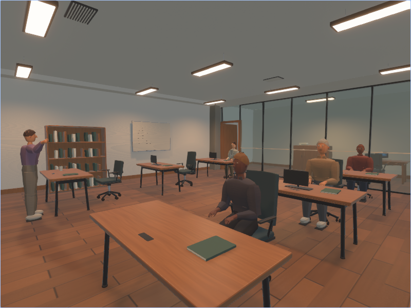
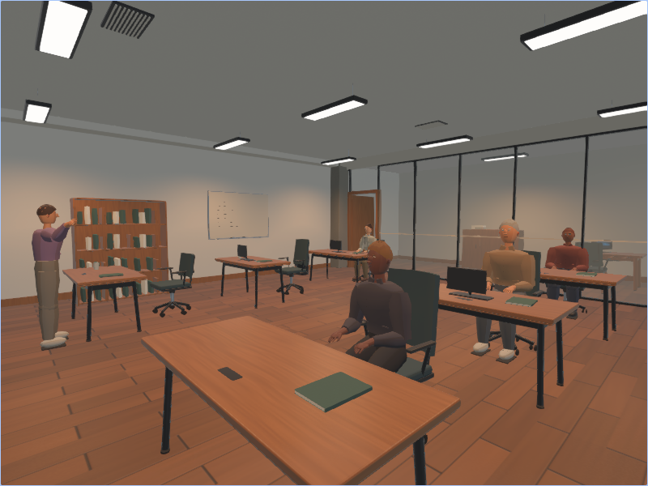
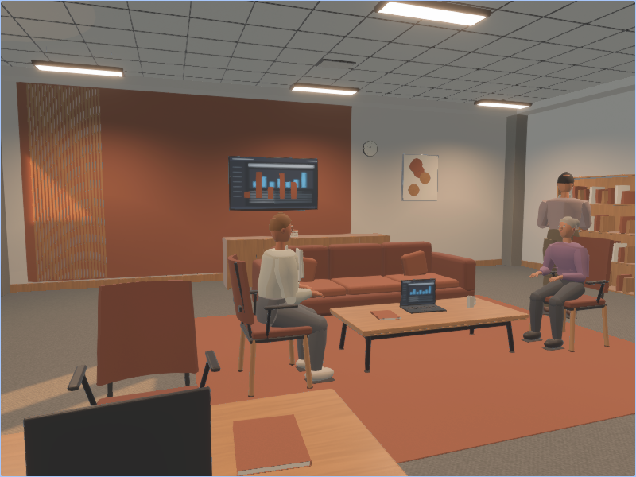
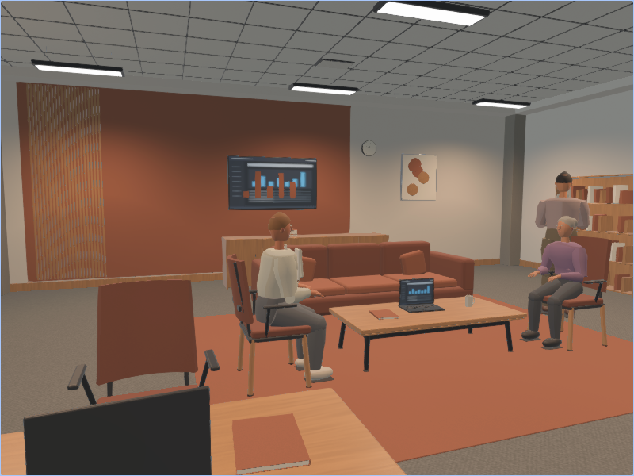

# Procedural interiors in WebGPU

The [generator-v4 review](procedural_indoor_review_v4.md) contains the current
native-Chromium Auto/Portable RGB/depth regeneration checks and screenshots.
The older reports below retain their original generator and dependency versions.

The Wasm viewer constructs the version 4 seeded interior grammar, articulated
procedural people, and procedural PBR maps in browser memory. It does not require
the furniture/material catalogs. Browser
dataset readback is unsupported: `image_copiers=true` fails with an actionable error
instead of attempting native GPU readback. Use native `indoor_validate`,
`zeroverse_gen`, or the Python dataloader for datasets.

## Build and serve

```sh
rustup target add wasm32-unknown-unknown
cargo build --bin viewer --target wasm32-unknown-unknown \
  --no-default-features --features web
# CLI version must match wasm-bindgen in Cargo.lock (currently 0.2.128).
cargo install wasm-bindgen-cli --version 0.2.128 --locked
wasm-bindgen --out-dir www/out --target web \
  target/wasm32-unknown-unknown/debug/viewer.wasm
python3 -m http.server 8765 --directory www
```

Open:

```text
http://localhost:8765/?scene_type=procedural-indoor&indoor_seed=6&indoor_quality=auto&editor=false&width=800&height=600
```

URL parameters accept underscore or hyphen field names, typed integer seeds,
native scene/layout/quality names, and existing serialized enum names. The startup
page checks WebGPU availability and retries adapter discovery briefly to handle a
transient browser GPU-process startup failure. It reports unsupported browsers
before launching the renderer. Hosting must use HTTPS or localhost.

The development Wasm binary is large; these correctness captures do not qualify
network startup performance. Use `--profile wasm-release` and its corresponding
artifact path for optimized publishing, then repeat browser validation.

## Feature profiles

| Capability | Native Auto | WebGPU Auto | Portable, either target |
| --- | --- | --- | --- |
| Procedural architecture, furniture, people and PBR maps | Yes | Yes | Yes |
| Generated environment reflections and PBR fixture lighting | Yes | Yes | Yes |
| Scene-baked diffuse irradiance volume | Yes | Disabled | Disabled |
| Shadow maps | Sun/spot 2048; point 1024 per face | 1024 | Disabled |
| Direct sun | Shadowed | Shadowed | Disabled to avoid shining through walls |
| Glass | Screen-space specular transmission | Screen-space specular transmission | Alpha-blended approximation |
| SSAO | Yes | Disabled | Disabled |
| Bloom | Yes | Yes | Disabled |
| FXAA | Yes | Yes | Yes |
| Asynchronous dataset readback | Yes | Rejected | Native only |
| Dedicated float32 geometric annotation attachments | Native capture | Unavailable | Native capture |

Native indoor dataset capture writes depth, world position, normals and semantic
IDs directly to two `RGBA32Float` attachments in a separate geometry pass; it
does not use the RGB renderer's HDR intermediate. Browser annotation views and
legacy interactive render modes retain their HDR display path, which includes
float16 intermediates. Browser screenshots therefore do **not** have the native
capture path's numerical precision. RGB rendering also retains its HDR pipeline.

Set `--indoor-quality portable` natively or `indoor_quality=portable` in a URL to
select the reduced effect budget. It preserves the scene manifest and geometry.
It is not a physically equivalent rendering mode. In particular, it omits cast
shadows and substitutes approximate transparency. It does **not** change Bevy's
fundamental PBR binding layout or establish compatibility with every low-limit GPU.

## Browser regression

```sh
python3 -m pip install playwright pillow
python3 scripts/validate_indoor_web.py --url http://127.0.0.1:8765/ \
  --browser /usr/bin/google-chrome --seeds 0 6 --profiles auto portable \
  --modes Color Depth Normal Semantic Position --wasm-path www/out/viewer_bg.wasm \
  --generator-version 4 --human-density 0.6 --min-humans 1 \
  --regenerate --output out/indoor_web_bevy019
```

The script records actual adapter features/limits, uncaptured WebGPU errors,
submission counts, console messages, canvas screenshots, pixel statistics and
image hashes. Optional regeneration verifies both seed advancement and changed
pixels. Version and human-count checks read the engine's emitted scene log rather
than infer them from URL parameters. A blank canvas fails even when engine
initialization succeeds.

The [Bevy 0.19.1 browser report](procedural_indoor/web_qualification_bevy019.json)
records 20 passing cases on the latest dependency stack: two profiles × seeds
0 and 6 × RGB/depth/normal/semantic/position. Every case also regenerated with R,
yielding 40 nonblank screenshots at 800×600. No uncaptured WebGPU or JavaScript
errors were observed. The [two-camera grid test](procedural_indoor/web_grid_bevy019.json)
also passes startup and regeneration using the same Wasm artifact. These checks
qualify hardware browser viewing; GPU timing and native dataset precision are
separate measurements. The artifact hash and exact requested adapter features
and limits are retained in each report.




The reports below are historical Bevy 0.17.3 validation and do not substitute for
the latest dependency-stack checks.

The [version 3 browser report](procedural_indoor/web_qualification_v3.json) records
20 passing cases: two profiles × seeds 0 and 6 × RGB/depth/normal/semantic/position,
with human density 0.6.
Each case also regenerated with R to seed 1 or 7, yielding 40 screenshots checked
for nonblank image signal at 800×600. No uncaptured WebGPU or JavaScript errors were observed.
The emitted manifests contained respectively 4, 5, 1 and 7 people for seeds
0, 6, 1 and 7. Their displayed semantic masks contained 3,999–31,714 person-colored
pixels, so these checks include visible human geometry and labels.
The report includes the served Wasm binary identity. These are display checks;
numeric annotations remain qualified through native capture validation.
The subsequent [final lighting check](procedural_indoor/web_lighting_v3.json)
records a rebuilt artifact with the room-sized fixture grid and corrected emissive
screen exposure: four RGB cases (two seeds × two profiles), each regenerated,
also passed. Both reports retain their distinct Wasm hashes; the 20-case report
precedes that final lighting revision. These captures verify rendering behavior,
not browser throughput.
The previous [version 2 report](procedural_indoor/web_qualification.json) remains
available as historical evidence; it does not qualify the new people or lighting.
The [readback rejection check](procedural_indoor/web_readback_guard_v3.json) confirms
that a browser dataset-capture request receives the explicit native-capture message.
The [two-camera grid check](procedural_indoor/web_grid_qualification_v3.json) also
checks the surface/UI camera and camera textures. This
check renders the offscreen camera textures in the browser; it does not read them
back as training data.

This evaluation found and fixed an actual annotation-regeneration crash: annotation
materials were inserted after Bevy's material-specialization tracking on some
schedule orders. Explicit ordering fixes the Wasm failure. A CPU regression checks
that all five annotation material types enter the specialization list in the same
frame across three scene replacements; the real browser regeneration suite also
passes after the fix.




The exercised environment is **headed Linux Chrome 153 on NVIDIA Blackwell**, with
explicit test flags enabling WebGPU/Vulkan and bypassing the browser blocklist.
The tested adapter exposed 48 sampled textures per shader stage. The flags are
recorded in every report; this is not evidence that all browsers, mobile devices,
default browser policies, or baseline 16-texture adapters work. Headless screenshots
on this machine could be blank despite GPU submissions, and SwiftShader suffered
device loss, so neither path is qualified by the successful hardware captures.

Browser viewing remains a real-time rasterized PBR approximation: it omits the
native scene-baked irradiance volume, and reflections and refraction are
approximate. Procedural people have simplified faces and silhouettes rather than
photorealistic scanned anatomy. Passing browser regression does not establish
photorealism or numerical ground truth for browser screenshots.
