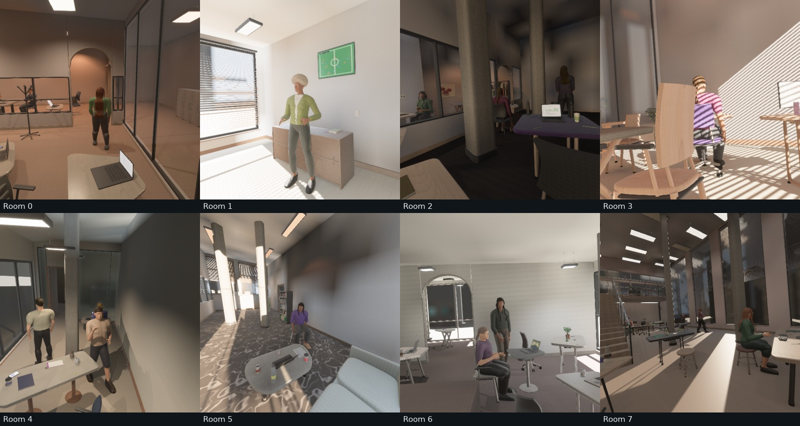
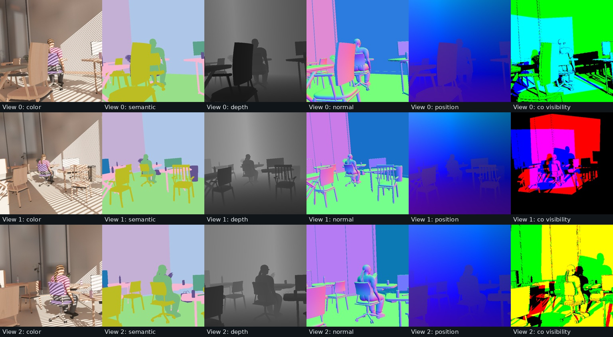

# Procedural-space robustness

The indoor generator now checks that manufactured objects agree with their
placement reservations, supported props fit below the roof, and wall fixtures
have real mounting contact. This local qualification is bound to
[the receipt](evidence/space_robustness/receipt.json) and core source
`51c775d8ffcdfb29f2a8ac1d29ea5b8cc41c7234c3bf42294ad925349416d18a`.
Generator version 27 identifies the changed placement/construction program.



## Construction and acceptance

Wall displays have a bracket joining the panel to its mounting face. Boards,
art, clocks, outlets and switches use offsets derived from their actual rear
faces, with a 1 mm gap to avoid coincident wall faces. Mounts follow oblique
envelope walls and reject glazing apertures, unsupported backing and roof
intersections. The candidate that passes placement is the one constructed;
wall-decoration seeds are no longer resampled after acceptance.

Whiteboards reserve continuously sampled 12–18 cm depth for the frame and tray.
Artwork relief and stacked clock hands fit their full depth reservations. Mug
saucers account for the cup's offset center and narrow width. These fixes retain
separate material parts and semantic attachments.

Tall tabletop props check all corners of their rotated bounds against the sloped
roof. Neighbor-room props use that room's flat ceiling. Base scene dimensions,
densities, transforms and photometry are checked before dependent program
queries. The accepted solar range preserves the existing 150,000 lux photometry
contract. Nonfinite mesh normals explicitly fail qualification.

`validation/geometry.rs` constructs and validates one assembly at a time. It
exports object-envelope check counts by kind and maximum overrun in every
`geometry_<seed>.json`. All objects must fit their reservation within 3 mm,
allowing small trim/piping; floor and supported objects must have contact within
3 mm. The audit reports degenerates separately. It does not silently resize
geometry to make invalid reservations pass. This organization reduces retained
CPU geometry during qualification; runtime throughput and peak memory were not
benchmarked in this shared-GPU session.

## Consecutive dense-room qualification

Seeds 0–511 use mixed activity, furniture density 0.85, human density 0.7 and
three cameras. All 512 layouts and actual constructed meshes passed. No seed or
rendered view was filtered.

| Check | Result |
|---|---:|
| Built object reservations checked | 37,052 |
| Chairs / plants / laptops | 5,657 / 1,128 / 2,438 |
| Boards / wall displays / clocks | 178 / 102 / 211 |
| Largest object mesh overrun | 0.002 m |
| Mesh envelope allowance | 0.003 m |
| Triangles checked | 342,946,984 |
| Area-tolerance degenerates | 0 |
| Triangles per room, P05 / median / P95 | 273,176 / 591,779.5 / 1,284,115 |

Features can co-occur: 221 rooms have concave plans, 458 oblique envelope edges,
354 sloped ceilings, 194 archways, 425 pillars and 46 mezzanines. Raised and
depressed floors occur in 90 and 103 rooms respectively. All ten chair families
and nineteen hair topologies appear; these are coverage checks, not a claim
about independent perceptual diversity.

| Continuous sampled factor | P05 | Median | P95 |
|---|---:|---:|---:|
| Envelope floor area, m² | 41.95 | 96.98 | 228.05 |
| Room height, m | 2.80 | 3.94 | 6.84 |
| Primary-room chairs | 3 | 8 | 22 |
| Solar illuminance, lux | 1.27 | 9,444.67 | 78,098.65 |
| Electric target illuminance, lux | 9.14 | 302.56 | 807.47 |
| Camera vertical field of view, degrees | 33.82 | 70.66 | 103.12 |
| Camera height, m | 0.88 | 1.61 | 2.70 |
| Table capsule blend | 0.015 | 0.147 | 0.728 |
| Active chair curvature, m | 0.022 | 0.056 | 0.091 |

Every camera was in the primary room. Factor counts and denominators, histogram
bins, object count distributions, placement heatmaps and camera overlap metadata
are retained in [metrics.json](evidence/space_robustness/metrics.json).
The [per-seed geometry audit](evidence/space_robustness/geometry_audit.json)
retains all constructed checks and semantic triangle counts. Raw program control
variance does not establish effective visual diversity or ten-million-sample
learning utility.

## Native RGB and aligned annotations

The first eight consecutive rooms were captured at three 512×512 views each on
NVIDIA RTX PRO 6000 Blackwell/Vulkan. Native Auto retained 2048-pixel shadow maps,
SSAO, bloom, glass transmission and baked diffuse GI. These are static captures;
motion models were not requested or loaded. Existing local WGPU patches are
included in the source identity and disclosed in the receipt.



| Capture check | Result |
|---|---:|
| Captured views | 24 |
| Semantic classes per view | 8–16 |
| Worst per-view self-reprojection P99 | 0.002495 px |
| Worst depth/position P99 | 0.000001908 m |
| Maximum normal-length error | 0.000000238 |
| Exported camera-pose error | 0 |
| Directed peer visibility, P05 / median / P95 | 38.0% / 58.9% / 86.5% |
| Visibility shared with any peer, P05 / median / P95 | 54.6% / 78.5% / 96.3% |

Geometric targets used direct float32 precision. All eight occupied rooms
contained person pixels in at least one view; this does not mean every actor
was visible. [Capture checks](evidence/space_robustness/capture_checks.json) retain
calibration, photometry, semantic pixel counts and measured overlap for all views.
The evidence folder contains all 24 original RGB images and room 3's exact
16-bit co-visibility membership masks with separate validity masks. Additive
preview colors are a visualization of those masks.

The final source passed 245 core tests, with three larger qualification tests
explicitly ignored. Strict workspace/all-target Clippy passed with warnings
denied. The motion-enabled WebGPU viewer compiled; browser runtime and new motion
captures were not rerun. The upstream Burn future-compatibility notice remains.
Tests cover detached and reversed mounts, actual rear-face contact, narrow mugs,
clock relief, roof clearance, malformed base scalars, hidden mesh overruns and
nonfinite normals. Thin-polygon seeds 202 and 1,013,005 also passed.

Hair, people and some finishes remain visibly synthetic. This audit does not
establish photographic accuracy, unlimited-process memory stability or broad
training transfer. Full local CLI outputs are under `out/space_robustness/qualified`;
this work is local and unpublished.

## Reproduce

```sh
cargo run --release --features human_motion --bin indoor_validate -- \
  --seed 0 --audit-seeds 512 --audit-geometry \
  --density 0.85 --human-density 0.7 \
  --cameras 3 --width 512 --height 512 --renders 8 \
  --labels --co-visibility --no-raw --asset-root "$PWD" \
  --output out/space_robustness/qualified
cargo test --lib --features human_motion
cargo clippy --workspace --all-targets --features human_motion -- -D warnings
cargo check --target wasm32-unknown-unknown --no-default-features \
  --features web,human_motion --bin viewer
```
