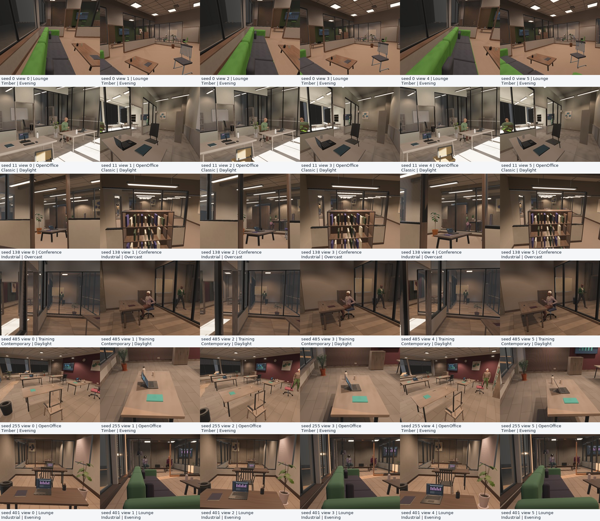

# Local generator 7 review

> **Archived evaluation.** This report describes its recorded build. Use the
> [documentation index](README.md) for current capabilities and defaults.

Generator 7 changes pixels and camera paths. The capture contract is `capture-v9`;
generator 6 distributions and Cycles comparisons are historical evidence only.
All work in this review is local; no release or remote CI was requested.

## Changes

- The Zeroverse panel groups scene generation, rendering/annotations, cameras,
  playback and regeneration. The raw world inspector is an advanced section.
  Configuration and public runtime resources synchronize per field before asset
  demand. Changing either scene selector regenerates, including Object → Indoor.
  Editing a density or render control no longer overwrites an independently edited
  scene selector. A zero regeneration interval consistently means manual only.
- Cornell regeneration waits for deferred material discovery, activates the selected
  texture maps and provides a safe material when the catalog is empty. Native
  headless capture no longer creates a hidden window or a process-global Winit
  event loop. Image-target capture works without a display server; the standalone
  headless viewer retains a continuous runner. Capture camera zero explicitly
  drives local-light shadow LOD even when the editor CLI flag is left at its default.
- AnnyBody remains the human surface and full skinning source. Waist, neckline,
  sleeve and jacket regions are cut through triangles in rest-body coordinates,
  retaining shared interpolated positions and Anny's face-corner UVs. Torso ease,
  smooth collar/cuff boundaries and raised stitching improve garment separation; buttons
  follow the deformed body. Clothing uses neutral, dedicated fine fabric maps,
  independent of room upholstery. These are fitted procedural garments, not cloth
  simulation or a production wardrobe asset library.
- Hair conforms to the phenotype scalp and head rotation, with combed ribbons and
  directional highlights. Irises, pupils and brows attach to the facial rig.
  Skin microstructure is shared while pigmentation is individual. Hair remains a
  bounded geometric approximation; there is no strand transport or skin SSS.
- Door headers meet jambs without overlapping visible faces. Ceiling cross rails
  and coffers terminate at main rails. Perimeter corners and niche shelves use
  butt joints rather than overlapping boxes. Glazing rails replace the plaster
  beneath them; metal and plaster no longer share exposed planes.
- Exterior and interior glazing independently sample tint/absorption, IOR and
  roughness. Clear-glass roughness respects Bevy's 0.089 GGX floor; smaller
  values would falsely imply reflection diversity. Interior glazing includes frosted finishes. Material thickness uses
  the corresponding pane thickness. Portable uses a documented alpha approximation
  with tint and opacity derived from the recipe. Native transmission is screen
  space; neither glass caustics nor multi-pane path tracing is implemented.
- Table slabs, edge bevels, leg radius, inset and rake now vary continuously in
  a separate table builder, while preserving the support and placement envelope.
- Coordinated neutral/wood palettes, contrasting secondary textiles, continuously
  spaced ceiling/wall finishes and both opaque and glazed partitions expand the
  finish space. The enclosing building remains rectangular with orthogonal room
  partitions; this does not represent arbitrary building architecture.
- Fixture flux, colour temperature and cone angles vary per fixture. Direct
  lighting and CPU/GPU GI share these parameters. The finite shadow budget and
  low-frequency probe transport remain approximations.
- Camera motion uses cubic Bezier paths, changing aim and small roll variation.
  Log-uniform focal-length sampling spans roughly 34–92 degrees vertical FOV.
  Targets include content in the camera's current zone. Runtime, reference poses,
  validation and placement heatmaps share the same evaluator. Curve clearance
  inflates swept segments by a bound on Bezier interpolation error. Projection
  remains a centered pinhole; optical distortion and rolling shutter are absent.
- Metrics schema 4 adds optical glass parameters, finish spacing, fixture cones
  and power, roll, aim motion and curve bend. Curved path length and heatmaps now
  follow the rendered trajectory rather than the endpoint chord.
- A required O-voxel annotation timing out now fails capture instead of emitting
  an incomplete sample. O-voxel colours retain the existing semantic-palette
  contract, not RGB appearance. Glass remains the first geometric surface in
  depth, normal, position, semantic and voxel annotations, regardless of RGB
  transparency. Native geometry attachments retain the float32 MRT path.
- GPU O-voxel accumulation uses the CPU's conservative floor/ceil cell bounds and
  the same degenerate-triangle threshold. Both use majority semantic votes with
  deterministic ID tie-breaking; the GPU previously chose an arbitrary first hit
  and rejected about 22% of CPU surface cells in the regression scene. Output and
  tile-pair overflow now fail instead of returning a truncated volume. Sparse GPU
  voting supports arbitrary u16 IDs with up to 32 distinct classes in one cell;
  exceeding this fails explicitly. Voxel colours are triangle averages, with no
  texture or subpixel material evaluation.

## Build warning fixes

The local `cfg_aliases` patch removes expression-position semicolons in three
macro parser arms. This fixes future-incompatibility warnings from dependent
build scripts without suppressing warnings. The existing vendored `wgpu-core`
uses recursion limit 256 for its Send/Sync assertion on current Rust.
These workspace patches do not automatically apply to published consumers.
Release preparation later replaced the local `cfg_aliases` patch with published
`cfg_aliases` 0.2.2, which contains the same macro correction. The wgpu patches
remain checkout-only.
`cargo run --bin viewer -- --help`, the native build, strict Clippy and the Wasm
build complete without compiler warnings. The dependency still logs its runtime
notice about four-influence legacy GPU skinning when loading the human reference;
indoor people use the full eight-influence CPU deformation described above.

## Validation

The local native suite passed **81 library tests and one inspector integration
test**. Three long library qualifications remain ignored. Strict Clippy passed
with `-D warnings`; the Wasm viewer build passed. The final hair highlight change
only adjusts material uniforms; native renders, Clippy and browser checks were
repeated after it. The Python validation/contract suite passed 11 tests.

The native GPU regression starts in Object, changes the public scene setting to
ProceduralIndoor, loads Anny people, captures all five modalities, compares CPU/GPU
voxel coordinates and semantic IDs exactly, then sends a real R key event and
requires seed 116 after seed 115. It passed. The voxel unit oracle now actually
fails on mismatches, rather than silently accepting a CPU fallback or discrepancy;
it covers subcell surfaces, small triangles, degenerate triangles, majority/tied
labels, repeated dispatches and capacity failures.

Both native render regressions also passed sequentially with `DISPLAY` and
`WAYLAND_DISPLAY` unset, including empty assets, odd image dimensions, rotated
geometry and legacy scene switching. Recreating apps in one test process still
logs Bevy's already-installed global logger notice; the Linux adapter enumerator
also logged EGL teardown notices. Neither affected Vulkan captures. These are
distinct from compiler warnings and browser inspector errors.
An additional [eight-second standalone headless run](procedural_indoor/headless_program7.json)
verified the continuous runner with the default editor flag and an Anny-populated
scene. It completed without window, screenshot-target or shadow-LOD warnings.
The profiler only requests a window screenshot in windowed mode.

The final cohort in `out/quality7` contains **512 audited scenes, 1,024 camera
trajectories and 36 native views at 960×720**. Six category-balanced seeds
(0, 11, 138, 485, 255, 401), two cameras and three trajectory steps were rendered
without image-quality filtering. No layout or camera validation failures occurred.
The [distribution](procedural_indoor/distribution_program7.json),
[metrics](procedural_indoor/metrics_program7.json) and
[capture summary](procedural_indoor/render_summary_program7.json) retain counts,
joint distributions and heatmaps, including zero-count scenes. CSVs and figures
are in `out/quality7`.

| Observed quantity | Result |
| --- | ---: |
| Main-room chairs per scene | 1–13, mean 4.85 |
| Camera height | 0.785–2.248 m |
| Vertical field of view | 33.76–92.29° |
| Interior glass roughness | 0.089–0.479 |
| Glass IOR | 1.460–1.550 |
| Fixture flux | 888–7,664 lm |
| Worst per-view p99 depth/position disagreement | 2.63 µm |
| Worst per-view p99 reprojection error | 0.00262 px |
| Maximum normal length error | 2.39×10⁻⁷ |
| Maximum clipped RGB fraction | 0.0458% |
| Camera pose disagreement | 0 |

These are observed ranges and geometric consistency checks, not perceptual-quality
scores or evidence of ten-million-scene statistical coverage. In particular,
annotations describe the first geometric surface: transparent glass can label a
pixel as window while a person remains visible in RGB behind it.



The [GI ablation](procedural_indoor/gi_program7.json) also passed. GPU probe values
had 22.9% relative MAE against the CPU high-sample oracle at this bounded sampling
budget. Turning off only the baked irradiance volume changed mean linear luminance
by 0.0129 and 0.0172 in the two fixed views; capture waited for CPU GI completion.
This verifies transport contribution and consistency, not physical equivalence
to Cycles. There is no new matched Cycles qualification for generator 7.

The final debug Wasm artifact passed **eight Chromium WebGPU cases**: Auto and
Portable × Color, Depth, Normal and Semantic, each with the editor, Anny people
and R regeneration from seed 115 to 116. No renderer/GPU errors or inspector/picking
warnings occurred. The [browser report](procedural_indoor/web_program7.json)
includes the artifact hash. A separate interaction check selected Indoor through
the actual Object inspector dropdown, then pressed R; screenshots and logs are in
`out/quality7_ui`; it exercises the same inspector implementation as the final artifact. Browser
dataset readback, browser voxel export and other browser/GPU combinations are not
qualified by this viewer test.

The [30-second native profile](procedural_indoor/viewer_profile_program7.json)
used an RTX PRO 6000 Blackwell, 800×600, full human density and regeneration every
four seconds. First submission was 1.47 s, first scene event 3.24 s; frame-gap
p95 was 19.0 ms, with 101.3 ms maximum after five seconds. Main-schedule work
peaked at 26.4 ms. The process was competing with other graphics applications.
The last scene loaded near the end of the run; the final snapshot has no completed
GI statistic. This is an interactive preview profile, not a sustained fully baked
image-quality benchmark.
It does not establish universal hitch-free startup or unlimited memory stability.

The images remain visibly synthetic, especially people, fitted clothing, footwear,
hair and some surface finishes. The final browser seed 115 view still shows a
coarse hair silhouette and broad pale highlights; the material adjustment does
not establish convincing strand appearance. Broader human appearance, cloth drape, non-orthogonal
building geometry and accurate multi-pane/indirect transport remain quality gaps.
No claim of photographic realism, state of the art, 10-million-sample learning
utility or unlimited-process memory stability follows from these changes.

Reproduce the native cohort with:

```sh
cargo run --bin indoor_validate -- --audit-seeds 512 --renders 6 --stratified \
  --cameras 2 --playback-steps 3 --width 960 --height 720 \
  --human-density 0.5 --labels --no-raw --output out/quality7
python scripts/indoor_report.py out/quality7 --figures
```

Native GPU regressions require the local assets and a graphics adapter, but no
display server:

```sh
env -u DISPLAY -u WAYLAND_DISPLAY cargo test --test procedural_indoor_render -- --ignored --test-threads=1
cargo test --test procedural_indoor_gi -- --ignored --test-threads=1
```
