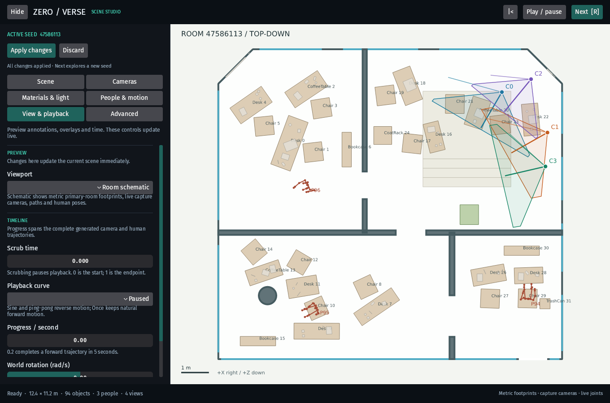
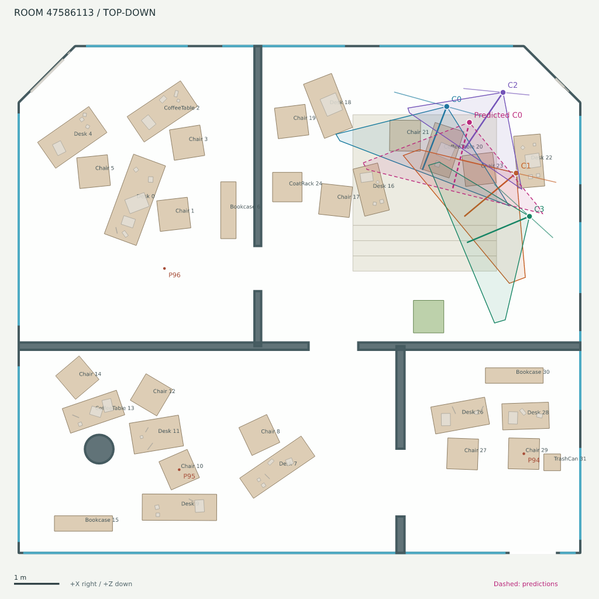

# Room schematics



Choose **View & playback → Viewport → Room schematic** in the native or WebGPU
viewer. Editor camera and Capture grid remain available in that selector.
`?room_schematic=true&scene_type=procedural-indoor` selects it in a shared link;
the viewer updates the URL when the selection changes. Use the timeline to inspect
camera and human poses at another trajectory position. The schematic refreshes at
most eight times a second and retains its image when unchanged.

The diagram shows the primary-room envelope, windows, partitions and openings,
floor levels, mezzanine/stairs, columns, oriented furniture and prop bounds,
plants, capture cameras, lens footprints, trajectories, and human skeletons.
It omits ceilings and neighboring geometry. Furniture polygons are bounds, not
mesh silhouettes. Camera lens footprints have a finite display length; they do
not indicate measured co-visibility or occlusion. Use the co-visibility annotation
for that purpose. Plans generated from a manifest alone show person positions;
captured samples and the viewer show actual skeletons.

## Dataset export

```sh
cargo run -p bevy_zeroverse_burn --bin zeroverse_gen -- \
  --scene-type procedural-indoor --output out/rooms --samples 3 \
  --cameras 3 --width 512 --height 512 --playback-steps 1 --schematic
```

The optional export writes one JSON/SVG/PNG triplet per timestep under
`schematics/sample_000000/000.*` for folder output, or
`schematics/chunk_000000/0000/000.*` for chunk output (chunk, sample within chunk,
timestep). Its capture and resume configuration records whether schematics were
requested. Existing sample tensors and render-mode channels are unchanged.
Rendering runs on the export thread after scene, camera and motion readiness;
it needs no extra GPU renders. With export disabled, no schematics are built.

## Rust API and prediction overlays

```rust,ignore
use bevy_zeroverse::annotation::schematic::{Overlay, RenderOptions};
let plan = sample.schematic(0)?; // recorded camera/pose matrices at timestep 0
let mut predictions = Overlay::default();
predictions.cameras.push(predicted_camera); // world-space Camera
predictions.poses.push(predicted_pose);     // joints + parent indices
plan.write("out/calibration", RenderOptions::default(), predictions)?;
```

`Schematic::svg`, `rgba`, and `document` also work without a filesystem on Wasm.
`Schematic::from_manifest` supports CPU-only layout audits. See
[`examples/schematic.rs`](../examples/schematic.rs) for a runnable prediction
example. Applications may insert `app::editor::schematic::Predictions` to display
model outputs in the viewer. Predictions use dashed magenta; their outliers are
clipped to the map viewport and never expand the ground-truth metric extent.

Coordinates use world-space metres, +Y up. The view looks down onto X/Z: +X is
right, +Z down. Camera transforms are column-major `world_from_view`, -Z forward,
+Y up. Optional full `CameraCalibration` takes precedence over fov/aspect when
projecting image-plane corners. JSON includes the complete editable scene, overlays, render options and
`Projection`: `u = scale*x + offset[0]`, `v = scale*z + offset[1]`. Coordinates
refer to pixel boundaries; pixel centers are `(i+0.5, j+0.5)`. `project` and
`unproject` supply the exact mapping; unprojection needs an explicit world height.
The JSON records normalized trajectory progress and physical time when available.


