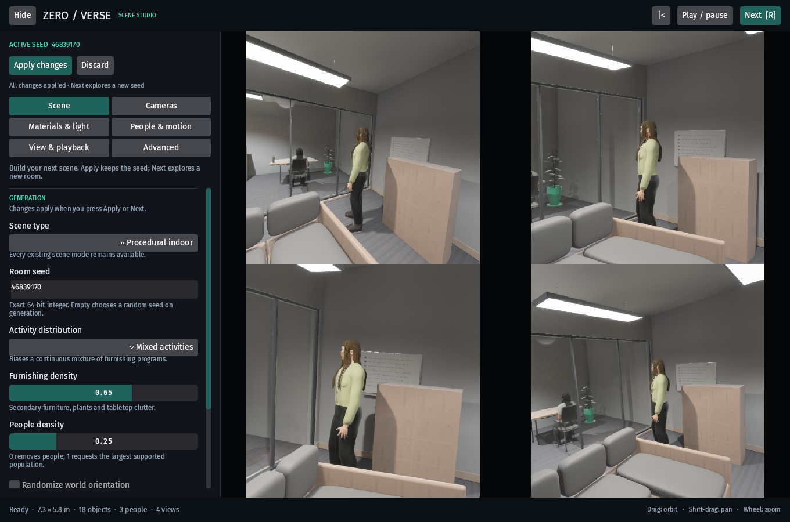
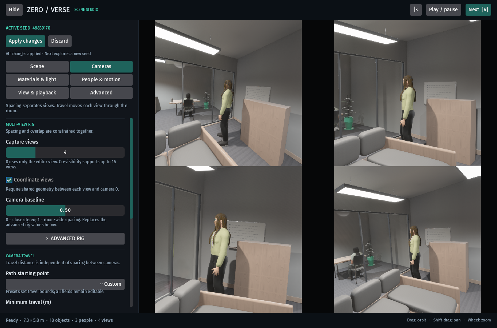
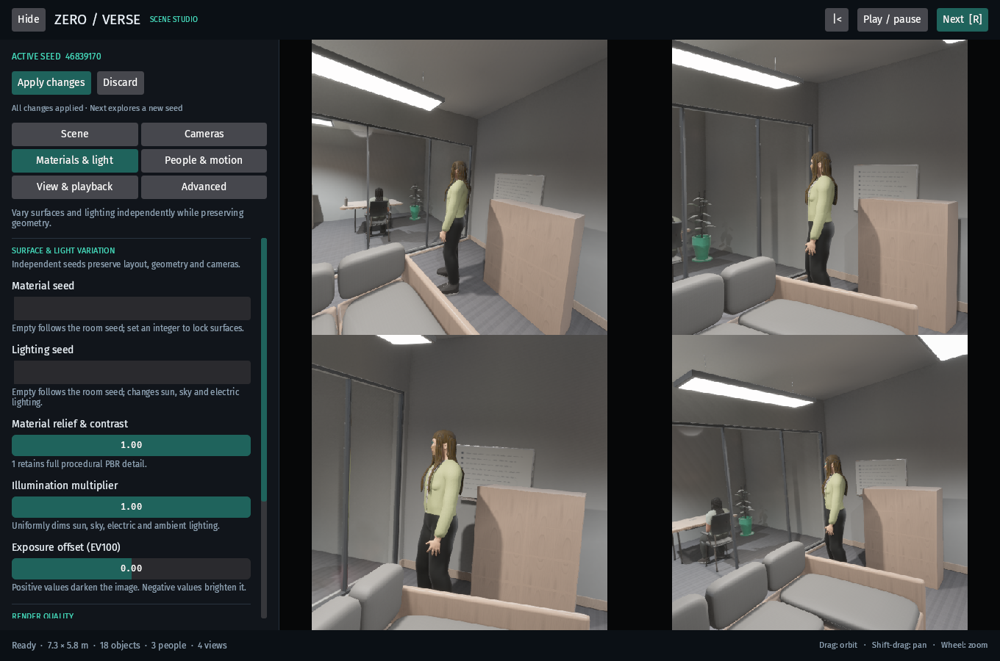
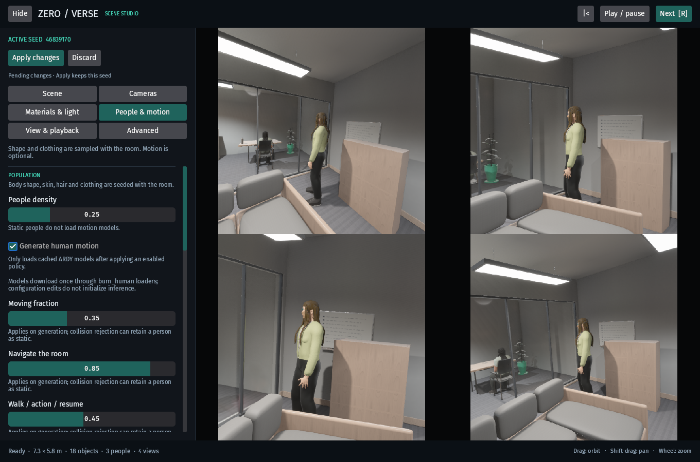
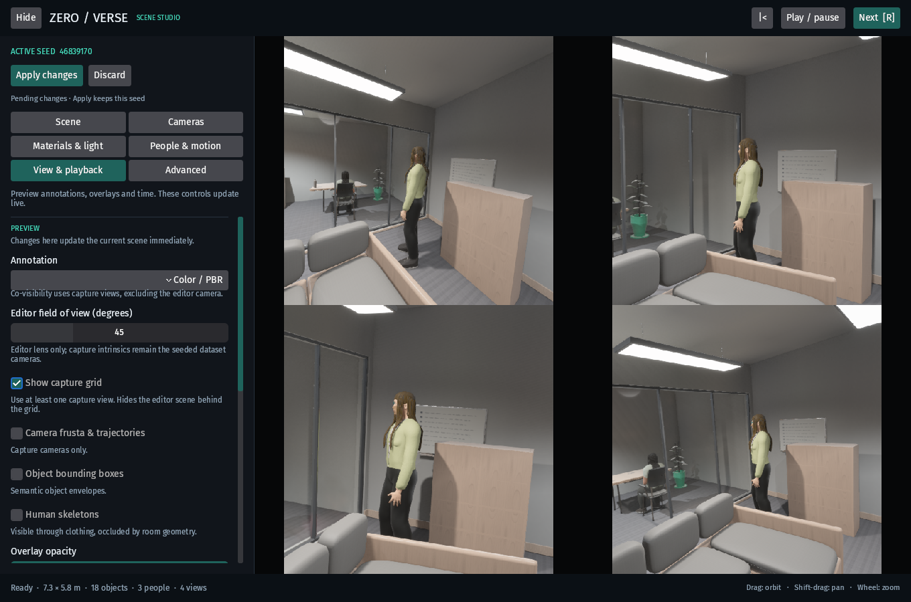
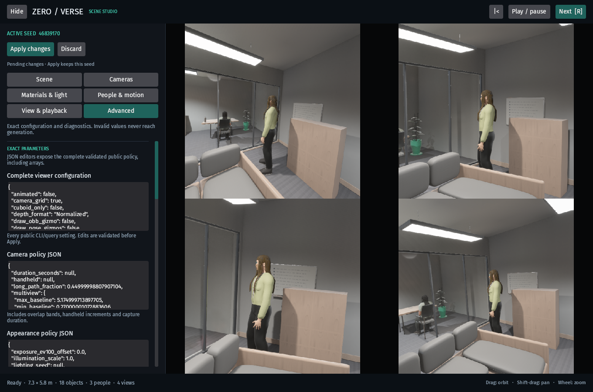
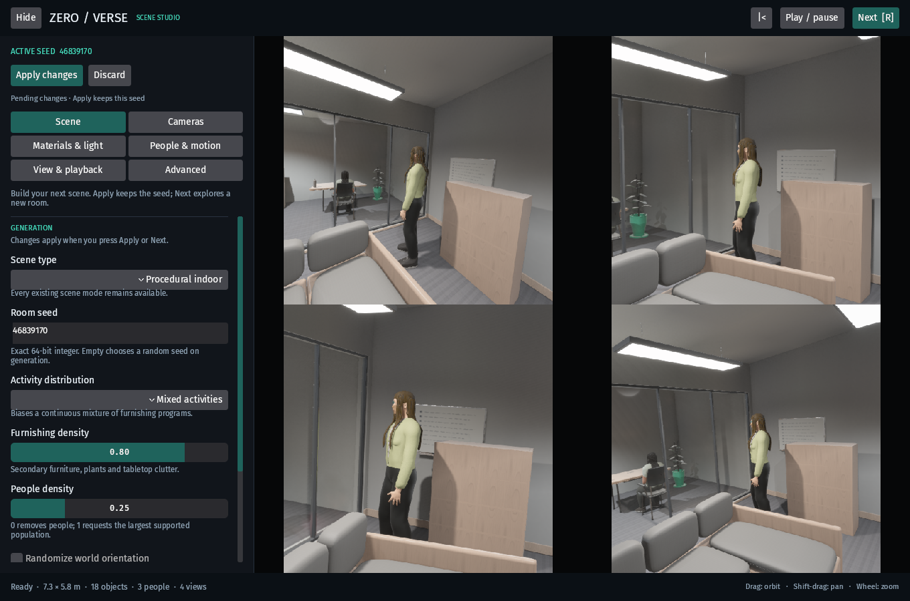
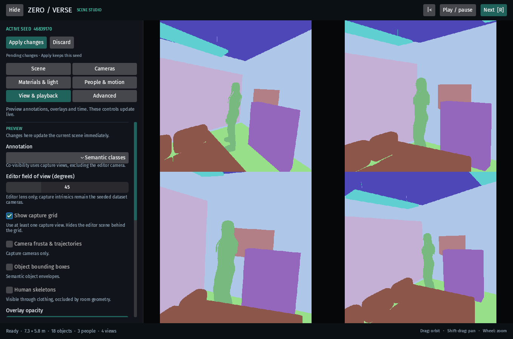
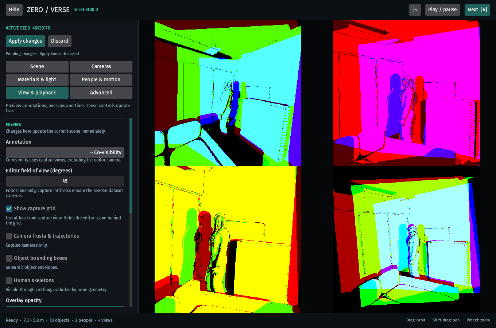
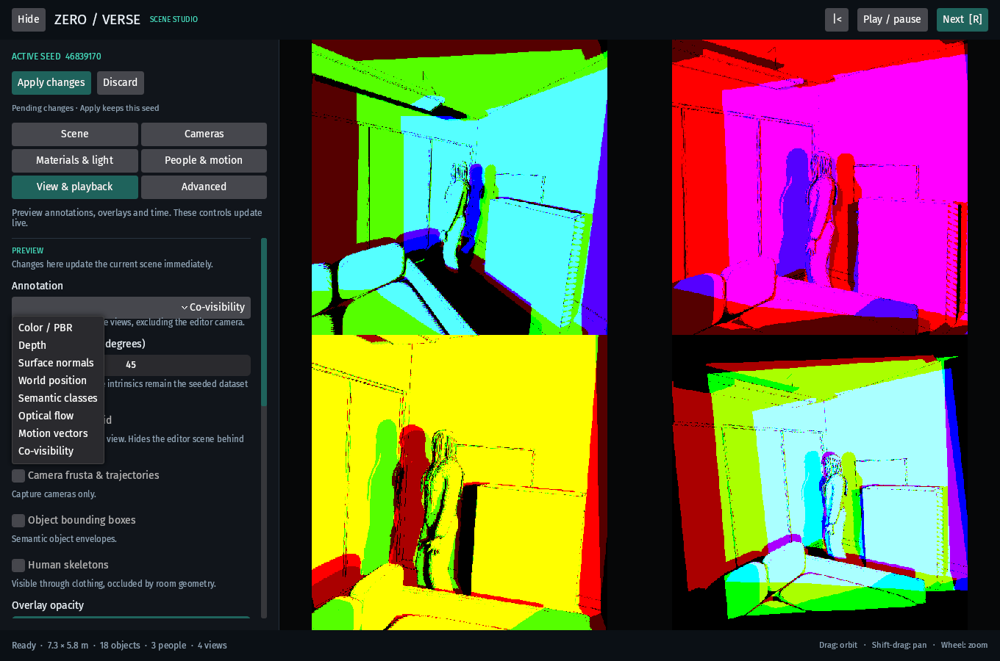

# Scene Studio

Native and WebGPU viewers use the same Bevy Feathers controller. The scene remains
visible beside a fixed, scrollable control panel. Hide expands the scene viewport;
View → Capture grid reserves the same viewport for dataset cameras.

- **Scene:** mode, full-width room seed, activity distribution and population.
- **Cameras:** view count, baseline, proxy overlap constraints, travel distance,
  static / handheld / room-exploration starting points, metric increments and duration.
- **Materials & light:** independent material / lighting seeds, relief, dimming,
  exposure and platform quality. Auto retains all platform-supported effects.
- **People & motion:** population, ARDY sampling, diffusion, guidance, batching,
  prompt-family weights and exact custom actor trajectories.
- **View & playback:** annotations, camera grid, overlays, editor lens, timeline,
  playback curves (including Sin) and fixed-interval optical-flow visualization.
- **Advanced:** complete policy JSON, capture resolution and timesteps, O-voxel,
  depth units, navigation preferences and optional scene-resource diagnostics.

**Apply changes** regenerates with the selected seed. **Next / R** applies the
configuration and advances from the displayed seed. Moving sliders or typing
never regenerates a scene. Pending changes are visibly marked; Discard returns
them to the last applied configuration. Preview controls update immediately.
Space controls playback when the scene has keyboard focus; focused buttons retain
their normal keyboard activation.
Invalid fields remain editable and block generation with a readable error.

On WebGPU, the address bar is updated with `history.replaceState` after valid edits
and scene generation. It records the current seed, complete nested policies,
render/grid/overlay state, panel, timeline and editor camera in versioned
`viewer_state` JSON. Copying the URL replays those settings without carrying a
sequence offset from previous rooms. Pending edits are restored as pending,
preserving the rendered scene until Apply. Startup options such as headless mode or
readback require relaunching with the desired CLI/query setting. Continuous motion/camera updates are
throttled to twice per second. Random legacy object scenes do not have the indoor
seed replay contract. Low-level ECS inspector edits are not serialized in URLs.

Camera baseline remains `indoor_camera={"baseline":0.8}`; the editor expands it into
explicit constraints in shared links so custom overrides remain unambiguous.
Baseline separates cameras; travel bounds move each camera. Neither guarantees a
particular measured pixel overlap. Collision checks and placement constraints
remain active for all presets.

Motion models initialize only on generation with an enabled motion policy. Native
builds need `--features human_motion`. WebGPU keeps native-only GI options in shared
settings and identifies their platform limitation. O-voxel rejects motion and
multiple capture timesteps rather than producing inconsistent geometry labels.

## Validation

Pure Rust tests exercise draft/application separation, 64-bit seed handling,
policy validation, all enumerated choices, URL round trips and shortcut isolation.
`cargo run --example review_editor --features human_motion` captures the actual
native controller states to `out/ui_revamp/native/` for visual review.

## Native visual review

Actual Bevy screenshots of seed **46839170**, four 512 × 512 capture views, in a
1360 × 900 editor window. Motion settings shown as pending do not start model loading.

Scene and active seed

Camera baseline and travel

Materials and lighting

Population and ARDY motion

Annotations and playback

Complete policy editors

Pending changes

Semantic preview

Co-visibility preview

Annotation dropdown

The native review also exercises text entry of `u64::MAX`, slider events, Discard,
text hit-target bounds, menu activation and focused-button keyboard activation.
Core validation passed 383 tests
(22 ignored); the reported seed passed 27 camera/population/furnishing configurations.
The shared WebGPU controller compiles with motion enabled. Browser rendering could
not be qualified in the connected in-app browser because it exposes no WebGPU
adapter; its preflight error state was checked. The native images above are not
presented as browser captures.

The View & playback viewport selector also offers a [room schematic](schematic.md):
a metric top-down diagram of primary-room geometry, capture cameras, trajectories
and human joints. Its native/Wasm renderer is shared with optional dataset exports
and supports prediction overlays.
